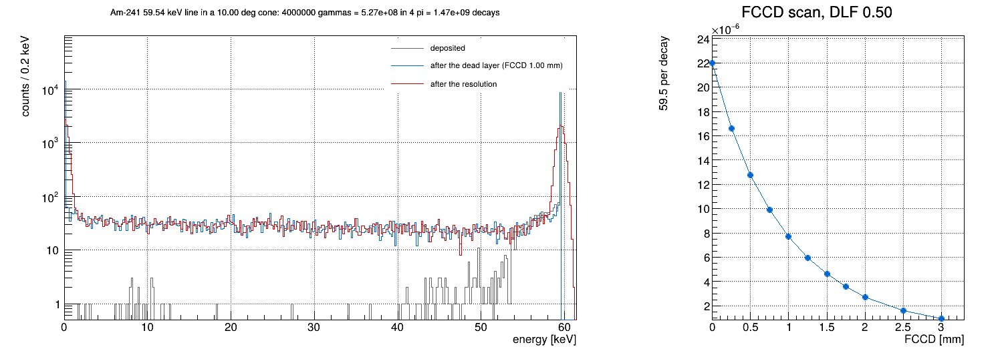
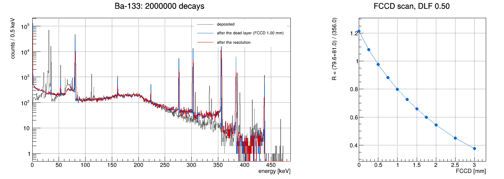
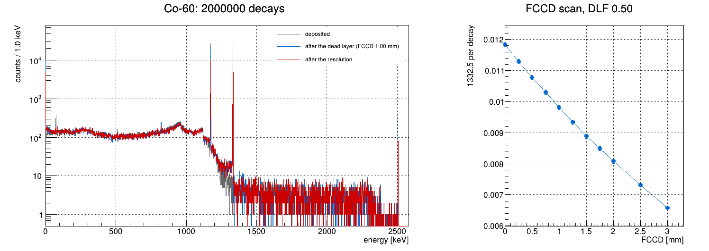
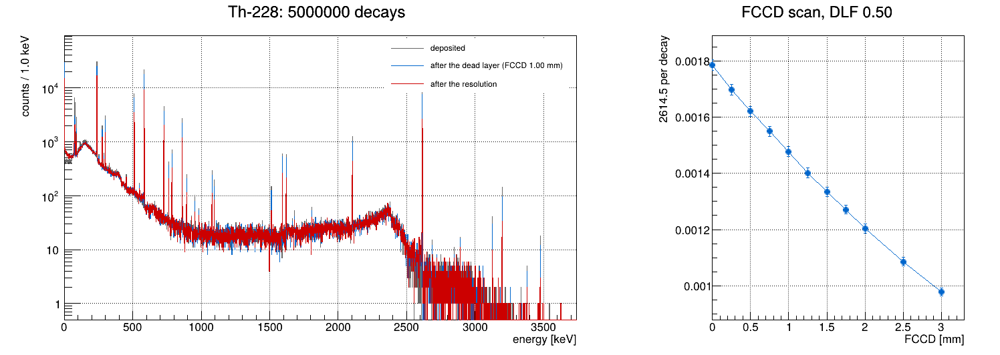

# HPGe characterization at HADES

One HPGe in a vacuum cryostat with a calibration source on top: the stand LEGEND characterizes its
detectors in, built by [legend-pygeom-hades](https://legend-pygeom-hades.readthedocs.io) and simulated
with remage. **The unknown is the detector, not the background**: each source is a known input, and
what the crystal makes of it measures its dead layer (FCCD, the full-charge-collection depth), its
active volume and its resolution.

| source | stand    | measures      | observable                                          | simulated as             |
| ------ | -------- | ------------- | --------------------------------------------------- | ------------------------ |
| Am-241 | `am_HS1` | dead layer    | the 59.5 keV peak per decay (collimated source)     | the 59.5 keV line, aimed |
| Ba-133 | `ba_HS4` | dead layer    | R = 79.6+81.0 keV peaks / 356.0 keV peak: no activity needed | decays          |
| Co-60  | `co_HS5` | active volume | the 1332.5 keV peak per decay                       | decays                   |
| Th-228 | `th_HS2` | resolution, pulse-shape peaks | lines from 239 to 2615 keV; DEP and SEP of 2614.5 keV | decays, the whole chain |

This README is the whole interface: every source file is described below, and every output (the
files in `output/` and everything the commands print) is shown or described here.

**Contents.** [Files](#files) · [Run](#run) · [Source code](#source-code) · [Outputs](#outputs) ·
[Results](#results) · [On a measurement](#on-a-measurement) · [Assumptions](#assumptions) ·
[Advanced: placeholders](#advanced-placeholders)

## Files

Source, at the top level, edited by hand:

| file | role |
| ---- | ---- |
| `am241.yaml` `ba133.yaml` `co60.yaml` `th228.yaml` | [the stand for each source](#srcyaml--the-stand): detector, `measurement:`, source position |
| `run.mac`    | [remage](#runmac--the-simulation): decay the source (or aim one gamma line), record every step in the crystal |
| `spectrum.C` | [the analysis](#spectrumc--the-analysis): steps → dead layer → resolution → peaks → FCCD scan → a measurement turned into an FCCD |
| `.gitignore` | ignores `output/` except its PNGs |

Everything else is generated and lives in `output/`, one set per source `<src>` = `am241`, `ba133`,
`co60`, `th228`:

| file | made by | holds | size |
| ---- | ------- | ----- | ---- |
| [`output/<src>.gdml`](#outputsrcgdml--the-stand) | legend-pygeom-hades from `<src>.yaml` | the stand, for remage | 16-26 kB |
| [`output/<src>.root`](#outputsrcroot--the-steps) | remage with `run.mac` | every step in the crystal, every primary | 155-281 MB |
| [`output/<src>_spectrum.png`](#outputsrc_spectrumpng--the-figures) | `spectrum.C` | the spectrum and the FCCD scan | ~37 kB |

No Python of our own: legend-pygeom-hades reads its YAML, the rest is remage and ROOT.

## Run

```bash
~/venvs/v/bin/pip install legend-pygeom-hades
```

legend-pygeom-hades 0.2.1, remage v0.26.0 (Geant4 11.4.2), ROOT 6.40. From `HADES/`:

```bash
mkdir -p output
~/venvs/v/bin/legend-pygeom-hades --public-geom --config am241.yaml output/am241.gdml
~/venvs/v/bin/legend-pygeom-hades --public-geom --config ba133.yaml output/ba133.gdml
~/venvs/v/bin/legend-pygeom-hades --public-geom --config co60.yaml output/co60.gdml
~/venvs/v/bin/legend-pygeom-hades --public-geom --config th228.yaml output/th228.gdml
remage -q --ignore-warnings -t 8 -w -o output/am241.root -s GDML=output/am241.gdml -s PARTICLE=gamma -s Z=95 -s A=241 -s E=59.5409 -s THETA=10 -s NEV=4000000 -s SEED=1 -- run.mac
remage -q --ignore-warnings -t 8 -w -o output/ba133.root -s GDML=output/ba133.gdml -s PARTICLE=ion -s Z=56 -s A=133 -s E=0 -s THETA=180 -s NEV=2000000 -s SEED=4 -- run.mac
remage -q --ignore-warnings -t 8 -w -o output/co60.root -s GDML=output/co60.gdml -s PARTICLE=ion -s Z=27 -s A=60 -s E=0 -s THETA=180 -s NEV=2000000 -s SEED=3 -- run.mac
remage -q --ignore-warnings -t 8 -w -o output/th228.root -s GDML=output/th228.gdml -s PARTICLE=ion -s Z=90 -s A=228 -s E=0 -s THETA=180 -s NEV=5000000 -s SEED=2 -- run.mac
root -l -b -q 'spectrum.C("output/am241.root")'
root -l -b -q 'spectrum.C("output/ba133.root")'
root -l -b -q 'spectrum.C("output/co60.root")'
root -l -b -q 'spectrum.C("output/th228.root")'
```

| step | per source | Am-241 | Ba-133 | Co-60 | Th-228 |
| ---- | ---------- | ------ | ------ | ----- | ------ |
| legend-pygeom-hades | ~7 s | | | | |
| remage, `-t 8` | | 4 × 10⁶ gammas, 31 s | 2 × 10⁶ decays, 86 s | 2 × 10⁶ decays, 114 s | 5 × 10⁶ decays, 261 s |
| `spectrum.C` | ~5 s | | | | |

More statistics: raise `NEV`, or run again with another `SEED` and a new file name.

**What they print.** legend-pygeom-hades prints one line, expected with `--public-geom`:

```
WARNING:pygeomhades.core:CONSTRUCTING GEOMETRY FROM PUBLIC DATA ONLY
```

remage with `-q` prints the same for every source (`--ignore-warnings` keeps the warning from
failing the exit code; with no `SensitiveRegion` in the GDML, Geant4's default production cuts apply
everywhere):

```
[Warning -> Could not find G4Region 'SensitiveRegion' in the store. No special production cuts applied
G4GDML: Reading 'output/am241.gdml'...
G4GDML: Reading definitions...
G4GDML: Reading materials...
G4GDML: Reading solids...
G4GDML: Reading structure...
G4GDML: Reading userinfo...
G4GDML: Reading setup...
G4GDML: Reading 'output/am241.gdml' done!
Stripping off GDML names of materials, solids and volumes ...
```

`spectrum.C` prints its report: all four are under [Outputs](#what-spectrumc-prints).

## Source code

### `<src>.yaml` — the stand

legend-pygeom-hades builds the stand from this. `am241.yaml`:

```yaml
#  Am-241, the collimated am_HS1: a 1.0 mm x 25.6 mm channel, a 2.24 deg half-angle. the dead layer, by its 59.5 keV line
#  legend-pygeom-hades builds output/am241.gdml from this. measurement is {source}_{HSX}_{position}_{ID}:
#    sources am_HS1 th_HS2 co_HS5 ba_HS4 am_HS6, position top (lat: am_HS1, th_HS2 only). the ID only labels the campaign

detector: V99000A              # public dummy diode. V -> ICPC, B -> BEGe
measurement: am_HS1_top_dlt

source_position:               # where the source sits on the cryostat
  phi_in_deg: 0.0
  r_in_mm: 0.0
  z_in_mm: 38.0

run: run0001
daq_settings:
  flashcam:
    card_interface: efb2       # required by the package; the lead castle table is picked by detector name (table 1 here, none for am_HS1)
```

| key | here | meaning |
| --- | ---- | ------- |
| `detector` | `V99000A` | the diode. With `--public-geom` a public dummy built from the package's test data: `V` an ICPC, `B` a BEGe (`B99000A`) |
| `measurement` | `<source>_<HSX>_<position>_<ID>` | the source and how it is mounted. Sources `am_HS1`, `th_HS2`, `co_HS5`, `ba_HS4`, `am_HS6`; position `top` (`lat` exists for `am_HS1` and `th_HS2` only); the ID labels the campaign and does not change the geometry |
| `source_position` | φ 0°, r 0 mm, z 38 mm | where the source sits, in the campaign's cylindrical coordinates |
| `run` | `run0001` | the campaign run; it only picks the lead castle table for a few named detectors |
| `daq_settings.flashcam.card_interface` | `efb2` | required by the package; the castle table here comes from the detector name (table 1) |

The four files differ only in their first comment line and `measurement:`, which decides what is built
around the crystal:

| file | `measurement` | the source, as built | lead castle, bottom plate |
| ---- | ------------- | -------------------- | ------------------------- |
| `am241.yaml` | `am_HS1_top_dlt` | a SiO₂ disc in a steel capsule, inside a copper collimator with a 1.0 mm × 25.6 mm channel | none |
| `ba133.yaml` | `ba_HS4_top_dlt` | a disc 5 mm wide in a 0.5 mm foil and an aluminium ring, on an acrylic holder | yes |
| `co60.yaml`  | `co_HS5_top_dlt` | the same, with a narrower foil and ring | yes |
| `th228.yaml` | `th_HS2_top_psa` | a SiO₂ disc in epoxy and a steel capsule, in a copper block with lead plates, on an acrylic holder | yes |

### `run.mac` — the simulation

`remage [flags] -s KEY=VALUE ... -- run.mac`: each `-s` fills a `{KEY}` alias in the macro. The flags
used: `-q` prints only warnings and errors, `--ignore-warnings` keeps a warning from failing the exit
code, `-t 8` runs 8 threads, `-w` overwrites the output, `-o` names it.

| alias | decay mode | line mode | meaning |
| ----- | ---------- | --------- | ------- |
| `GDML` | `output/<src>.gdml` | `output/am241.gdml` | the stand |
| `PARTICLE` | `ion` | `gamma` | what is fired |
| `Z`, `A` | the nuclide | the nuclide (ignored once the gamma replaces it) | `/gps/ion` needs them either way |
| `E` | `0` | the line [keV] | kinetic energy: a nucleus starts at rest |
| `THETA` | `180` | the cone [deg] | emission half-angle from −z, where the crystal is; a decay ignores it |
| `NEV` | decays | gammas | primaries |
| `SEED` | | | the random stream: one per run |

The macro, section by section (every command is in it, with its comment):

```
1. before init
   RegisterDetectorsFromGDML Germanium      the diode, from the map legend-pygeom-hades writes into the GDML (uid 1)
   NtupleUseVolumeName true                 the step table is named after the diode: stp/V99000A
   GDMLDisableOverlapCheck true             pyg4ometry checked it when it built the GDML
   IncludeGDMLFile {GDML}; /run/initialize
2. after init: output
   navigator check_mode false
   Germanium/DiscardZeroEnergyHits true     no rows for steps that deposit nothing
   Germanium/StoreSinglePrecisionEnergy, StoreSinglePrecisionPosition
   Vertex/StorePrimaryParticleInformation   stp/particles: spectrum.C reads the source and the cone from it
   Vertex/StoreSinglePrecisionPosition, StoreSinglePrecisionEnergy
3. decay physics
   Stepping/DaughterNucleusMaxLifetime 1 y  a daughter living longer than a year stops the decay: Np-237 ends
                                            Am-241, while the Th-228 chain (members up to 3.6 d) runs to Pb-208
4. the source
   Randomization/Seed {SEED}
   Confine Volume; Physical/AddVolume Source_PV   the disc that decays (source_pv is the holder around it)
   Select GPS
   /gps/particle ion; /gps/ion {Z} {A}      /gps/ion needs particle ion first
   /gps/particle {PARTICLE}                 ion keeps that nucleus, gamma replaces it
   /gps/energy {E} keV
   /gps/ang/type iso; mintheta 0; maxtheta {THETA} deg
   /run/beamOn {NEV}
```

Two modes, one macro:

| mode  | aliases | Geant4 | used for |
| ----- | ------- | ------ | -------- |
| decay | `PARTICLE=ion Z A E=0 THETA=180` | the nuclide decays: every line, X-ray and coincidence sum, per decay | Ba-133, Co-60, Th-228 |
| line  | `PARTICLE=gamma E=<keV> THETA=<deg>` | one gamma energy into a cone around the crystal | the collimated Am-241 |

- **Why decays decay:** Geant4 11.4 ignores primaries living longer than a year; remage v0.26 raises
  that to 3 × 10¹⁰ years, so Am-241 (432 y), Ba-133 (10.5 y), Co-60 (5.3 y) and Th-228 (1.9 y) decay.
- **The chain:** remage sets the time of the primary's own decay to 0, but each later member keeps its
  real delay, so the Th-228 chain spreads over weeks inside one remage event. `spectrum.C` splits it.
- **Why line mode for Am-241:** the `am_HS1` channel passes only 3.8 × 10⁻⁴ of the gammas, so decays
  would waste 99.96% of the time. Line mode counts per gamma; `spectrum.C` turns that into per decay
  with the cone fraction and the emission probability. The cone must be wider than the channel's
  2.24°: [the check](#line-mode-against-decays) finds 3° misses 1% that leaks through the collimator's
  edges, and 10° matches real decays.

### `spectrum.C` — the analysis

```
spectrum.C(file, fccd = 1.0, measured = -1, error = 0, dlf = 0.5, seed = 1)
  file       output/<src>.root
  fccd       the FCCD [mm] the response table and the spectrum are given at
  measured   a measured observable (and its error): read back as an FCCD. ignored if < 0
  dlf        the fraction of the FCCD that is fully dead
  seed       the resolution smearing
```

The source never has to be named: it is read from the file. Section by section:

```
1. configuration  cfg:: below, and two helpers: activeness(d, fccd, dlf) is 0 in the dead part
                  (d <= dlf x fccd), linear through the transition, 1 beyond the FCCD; scanTree() walks a
                  tree reading the named columns as doubles, whatever their stored type
2. the source     stp/particles. a nucleus (PDG > 10⁹): Z and A pick the source in cfg::sources, and
                  counts are per decay. a gamma (PDG 22): its energy picks the line; the widest primary
                  direction from -z gives the cone; per decay = per gamma x (1 - cos THETA)/2 x the line's
                  emission probability. anything else, or no stp/particles: an ERROR and a stop
3. events         the germanium table (the one with dist_to_surf_in_m) is read whole and sorted by event
                  and time (with -t an event's rows need not be together). a new detector event starts
                  when the event changes or 10 µs have passed since its first step. per detector event:
                  the deposited energy, and the active energy, sum of edep x activeness, at every FCCD of
                  the scan at once
4. peaks          one Gaussian draw per event, shared by every FCCD so the scan moves smoothly:
                  smeared = active + z sigma(active). per peak and FCCD: counts in the window
                  [e1 - 3 sigma, e2 + 3 sigma] and in a side band of half its width on each side;
                  net = window - side bands, error sqrt(window + side bands): as on a measured spectrum
5. response       at the requested FCCD: the energy lost to the dead layer (1 - active/deposited, summed
                  over events); per peak the window, net counts, per decay, and the width: a Gaussian on
                  an erfc step, fitted by chi2 over ±4 sigma once a peak has 300 net counts, against the
                  injected FWHM. when the fitted peaks span a factor 3 in energy, FWHM² = A + B E is
                  fitted to them: the resolution handed back
6. FCCD scan      the observable at every FCCD of the scan. with a measured value: the interval it falls in,
                  linear interpolation, and an error from the measurement and the MC statistics of the
                  curve, each divided by the local slope
7. draw           output/<src>_spectrum.png
```

`cfg::`:

| name | value | role |
| ---- | ----- | ---- |
| `resoA`, `resoB` | 0.865 keV², 0.00225 keV | the resolution FWHM(E) = √(A + B E): ~1.0 keV at 60 keV, ~2.6 keV at 2615 keV. **a placeholder** for the detector's calibration |
| `window_ns` | 10⁴ ns | the detector event window |
| `scan` | 0, 0.25, ..., 2.0, 2.5, 3.0 mm | the FCCD scan; a requested FCCD off the grid is added to it |
| `minFit` | 300 | net counts a peak needs before its width is fitted |
| `sources` | below | each source's peaks and observable |

`cfg::sources`: a peak is a window from `e1` to `e2` (a doublet when they differ), its gammas per decay
(used only to turn a line-mode run into per decay; 0 for doublets and escape peaks) and whether its
width is fitted:

| source | Z, A | peaks [keV] (width fitted) | observable |
| ------ | ---- | -------------------------- | ---------- |
| Am-241 | 95, 241 | **59.5409** (0.3592, fitted); 26.3446 (0.0231) | 59.5 per decay |
| Ba-133 | 56, 133 | **79.6142-80.9979**; 276.3989 (0.0716, f); 302.8508 (0.1834, f); **356.0129** (0.6205, f); 383.8485 (0.0894, f) | R = (79.6+81.0) / 356.0 |
| Co-60 | 27, 60 | 1173.228 (0.9985, f); **1332.492** (0.9998, f); 2505.720 sum | 1332.5 per decay |
| Th-228 | 90, 228 | 238.632-240.986 (Pb-212, Ra-224); 583.187 (0.3045, f); 727.330 (0.0667, f); 860.557 (0.0448, f); 1592.511 DEP; 1620.50 (0.0147, f); 2103.511 SEP; **2614.511** (0.3585, f) | 2614.5 per decay |

Bold: the peaks the observable is built from. A nuclide not in the table stops with an ERROR: add its
peaks to run it.

## Outputs

### `output/<src>.gdml` — the stand

The world (vacuum) holds a lab box of air, turned so z points up; in it the aluminium cryostat
`cryo_pv_1` and its vacuum `cavity_pv`, which holds the crystal `V99000A` (enriched germanium, 75%
Ge-76), its holder `holder_pv_1` and wrap `wrap_pv_1`. Around them, per source (physical volume →
logical [material]):

| source | volumes |
| ------ | ------- |
| Am-241 | `Source_PV` → Source [SiO₂]; `Source_Encapsulated_PV` → [steel]; `source_pv_1` → Source_Collimated [Cu]; `Collimator_Beam_PV` → the channel [air] |
| Ba-133, Co-60 | `Source_PV` → Source; `Source_foil_PV`; `Source_Alring_PV` [Al]; `source_pv_1` → Source_Encapsulated; `source_holder_pv_1` [acrylic]; `plate_pv_1` [Al]; `castle_pv_1` [Pb] |
| Th-228 | `Source_PV` → Source [SiO₂]; `Source_Epoxy_PV` [epoxy]; `Source_Encapsulated_PV` [steel]; `CuSource_Holder_Cavity_PV` [air]; `source_pv_1` → CuSource_Holder [Cu]; `th_plate_pv_1` → Source_Plates [Pb]; `source_holder_pv_1` [acrylic]; `plate_pv_1` [Al]; `castle_pv_1` [Pb] |

`Source_PV` is in every one, which is why one macro serves all four.

### `output/<src>.root` — the steps

Everything is under `stp/`:

| tree | one row per | columns | read by `spectrum.C` |
| ---- | ----------- | ------- | -------------------- |
| `V99000A` | step in the crystal | `evtid`, `particle` (PDG), `edep_in_keV`, `time_in_ns` (double), `xloc_in_m`, `yloc_in_m`, `zloc_in_m`, `dist_to_surf_in_m` (distance to the nearest crystal surface) | `evtid`, `edep_in_keV`, `dist_to_surf_in_m`, `time_in_ns` |
| `particles` | primary | `evtid`, `vertexid`, `particle` (PDG), `px_in_MeV`, `py_in_MeV`, `pz_in_MeV`, `ekin_in_MeV` | `particle`, `p`, `ekin_in_MeV` |
| `vtx` | event | `evtid`, `time_in_ns`, `xloc_in_m`, `yloc_in_m`, `zloc_in_m`, `n_part` | no |
| `detector_origins` | thread (8) | `name`, `xloc_in_m`, `yloc_in_m`, `zloc_in_m`: `V99000A` at z = −0.068 m | no |

| rows | Am-241 | Ba-133 | Co-60 | Th-228 |
| ---- | ------ | ------ | ----- | ------ |
| `V99000A` (steps) | 434 474 | 3 498 645 | 2 881 374 | 4 288 590 |
| `particles`, `vtx` (primaries) | 4 000 000 | 2 000 000 | 2 000 000 | 5 000 000 |

Floats are single precision except `time_in_ns`, which a Th-228 chain needs: its members arrive up to
weeks (10¹⁵ ns) after the first.

### What `spectrum.C` prints

The format, line by line:

```
<file>: <source>: <N> decays                      line mode: <source> <E> keV line in a <THETA> deg cone:
                                                  <N> gammas = <N in 4 pi> in 4 pi = <decays> decays
  <steps> steps -> <events> detector events (10 us window)
FCCD f mm, DLF d, seed s: energy lost to the dead layer x %
  peak [keV]  window [keV]  net counts ± error  per decay ± error  FWHM: fitted ± error (injected)
  resolution from n peaks, FWHM^2 = A + B E: ...  only when the fitted peaks span a factor 3 in energy
FCCD scan, DLF d: <observable> against the dead layer
  FCCD [mm]  [numerator and denominator per decay, for a ratio]  observable ± MC statistics
                                                  "<- drawn" marks the requested FCCD
measured m ± e -> FCCD f ± s mm (measurement, MC statistics)    only when a measurement is given
wrote output/<src>_spectrum.png
```

Am-241:

```
output/am241.root: Am-241 59.54 keV line in a 10.00 deg cone: 4000000 gammas = 5.27e+08 in 4 pi = 1.47e+09 decays
  434474 steps -> 33663 detector events (10 us window)

FCCD 1.00 mm, DLF 0.50, seed 1: energy lost to the dead layer 54.35 %
  peak [keV]   window [keV]              net counts              per decay   FWHM [keV]: fitted (injected)
  59.5           58.27 - 60.81        11271 +- 109     7.688e-06 +- 7.4e-08    1.018 +- 0.009 (0.999)

FCCD scan, DLF 0.50: 59.5 per decay against the dead layer
  FCCD [mm]            59.5 per decay
  0.00          2.1992e-05 +- 1.2e-07 
  0.25            1.66e-05 +- 1.1e-07 
  0.50          1.2787e-05 +- 9.5e-08 
  0.75          9.9189e-06 +- 8.4e-08 
  1.00          7.6883e-06 +- 7.4e-08    <- drawn
  1.25          5.9755e-06 +- 6.6e-08 
  1.50          4.6283e-06 +- 5.8e-08 
  1.75          3.5628e-06 +- 5.1e-08 
  2.00          2.7019e-06 +- 4.5e-08 
  2.50          1.6132e-06 +- 3.5e-08 
  3.00          9.7067e-07 +- 2.7e-08 
wrote output/am241_spectrum.png
```

Ba-133:

```
output/ba133.root: Ba-133: 2000000 decays
  3498645 steps -> 320793 detector events (10 us window)

FCCD 1.00 mm, DLF 0.50, seed 1: energy lost to the dead layer 20.06 %
  peak [keV]   window [keV]              net counts              per decay   FWHM [keV]: fitted (injected)
  79.6+81.0      78.31 - 82.30        28646 +- 179     1.432e-02 +- 9.0e-05    -
  276.4         274.85 - 277.95        4767 +- 74      2.384e-03 +- 3.7e-05    1.198 +- 0.017 (1.219)
  302.9         301.27 - 304.43       11918 +- 112     5.959e-03 +- 5.6e-05    1.239 +- 0.010 (1.244)
  356.0         354.37 - 357.66       35857 +- 191     1.793e-02 +- 9.5e-05    1.288 +- 0.006 (1.291)
  383.8         382.17 - 385.52        5213 +- 73      2.606e-03 +- 3.6e-05    1.331 +- 0.015 (1.315)

FCCD scan, DLF 0.50: R = (79.6+81.0) / (356.0) against the dead layer
  FCCD [mm]      79.6+81.0 /decay         356.0 /decay                        R
  0.00                 2.4653e-02           2.0324e-02         1.213 +- 0.0083  
  0.25                 2.1729e-02           2.0088e-02        1.0817 +- 0.0077  
  0.50                 1.8981e-02           1.9471e-02       0.97483 +- 0.0072  
  0.75                 1.6494e-02           1.8708e-02       0.88168 +- 0.0069  
  1.00                 1.4323e-02           1.7928e-02        0.7989 +- 0.0066     <- drawn
  1.25                 1.2481e-02           1.7167e-02       0.72701 +- 0.0063  
  1.50                 1.0825e-02           1.6441e-02        0.6584 +- 0.0061  
  1.75                 9.4055e-03           1.5709e-02       0.59875 +- 0.0058  
  2.00                 8.1905e-03           1.5062e-02       0.54379 +- 0.0056  
  2.50                 6.1895e-03           1.3714e-02       0.45133 +- 0.0053  
  3.00                 4.6780e-03           1.2460e-02       0.37544 +- 0.005   
wrote output/ba133_spectrum.png
```

Co-60:

```
output/co60.root: Co-60: 2000000 decays
  2881374 steps -> 215576 detector events (10 us window)

FCCD 1.00 mm, DLF 0.50, seed 1: energy lost to the dead layer 7.73 %
  peak [keV]   window [keV]              net counts              per decay   FWHM [keV]: fitted (injected)
  1173.2       1170.84 - 1175.61      22109 +- 151     1.105e-02 +- 7.6e-05    1.864 +- 0.011 (1.872)
  1332.5       1329.99 - 1335.00      19633 +- 141     9.817e-03 +- 7.1e-05    1.977 +- 0.012 (1.965)
  2505.7 sum   2502.47 - 2508.97        258 +- 16      1.290e-04 +- 8.1e-06    -

FCCD scan, DLF 0.50: 1332.5 per decay against the dead layer
  FCCD [mm]          1332.5 per decay
  0.00             0.01184 +- 7.7e-05 
  0.25            0.011293 +- 7.6e-05 
  0.50            0.010774 +- 7.4e-05 
  0.75              0.0103 +- 7.2e-05 
  1.00           0.0098165 +- 7.1e-05    <- drawn
  1.25           0.0093405 +- 6.9e-05 
  1.50           0.0088875 +- 6.7e-05 
  1.75             0.00849 +- 6.6e-05 
  2.00           0.0080805 +- 6.4e-05 
  2.50            0.007314 +- 6.1e-05 
  3.00           0.0065895 +- 5.8e-05 
wrote output/co60_spectrum.png
```

Th-228:

```
output/th228.root: Th-228: 5000000 decays
  4288590 steps -> 397453 detector events (10 us window)

FCCD 1.00 mm, DLF 0.50, seed 1: energy lost to the dead layer 8.49 %
  peak [keV]   window [keV]              net counts              per decay   FWHM [keV]: fitted (injected)
  238.6+241.0   237.12 - 242.50       26586 +- 179     5.317e-03 +- 3.6e-05    -
  583.2         581.31 - 585.07       17770 +- 136     3.554e-03 +- 2.7e-05    1.485 +- 0.010 (1.476)
  727.3         725.32 - 729.34        3633 +- 63      7.266e-04 +- 1.3e-05    1.528 +- 0.026 (1.582)
  860.6         858.42 - 862.69        2185 +- 49      4.370e-04 +- 9.8e-06    1.668 +- 0.035 (1.674)
  1592.5 DEP   1589.82 - 1595.20        477 +- 26      9.540e-05 +- 5.3e-06    -
  1620.5       1617.79 - 1623.21        493 +- 26      9.860e-05 +- 5.2e-06    2.160 +- 0.126 (2.124)
  2103.5 SEP   2100.50 - 2106.52       1043 +- 37      2.086e-04 +- 7.4e-06    -
  2614.5       2611.20 - 2617.82       7390 +- 87      1.478e-03 +- 1.7e-05    2.607 +- 0.025 (2.598)
  resolution from 5 peaks, FWHM^2 = A + B E: A 0.867 +- 0.052 keV^2 (injected 0.865), B 2.255e-03 +- 6.5e-05 keV (injected 2.250e-03)

FCCD scan, DLF 0.50: 2614.5 per decay against the dead layer
  FCCD [mm]          2614.5 per decay
  0.00           0.0017866 +- 1.9e-05 
  0.25           0.0016972 +- 1.9e-05 
  0.50           0.0016208 +- 1.8e-05 
  0.75           0.0015504 +- 1.8e-05 
  1.00            0.001478 +- 1.7e-05    <- drawn
  1.25            0.001402 +- 1.7e-05 
  1.50            0.001335 +- 1.6e-05 
  1.75            0.001271 +- 1.6e-05 
  2.00           0.0012036 +- 1.6e-05 
  2.50           0.0010858 +- 1.5e-05 
  3.00            0.000977 +- 1.4e-05 
wrote output/th228_spectrum.png
```

With a measurement, here R taken from the scan at FCCD 0.80 mm and fed back ± 0.01
(`spectrum.C("output/ba133.root", 1.0, 0.86712, 0.01)`), the report ends with:

```
measured 0.86712 +- 0.01  ->  FCCD 0.794 +- 0.037 mm   (measurement 0.030, MC statistics 0.021)
```

### `output/<src>_spectrum.png` — the figures

Left: the spectrum of detector events at the requested FCCD, deposited (grey), after the dead layer
(blue) and after the resolution (red), log scale, 0.2, 0.5 or 1 keV bins. Right: the observable
against the FCCD with its MC error; with a measurement, its band (red) and the FCCD read off (star).



Am-241: a single line, so nothing above 60 keV. More than half the 59.5 keV energy lands in dead
material at 1 mm. The flat shelf below the peak is 59.5 keV gammas absorbed in the transition layer,
which keep only part of their energy: before the dead layer (grey) there is almost nothing there,
since a Compton scatter of 59.5 keV leaves at most 11.6 keV. The peak per decay falls by a factor 23
from 0 to 3 mm.



Ba-133: the 79.6+81.0 keV doublet loses far more to the dead layer than the 356.0 keV peak (blue
below grey), which is the whole method: R falls from 1.21 to 0.38 over 3 mm. The 30-36 keV Cs X-rays
and the 437 keV sum (81.0 + 356.0) show it is a decay, not a line.



Co-60: the two peaks, their Compton edges, and the 2505.7 keV sum peak (both gammas in the crystal
at once, 1.29 × 10⁻⁴ per decay), which only a decay simulation gives. The dead layer acts through
the volume it removes: the 1332.5 keV peak falls about 5% per 0.25 mm.



Th-228: the whole chain in equilibrium: Pb-212's 238.6, Tl-208's 583.2, 860.6 and 2614.5, Bi-212's
727.3 and 1620.5 keV, the 2614.5 keV Compton edge at 2382 keV, its single (2103.5) and double
(1592.5) escape peaks, and sums above 2615 keV.

## Results

2 × 10⁶ to 5 × 10⁶ primaries per source, the public dummy `V99000A`, FCCD 1 mm, DLF 0.5:

| | Am-241 | Ba-133 | Co-60 | Th-228 |
| --- | --- | --- | --- | --- |
| energy lost to the dead layer | 54.4% | 20.1% | 7.7% | 8.5% |
| observable | 59.5 keV: 7.69 × 10⁻⁶ per decay | R = 0.799 ± 0.007 | 1332.5 keV: 9.82 × 10⁻³ per decay | 2614.5 keV: 1.48 × 10⁻³ per decay |
| MC statistics on it | 1.0% | 0.8% | 0.7% | 1.2% |
| **a 1% error on it moves the FCCD by** | **0.010 mm** | **0.026 mm** | **0.051 mm** | **0.050 mm** |

The last row is each source's power: Am-241 at 59.5 keV is the sharpest dead-layer probe but needs
the source activity; Ba-133 needs none; Co-60 and Th-228 see the dead layer only through the volume
it removes, which is why Co-60 is the active-volume measurement.

### The FCCD scan

The observables against the dead layer: a measurement read off this table (`spectrum.C` interpolates
it) is the detector's FCCD.

| FCCD [mm] | Am-241: 59.5 keV per decay [10⁻⁶] | Ba-133: R | Co-60: 1332.5 keV per decay [10⁻³] | Th-228: 2614.5 keV per decay [10⁻³] |
| --- | --- | --- | --- | --- |
| 0.00 | 21.99 ± 0.12 | 1.213 ± 0.008 | 11.84 ± 0.08 | 1.787 ± 0.019 |
| 0.25 | 16.60 ± 0.11 | 1.082 ± 0.008 | 11.29 ± 0.08 | 1.697 ± 0.019 |
| 0.50 | 12.79 ± 0.10 | 0.975 ± 0.007 | 10.77 ± 0.07 | 1.621 ± 0.018 |
| 0.75 | 9.92 ± 0.08 | 0.882 ± 0.007 | 10.30 ± 0.07 | 1.550 ± 0.018 |
| **1.00** | 7.69 ± 0.07 | 0.799 ± 0.007 | 9.82 ± 0.07 | 1.478 ± 0.017 |
| 1.25 | 5.98 ± 0.07 | 0.727 ± 0.006 | 9.34 ± 0.07 | 1.402 ± 0.017 |
| 1.50 | 4.63 ± 0.06 | 0.658 ± 0.006 | 8.89 ± 0.07 | 1.335 ± 0.016 |
| 1.75 | 3.56 ± 0.05 | 0.599 ± 0.006 | 8.49 ± 0.07 | 1.271 ± 0.016 |
| 2.00 | 2.70 ± 0.04 | 0.544 ± 0.006 | 8.08 ± 0.06 | 1.204 ± 0.016 |
| 2.50 | 1.61 ± 0.04 | 0.451 ± 0.005 | 7.31 ± 0.06 | 1.086 ± 0.015 |
| 3.00 | 0.97 ± 0.03 | 0.375 ± 0.005 | 6.59 ± 0.06 | 0.977 ± 0.014 |

### Closure tests

- **The inversion:** R at FCCD 0.80 mm (0.867), fed back as a measurement ± 0.01, returns
  0.794 ± 0.037 mm.
- **The resolution:** fitted across Th-228's 583-2615 keV peaks, FWHM² = A + B E returns
  A 0.867 ± 0.052 keV² (0.865 injected) and B (2.255 ± 0.065) × 10⁻³ keV (2.250 × 10⁻³). Peak by peak
  the fitted widths match the injected ones within about 2 sigma.

### Line mode against decays

Per emitted 59.5 keV gamma, the 59.5 keV full-energy peak in `am_HS1` (deposited energy, no dead layer):

| simulated as | primaries | peak per emitted gamma |
| ------------ | --------- | ---------------------- |
| the line in a 3° cone | 4 × 10⁶ | 6.155 × 10⁻⁵ ± 0.2% |
| the line in a 10° cone | 4.4 × 10⁷ | 6.216 × 10⁻⁵ ± 0.2% |
| the line in 4π | 5 × 10⁷ | 6.25 × 10⁻⁵ ± 1.8% |
| Am-241 decays (0.3592 gammas each) | 5 × 10⁷ | 6.42 × 10⁻⁵ ± 3% |

3° (just wider than the channel's 2.24°) misses 1.0 ± 0.2%: gammas that cross the copper
collimator's edges. 10° agrees with 4π and with real decays, so `am241` runs at 10°. This was a one-off
check with the 4π and decay files kept out of `output/`; through `spectrum.C`, the same `am241` command
at `THETA=3` gives 7.624 ± 0.022 × 10⁻⁶ per decay at 1 mm, 0.8 ± 1.0% below 10°, and a fitted
59.5 keV width of 1.003 ± 0.003 keV (0.999 injected): the 10° run's 1.018 ± 0.009 is a 2 sigma
fluctuation, not a broadening.

## On a measurement

1. Count the peaks of the measured spectrum with the windows `spectrum.C` prints (net = window −
   side bands).
2. Form the observable. Ba-133: R = net(79.6+81.0) / net(356.0), no activity needed. Am-241 and
   Co-60: net counts / (source activity × live time), per decay.
3. Read it back as an FCCD:

```bash
root -l -b -q 'spectrum.C("output/ba133.root", 1.0, ‹R›, ‹error on R›)'
```

The error it returns adds the measurement and the MC statistics of the curve; it leaves out the
assumptions below.

## Assumptions

- **The dead layer** is one FCCD with a linear transition (DLF 0.5), measured from the nearest
  surface. `dist_to_surf` stands in for the distance to the n+ contact; they differ near the p+
  contact and the passivated groove, so the FCCD here is an *effective* one.
- **The detector is the public dummy** `V99000A` in a dummy cryostat, not a real crystal.
- **The resolution is a placeholder**, not this detector's calibration.
- **Events** are one detector's steps within 10 µs; no trigger threshold, pile-up or dead time.
- **One seed per run**: the errors are MC statistics only.

## Advanced: placeholders

Each `‹placeholder›` is a piece this simulation does not do yet: what it adds, what it needs, and
where it plugs in.

| ‹placeholder› | adds | needs | plugs into |
| ------------- | ---- | ----- | ---------- |
| ‹field map› | A/E and pulse-shape discrimination: how much of the Th-228 DEP, SEP and FEP survives | the crystal's impurity profile → electric field and weighting potential (fieldgen/siggen or SolidStateDetectors.jl) → a drift-time map | a response step after remage: reboost's `drift_time` and `maximum_current` give A/E per event |
| ‹pulse shapes› | waveforms: A/E with noise, rise times, surface-event cuts | the field map, the electronics response, measured noise | the same response step |
| ‹real detector› | the crystal's real shape and cryostat | `legend-metadata` (diode) and the HADES cryostat records | `detector:` in the YAML; drop `--public-geom` |
| ‹n+ contact› | a physical, not effective, FCCD | the distance to the n+ contact, not to the nearest surface | the distance fed to `activeness()` |
| ‹transition layer› | a measured charge-collection profile instead of the linear one | a measured or modelled profile | `activeness()` |
| ‹resolution› | spectra comparable to data | the detector's calibration, FWHM(E) | `cfg::resoA`, `cfg::resoB` |
| ‹activity and live time› | absolute efficiencies: Am-241 FCCD, Co-60 active volume | source certificates, DAQ live time | the `measured` argument |
| ‹active volume in cm³› | the active volume itself, not the FCCD equivalent | the crystal volume and its surface map | from the FCCD Co-60 returns |
| ‹surface scans› | the FCCD across the surface: `am_HS1` at other r and φ, `th_HS2` lateral | the campaign's source positions | `source_position` in the YAML, one run per position |
| ‹DAQ› | trigger threshold, pile-up, dead time | the DAQ settings | event building in `spectrum.C` |
| ‹systematics› | errors beyond MC statistics | runs with varied seeds, source position, geometry | rerun, compare the FCCD |
