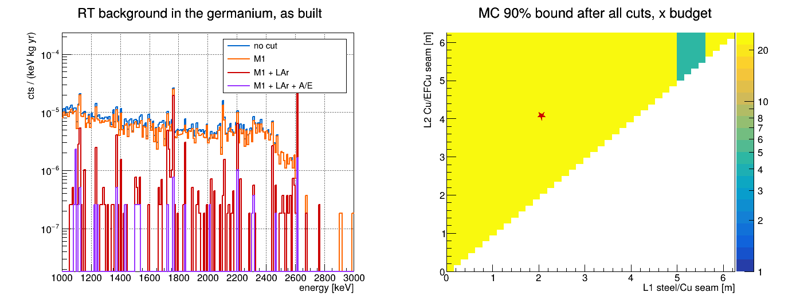
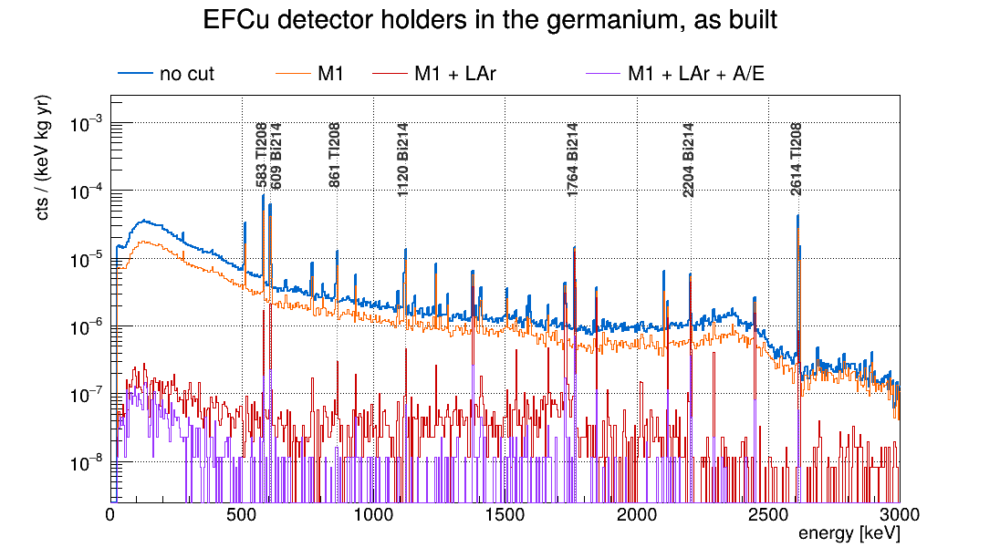
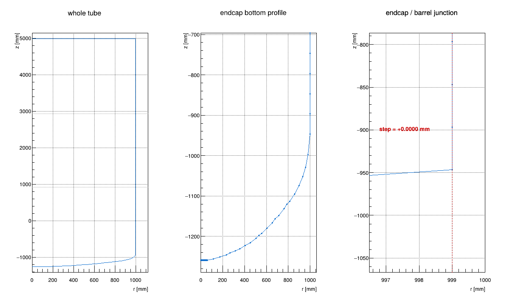

# RT and holder backgrounds

The background index (BI) at `Qbb = 2039 keV` that the re-entrant tube (RT) of LEGEND-1000 gives the
germanium array, **before and after every cut** LEGEND applies, and which mix of stainless steel (SS),
OFHC copper (Cu) and electroformed copper (EFCu) the tube can be built from while its BI after all cuts
stays under a budget of `1e-5 cts/(keV·kg·yr)`. The tube is the three materials from the top: steel
down to the seam `L1`, Cu down to `L2`, EFCu below. EFCu is the scarce one, so the search is: **the
least EFCu (`L2` as deep as possible), then the most steel (`L1` as deep as possible)**. Next to it,
the same chain gives the BI of the **EFCu detector holders** as built: the 1008 small copper pieces
that hold the detectors, 1.92 kg in all.

**What is simulated.** remage loads the whole LEGEND-1000 geometry, so Geant4 builds every volume with
its material: the tube, the underground argon (UGLAr) inside it, the 336 HPGe detectors, their
holders, PEN plates, fibres and cryostat. One nuclide decays at a time, uniformly in the tube wall or
in the holders: **Tl-208** for the ²³²Th chain and **Bi-214** for the ²³⁸U chain, the only chain
members whose gammas reach the 2 MeV region around `Qbb`. Each decay runs in full (betas, X-rays,
every gamma), and the steps it deposits in each HPGe detector and in the UGLAr are recorded.

**The detector response.** `sim/response.py` turns those steps into what LEGEND-1000 would measure,
with [reboost](https://reboost.readthedocs.io) 1.4, following the LEGEND-1000 simulation production
(legend-simflow's hit and optical tiers, with the parameters of legend1000-metadata `simprod`,
experiment `l1000dsg01`; [Detector response](#detector-response)):
- **germanium:** the energy collected through the n+ dead layer (FCCD 0.7 mm), smeared by the energy
  resolution; the A/E classifier, from each step's drift time and a current-pulse template;
- **argon:** the scintillation photons of each UGLAr step, and the photoelectrons the 252 SiPMs see
  of them, from the optical map of the underground argon.

**The analysis.** `ana/background.C` applies the cuts in LEGEND's order: **M1**, exactly one detector
above 25 keV; the **LAr veto**, rejecting a decay whose SiPMs see 4 or more photoelectrons; and the
**A/E cut**, keeping a single-site-like hit (classifier above −1.5). It counts the 360 keV background
window of MAJORANA [[1]](#references) and weights every decay by the activity of the material a design
puts at its depth, so every `(L1, L2)` comes from the same run. A design passes when the simulation's
90% upper bound on its BI after all cuts is under budget. A slab with no hits counts as 2.3 hits, so a
design can fail for lack of statistics, not only for too much background. The holders are one
material in one place: every holder decay gets the same weight, and they add to the tube's BI.

The geometry is `geom/output/l1000.gdml`, LEGEND-1000 as legend-pygeom-l1000 0.6.0 builds it
([geom/README.md](geom/README.md)). Depth is measured down from the top of the tube: 6.246 m long,
detectors at 4.9-5.9 m. As built: steel to 2.062 m, OFHC Cu to 4.067 m, EFCu below.

**Contents.** [Files](#files) · [Activities](#activities) · [Detector response](#detector-response) ·
[Run](#run) · [Results](#results) · [Limits](#limits) · [NERSC](#nersc) · [Future work](#future-work) ·
[References](#references)

## Files

| source | |
| ------ | --- |
| `sim/run.mac` | the simulation: loads the GDML, records the germanium and UGLAr steps (grouped into hits) and every decay's vertex, decays one nuclide uniformly in the wall or the holders |
| `sim/response.py` | the detector response, with reboost: per germanium hit the energy and the A/E classifier, per UGLAr hit the photoelectrons |
| `ana/background.C` | everything after it: reads the tube from the GDML and checks it, reads and checks the runs, the BI as built of the tube and of the holders through every cut, and every design |

| input | from |
| ----- | ---- |
| `geom/output/l1000.gdml` | legend-pygeom-l1000 0.6.0 ([geom/README.md](geom/README.md)) |
| `~/Documents/legend1000-metadata` | the LEGEND-1000 metadata (`6cd0209`): the detectors (`hardware/detectors/germanium/diodes`) and the production's response parameters (`simprod/config`); another path via `--metadata` or `$LEGEND1000_METADATA` |
| `output/merged_optmap_20260225_063750.lh5` | the UGLAr optical map, M. Neuberger's on NERSC [[5]](#references): 252 SiPM channels and `/all`, every SiPM summed, which is what `sim/response.py` uses (31.4 GB) |
| `output/dtmap_V00000A.lh5` | the drift-time maps (⟨100⟩ and ⟨110⟩ axes, 3500 V) of `V00000A`, the template detector the L1000 detectors copy, from SolidStateDetectors.jl, by M. Neuberger on NERSC [[5]](#references) |

`sim/run.mac` takes `-s` aliases: `GDML` the geometry; `Z`, `A` the nuclide (Tl-208: 81 208, Bi-214:
83 214); `NEV` decays; `SEED` the random stream; `VOLS` a regex over the source volumes: the whole
tube `reentrance_tube_.*`, one of its sections `reentrance_tube_copper` (EFCu: endcap, lower wall,
lid), `reentrance_tube_layer_copper_ofhc`, `reentrance_tube_layer_steel_316L`, or the holders
`hpge_string_support_weldment_copper_.*`. `sim/response.py` takes the remage outputs and, optionally,
`--gdml`, `--metadata`, `--optmap`, `--dtmap` and `--seed` (defaults: the inputs above, seed 1; each
file's random stream comes from the seed and its name). `ana/background.C` takes the tube runs, then the holder runs, as
`file=isotope` (wildcards merge files of one isotope), then the GDML; all three default to the files
below. Its printout:

| | |
| --- | --- |
| `[3]` | the tube, as read from the GDML: seams, endcap, wall thickness, and the densities of its materials |
| `[6]` | per chain: where the decays landed (all must be in the wall), hits through the cuts, how hard the LAr veto cuts (with the optical map alone too), and per section the volume, mass, activity, simulated decays and their density |
| `[7]` | per chain: hits by depth, and the decays each section needs to bound steel over it at 10% of the budget |
| `[8]` | the BI as built, per chain and section, before and after each cut; a section with no hit gets its 90% limit |
| `[9]` | the holders as built, per chain, before and after each cut, and the tube and holders together; the A/E cut on Tl-208's lines against the HADES measurement |
| `[10]` | for each `L2`, the deepest `L1` that passes after all cuts, with its masses and SS : Cu : EFCu split |

| output (in `output/`) | made by | holds |
| --------------------- | ------- | ----- |
| `tl208.lh5`, `tl208_2.lh5`, `bi214.lh5`, `bi214_2.lh5`, `holders_tl208.lh5`, `holders_bi214.lh5` | `sim/run.mac` | `stp/`: 336 tables `V<string><position>Z` (`V00101Z` ... `V04208Z`) and `liquid_argon_underground`, one row per hit, its steps as lists (`evtid`, `t0`, `edep`, `time`, `particle`, `xloc`, `yloc`, `zloc`; the HPGe also `dist_to_surf`); `vtx`, one row per decay; `tcm`; `detector_origins` |
| `tl208_hit.root` ... `holders_bi214_hit.root` | `sim/response.py` | TTrees `geds`, one row per germanium hit (`evtid`, `det` its uid, `edep` deposited and `energy` measured [keV], `aoe_class`); `lar`, one row per UGLAr hit (`evtid`, `edep` [keV], `pe` and `pe_map`, the photoelectrons with the argon beyond the map read at its edge and without); `vtx`, one row per decay (`evtid`, `xloc`, `yloc`, `zloc` [m]) |
| `tube.png` | `ana/background.C` | the tube, its endcap, and the endcap/barrel junction |
| `Tl208_Bi214_background.png` | `ana/background.C` | the tube's spectrum as built through every cut, and every design's 90% bound |
| `Tl208_Bi214_holders.png` | `ana/background.C` | the holders' spectrum as built through every cut, 0-3 MeV, their lines named |

git keeps only the PNGs.

Reference, not part of this study: `sim/EdgarSim_analysis.py` and `sim/RalphSim_materialMix.ipynb`
analyse Edgar's simulation, made with his older geometry, from its decay vertices in
`output/Tl208_EFCu_RT_nolayer_optical_map_vtx_update.parquet` and `output/Bi214_..._update.parquet`.
They read no GDML and do not run with this one.

## Activities

Chain activities, from Ralph's MaterialMix slides [[3]](#references):

| µBq/kg | ²³²Th chain | ²³⁸U chain | source, as quoted there |
| ------ | ----------- | ---------- | ----------------------- |
| steel | 1000 | 2500 | Bernhard |
| OFHC Cu | 1.1 | 1.3 | the MAJORANA assay paper [[4]](#references) |
| EFCu | 0.37 | 0.19 | M. Green, CD-1 |

- **Simulated nuclides, fixed:** Bi-214 is 100% of the ²³⁸U chain, and Tl-208 is 37% of the ²³²Th
  chain (`cfg::branch`). Each chain is assumed in equilibrium.
- **Alternatives:** the slides also list OFHC Cu from the CD-1 at 83 µBq/kg (²³²Th) and 1.2 mBq/kg
  (²³⁸U), and ask whether those are too high. Edgar's `survival_BI.py` uses 0.19 ± 0.10 (²³⁸U) and
  < 0.077 µBq/kg (²³²Th) for EFCu.
- **Where to change them:** `cfg::chain` in `ana/background.C`. A rerun of `ana/background.C` is enough;
  neither the simulation nor the response depends on them.

## Detector response

Every number comes from the LEGEND-1000 simulation production: legend1000-metadata
`simprod/config` (experiment `l1000dsg01`) and the detector record, applied with reboost
[[7]](#references) as legend-simflow's hit, optical and event tiers do [[6]](#references). There is
no LEGEND-1000 detector yet: every detector is the metadata's dummy `V99999Z`, a 3.0 kg
inverted-coaxial point contact (ICPC), and `V00000A`, whose drift times are used, has its geometry.

| | value | from |
| --- | --- | --- |
| dead layer | FCCD 0.7 mm, its outer half fully dead, linear in between | `V99999Z` `characterization.combined_0vbb_analysis`; `tier/hit` `dead_layer_fraction: 0.5` |
| energy resolution | FWHM = √(0.5 + 0.001·E) keV: 1.6 keV at `Qbb` | `pars/geds/eresmod` `default` |
| drift time | per step, interpolated between the ⟨100⟩ and ⟨110⟩ maps | `output/dtmap_V00000A.lh5` |
| A/E | A: the maximum of one template current pulse per step (amax 1250, μ 5 ns, σ 45 ns, low tail 0.35 × 150 ns, high tail 0.10 × 80 ns), smeared by σ = 4.1/0.72; E: the energy | `pars/geds/currmod` `default` |
| A/E classifier | (A/E − 1)/σ, σ = √(a + (b/E)^c) = 0.01 (a = 10⁻⁴, b = 0) | `pars/geds/aoeresmod` `default` |
| UGLAr light | reboost's LAr scintillation model, 25 photons per keV here | `reboost.spms.emitted_scintillation_photons` |
| photoelectrons | the summed optical map; amplitudes σ 0.3 PE; pulses within 16 ns merged; at most 100 PE per hit | `/all` of `output/merged_optmap_20260225_063750.lh5`; `tier/opt` |
| M1 | exactly one detector above 25 keV | `tier/evt` `geds_energy_thr_kev` |
| LAr veto | rejects a decay whose SiPMs see ≥ 4 PE in all | `tier/evt` `lar_veto_energy_sum_pe_thr` |
| A/E cut | keeps a hit whose classifier is > −1.5 | `pars/geds/psdcuts` `default.aoe.low_side` |

- **The optical map** was made with legend-pygeom-l1000 v0.4.0 [[5]](#references). Its detectors and
  SiPMs sit where this geometry's do, but its tube is 68 mm narrower and 68 mm lower, so the outer
  68 mm of this UGLAr is not in it. The map's detection probability is flat in radius out to its edge
  (4 × 10⁻³ per photon at the array's height, from r = 0 to 0.92 m), so `sim/response.py` reads a step
  beyond the edge at the edge, at its height. It also keeps the map alone (`pe_map`: no light from the
  outer 68 mm), and `[6]` gives the LAr veto both ways.
- **The SiPMs are summed:** the production also vetoes 4 SiPMs that each see light, with fewer than
  4 PE in all; with integer photoelectrons that only differs through the amplitude smearing.
- **A/E** uses the single-template model: the production's pulse-shape-library A/E needs a
  library per detector that does not exist for L1000 yet. `[9]` checks the cut on the lines of
  Tl-208 against the HADES measurement of `V00000A` [[5]](#references).

## Run

From the repository root, with remage 1.1.0 (Geant4 11.3.2), reboost 1.4.0 in `~/venvs/v` and ROOT 6.40.
Once, the two maps from NERSC (`m2676`; `nersc` is the `Host` entry in `~/.ssh/config`, see
[NERSC](#nersc)): the optical map took 51 min at 10-20 MB/s. `-m` makes remage write one file per run
instead of one per thread.

```bash
rsync -a --partial nersc:/global/cfs/cdirs/m2676/users/neuberger/L1000_optical_muon_sims/omaps/v0.4.0/ular/merged/merged_optmap_20260225_063750.lh5 output/
rsync -a nersc:/global/cfs/cdirs/m2676/users/neuberger/L1000_optical_muon_sims/hpge_related/dtmaps/gen/V00000A.lh5 output/dtmap_V00000A.lh5
```

```bash
export G=geom/output/l1000.gdml
remage -q --ignore-warnings -t 8 -w -m -o output/tl208.lh5 -s GDML=$G -s Z=81 -s A=208 -s NEV=1000000 -s SEED=1 -s VOLS='reentrance_tube_.*' -- sim/run.mac
remage -q --ignore-warnings -t 8 -w -m -o output/tl208_2.lh5 -s GDML=$G -s Z=81 -s A=208 -s NEV=2000000 -s SEED=3 -s VOLS='reentrance_tube_.*' -- sim/run.mac
remage -q --ignore-warnings -t 8 -w -m -o output/bi214.lh5 -s GDML=$G -s Z=83 -s A=214 -s NEV=1000000 -s SEED=2 -s VOLS='reentrance_tube_.*' -- sim/run.mac
remage -q --ignore-warnings -t 8 -w -m -o output/bi214_2.lh5 -s GDML=$G -s Z=83 -s A=214 -s NEV=2000000 -s SEED=4 -s VOLS='reentrance_tube_.*' -- sim/run.mac
remage -q --ignore-warnings -t 8 -w -m -o output/holders_tl208.lh5 -s GDML=$G -s Z=81 -s A=208 -s NEV=200000 -s SEED=11 -s VOLS='hpge_string_support_weldment_copper_.*' -- sim/run.mac
remage -q --ignore-warnings -t 8 -w -m -o output/holders_bi214.lh5 -s GDML=$G -s Z=83 -s A=214 -s NEV=200000 -s SEED=12 -s VOLS='hpge_string_support_weldment_copper_.*' -- sim/run.mac
~/venvs/v/bin/python sim/response.py output/tl208.lh5 output/tl208_2.lh5 output/bi214.lh5 output/bi214_2.lh5 output/holders_tl208.lh5 output/holders_bi214.lh5
root -l -b -q ana/background.C
```

| step | time (8 threads) | file |
| ---- | ---------------- | ---- |
| Tl-208, 1 M decays, seed 1 | 421 s | `tl208.lh5`, 53 MB |
| Tl-208, 2 M decays, seed 3 | 847 s | `tl208_2.lh5`, 76 MB |
| Bi-214, 1 M decays, seed 2 | 345 s | `bi214.lh5`, 47 MB |
| Bi-214, 2 M decays, seed 4 | 622 s | `bi214_2.lh5`, 67 MB |
| holders, Tl-208, 200 k decays, seed 11 | 183 s | `holders_tl208.lh5`, 196 MB |
| holders, Bi-214, 200 k decays, seed 12 | 160 s | `holders_bi214.lh5`, 103 MB |
| `sim/response.py`, all six | 74 s (13 s reading the inputs) | `*_hit.root`: 13, 26, 13, 25, 7 and 5 MB |
| `ana/background.C` | 29 s | `tube.png`, `Tl208_Bi214_background.png`, `Tl208_Bi214_holders.png` |

`sim/response.py` prints, per file, the decays, the hits, and how much of the UGLAr energy lay beyond the
optical map's edge and was read there (29-30% for the tube, 1-2% for the holders) or outside the map
even so (0.0%).

- The defaults of the last line are `"output/tl208*_hit.root=Tl208,output/bi214*_hit.root=Bi214"`,
  `"output/holders_tl208*_hit.root=Tl208,output/holders_bi214*_hit.root=Bi214"` and
  `"geom/output/l1000.gdml"`. The wildcards merge every file of a chain: 3 M tube decays each
  here. More statistics: more runs with their own seed and file name, each through `sim/response.py`.
  Never reuse a seed: two runs on one seed decay at the same points.
- The holders sit against the detectors, so their files are large per decay: 200 k decays already
  stand for ~20 000 years of the holders' real decays (`MC [yr]` in `[9]`).
- `VOLS=reentrance_tube_layer_steel_316L` (or `reentrance_tube_layer_copper_ofhc`, or
  `reentrance_tube_copper`) puts every decay in one section. Such runs merge
  with whole-tube ones, because the weights use each section's measured decay density.
- The cuts are constants in `cfg` of `ana/background.C` (`m1_keV`, `lar_pe`, `psd_low`); changing
  one needs a rerun of `ana/background.C` only. The response parameters need `sim/response.py` again.

## Results

Run on 8 Oct 2026, exactly as above: 3 M decays per chain in the tube, 200 k in the holders; Tl-208 at
37% of the ²³²Th chain.

**The BI as built, cts/(keV·kg·yr) (× the goal of 10⁻⁵), before and after each cut:**

| | no cut | M1 | M1 + LAr | M1 + LAr + A/E: all cuts |
| --- | --- | --- | --- | --- |
| tube | 5.00 × 10⁻⁶ (0.50) | 4.35 × 10⁻⁶ (0.44) | 1.45 ± 0.38 × 10⁻⁷ (0.015) | **2.2 ± 1.1 × 10⁻⁸ (0.0022)** |
| holders | 1.07 × 10⁻⁶ | 5.87 × 10⁻⁷ | 2.70 ± 0.21 × 10⁻⁸ | 1.6 ± 0.5 × 10⁻⁹ |
| tube + holders | 6.06 × 10⁻⁶ (0.61) | 4.94 × 10⁻⁶ (0.49) | 1.72 ± 0.38 × 10⁻⁷ (0.017) | **2.4 ± 1.1 × 10⁻⁸ (0.0024)** |

| | |
| --- | --- |
| behind the tube after all cuts | 4 window events, all from the EFCu: 3 Tl-208, 1 Bi-214 |
| the LAr veto, tube | keeps 1 in 40 M1 hits for Tl-208, 1 in 22 for Bi-214; read off the map alone (no light from the outer 68 mm), 1 in 14 and 1 in 10 |
| the A/E cut, holders' Tl-208 | keeps DEP 0.73, SEP 0.08, FEP 0.06, the window 0.31; measured on `V00000A` at HADES 0.90, 0.04, 0.06, 0.27 |
| SS : Cu : EFCu mass as built | 619 : 670 : 231 kg = 41 : 44 : 15 % (`[6]`, the GDML's sections) |
| the same as a design | 669 : 672 : 175 kg = 44 : 44 : 12 % (`[10]`, by depth: the EFCu lid counts as steel) |
| as built as a design, MC 90% bound | 25.2 × budget |
| least EFCu, then most steel | none can be shown to pass yet |
| decays the steel section needs | 4.6 × 10⁷ (Tl-208), 3.1 × 10⁸ (Bi-214) |

The tube as built sits far below the goal before any cut (0.50 ×) and 450 × below it after all of
them. Every cut matters: M1 removes 13%, the LAr veto 97% of what is left, and the A/E cut 85% of the
rest. The LAr veto is the strongest and the least certain: 30% of the argon energy in the tube's events
lies beyond the optical map, and reading it at the map's edge instead of seeing no light from it makes
the veto 2-3 × stronger. After all cuts the tube's BI rests on 4 window events, ±50%.

No decay in the steel section (0-2.06 m) reached a detector: no hit came from shallower than 2.5 m.
So every design with steel counts its steel slab at the 90% bound of a slab with no hit, mostly
Bi-214's (2.4 × 10⁻⁴, 24 × the budget), until that section has the decays above ([NERSC](#nersc)).
The steel is unresolved, not shown to be bad.

The holders add 7% to the tube's BI after all cuts, almost all of it Bi-214: the LAr veto removes
their Tl-208 nearly entirely (10 of 4332 M1 window hits survive) but keeps 162 of Bi-214's 558, most
likely its betas (up to 3.27 MeV) crossing from the holder straight into the germanium without
touching argon; the A/E cut then keeps 9 of them.

```
[3] the tube in geom/output/l1000.gdml: z -1259.0 .. 4987.0 mm (6.246 m), 182 points, seams EFCu | 920.0 | OFHC | 2925.0 | SS
    clean surface: on-axis points 2 (expect 2), duplicates 0, spikes 0, self-intersections 0 (expect 0)
    endcap: radius 999.0000 at z -946.6, barrel 999.0000: step +0.0000 mm
    shells against the barrel: OFHC -0.0000, SS -0.0000 mm
    wall thickness [mm]:  EFCu 1.50 (z -947)  EFCu 1.50 (z -13)  EFCu 2.10 (z 910)  OFHC 6.00 (z 1922)  SS 6.00 (z 3956)
    densities [kg/m^3], the GDML's: steel 8000, Cu 8960, EFCu 8960, holders 8960
    tube: PASS

window   : 1950-2350 keV minus 10 keV around 2039, 2103.5, 2118.5, 2204.1 keV (MAJORANA's BEW): 360 keV
cuts     : M1 (exactly one detector above 25 keV), LAr veto (the SiPMs see < 4 photoelectrons), A/E classifier > -1.5. energies: the detector response
activity : chain [uBq/kg] 232Th / 238U: steel 1000 / 2500, Cu 1.1 / 1.3, EFCu 0.37 / 0.19; Tl208 is 37.00% of 232Th, Bi214 100% of 238U

=== Tl208   (output/tl208_2_hit.root+output/tl208_hit.root, 3000000 decays)
[6] decays: EFCu 18.2%, OFHC 40.0%, SS 41.8%; in the argon 0, outside the wall 0   (merged from 2 files)
    hits: 26507, M1 22727, + LAr 571, + A/E 87; in the window: 907, 789, 13, 3
    LAr veto keeps 1 in 40 M1 hits; read off the optical map alone, without the argon beyond its edge, 1 in 14
    section mat      V [m^3]   M [kg]     A [Bq]   MC dec.  MC per m^3  decays/yr per
    mother  EFCu     0.02583    231.4  3.168e-05    545756    21131854        0.00183
    OFHC    Cu       0.07482    670.3  2.728e-04   1199116    16027695        0.00718
    SS      steel    0.07742    619.4  2.292e-01   1255128    16211020           5.76
    sampling density mother / shells = 1.311   (1.000 would be uniform; the weights use the measured density)
[7] depth [m]          decays     hits    hits/decay   window
     0.00..0.62         511776        0      0.00e+00        0
     0.62..1.25         379773        0      0.00e+00        0
     1.25..1.87         380017        0      0.00e+00        0
     1.87..2.50         377114        0      0.00e+00        0
     2.50..3.12         376625        4      1.06e-05        0
     3.12..3.75         374872       30      8.00e-05        2
     3.75..4.37         250432      395      1.58e-03       15
     4.37..5.00         123968     5548      4.48e-02      191
     5.00..5.62         124536    13314      1.07e-01      471
     5.62..6.25         100887     7216      7.15e-02      228   <- nearest the detectors
    a slab with no window hit is bounded at 2.30 x one decay's weight. to bound steel there at 10% of the budget:
      steel over SS        1255128 decays now: bound 3.7e-05, needs 4.6e+07 decays in it
      steel over OFHC      1199116 decays now: bound 3.7e-05, needs 4.5e+07 decays in it
      steel over mother     545756 decays now: bound 2.8e-05, needs 1.5e+07 decays in it

=== Bi214   (output/bi214_2_hit.root+output/bi214_hit.root, 3000000 decays)
[6] decays: EFCu 18.2%, OFHC 40.0%, SS 41.9%; in the argon 0, outside the wall 0   (merged from 2 files)
    hits: 13476, M1 12042, + LAr 545, + A/E 98; in the window: 40, 37, 7, 1
    LAr veto keeps 1 in 22 M1 hits; read off the optical map alone, without the argon beyond its edge, 1 in 10
    section mat      V [m^3]   M [kg]     A [Bq]   MC dec.  MC per m^3  decays/yr per
    mother  EFCu     0.02583    231.4  4.397e-05    545089    21106027        0.00255
    OFHC    Cu       0.07482    670.3  8.714e-04   1198771    16023084         0.0229
    SS      steel    0.07742    619.4  1.548e+00   1256140    16224091           38.9
    sampling density mother / shells = 1.309   (1.000 would be uniform; the weights use the measured density)
[7] depth [m]          decays     hits    hits/decay   window
     0.00..0.62         511514        0      0.00e+00        0
     0.62..1.25         380979        0      0.00e+00        0
     1.25..1.87         379982        0      0.00e+00        0
     1.87..2.50         376095        0      0.00e+00        0
     2.50..3.12         376662        0      0.00e+00        0
     3.12..3.75         375948        8      2.13e-05        0
     3.75..4.37         249793      115      4.60e-04        1
     4.37..5.00         124263     2764      2.22e-02       10
     5.00..5.62         123600     6901      5.58e-02       24
     5.62..6.25         101164     3688      3.65e-02        5   <- nearest the detectors
    a slab with no window hit is bounded at 2.30 x one decay's weight. to bound steel there at 10% of the budget:
      steel over SS        1256140 decays now: bound 2.5e-04, needs 3.1e+08 decays in it
      steel over OFHC      1198771 decays now: bound 2.5e-04, needs 3.0e+08 decays in it
      steel over mother     545089 decays now: bound 1.9e-04, needs 1.0e+08 decays in it

[8] background index as built [cts/(keV kg yr)], +- MC statistics; a section with no window hit gets its 90% limit
    chain  sect          win hits   no cut                 M1                     M1 + LAr               M1 + LAr + A/E        
    Tl208  steel          0/0/0/0   < 3.60e-05 (90%)       < 3.60e-05 (90%)       < 3.60e-05 (90%)       < 3.60e-05 (90%)      
           Cu             7/5/2/0   1.35e-07 +- 5.1e-08    9.97e-08 +- 4.5e-08    3.99e-08 +- 2.8e-08    < 4.58e-08 (90%)      
           EFCu      900/784/11/3   4.58e-06 +- 1.5e-07    3.99e-06 +- 1.4e-07    5.60e-08 +- 1.7e-08    1.53e-08 +- 8.8e-09   
           tube                     4.71e-06 +- 1.6e-07    4.09e-06 +- 1.5e-07    9.59e-08 +- 3.3e-08    1.53e-08 +- 8.8e-09   
    Bi214  steel          0/0/0/0   < 2.43e-04 (90%)       < 2.43e-04 (90%)       < 2.43e-04 (90%)       < 2.43e-04 (90%)      
           Cu             0/0/0/0   < 1.46e-07 (90%)       < 1.46e-07 (90%)       < 1.46e-07 (90%)       < 1.46e-07 (90%)      
           EFCu         40/37/7/1   2.83e-07 +- 4.5e-08    2.62e-07 +- 4.3e-08    4.95e-08 +- 1.9e-08    7.07e-09 +- 7.1e-09   
           tube                     2.83e-07 +- 4.5e-08    2.62e-07 +- 4.3e-08    4.95e-08 +- 1.9e-08    7.07e-09 +- 7.1e-09   
    ALL CHAINS
      no cut           5.00e-06 +- 1.7e-07 (0.5 x goal)
      M1               4.35e-06 +- 1.6e-07 (0.44 x goal)
      M1 + LAr         1.45e-07 +- 3.8e-08 (0.015 x goal)
      M1 + LAr + A/E   2.23e-08 +- 1.1e-08 (0.0022 x goal)
    win hits: per cut level, as in the columns. sections with no window hit are left out of the totals

[9] the EFCu detector holders as built: 1008 weldments, 213.7 cm^3, 1.92 kg of EFCu at 0.37 / 0.19 uBq/kg 232Th / 238U
    chain     decays     A [Bq]   MC [yr]     hits        win hits   no cut                 M1                     M1 + LAr               M1 + LAr + A/E        
    Tl208     200000  2.622e-07     24173   189614  8391/4332/10/1   9.64e-07 +- 1.1e-08    4.98e-07 +- 7.6e-09    1.15e-09 +- 3.6e-10    1.15e-10 +- 1.1e-10   
    Bi214     200000  3.639e-07     17418   111835   636/558/162/9   1.01e-07 +- 4.0e-09    8.90e-08 +- 3.8e-09    2.58e-08 +- 2.0e-09    1.44e-09 +- 4.8e-10   
             holders                                                 1.07e-06 +- 1.1e-08    5.87e-07 +- 8.4e-09    2.70e-08 +- 2.1e-09    1.55e-09 +- 4.9e-10   
    TUBE + HOLDERS
      no cut           6.06e-06 +- 1.7e-07 (0.61 x goal)
      M1               4.94e-06 +- 1.6e-07 (0.49 x goal)
      M1 + LAr         1.72e-07 +- 3.8e-08 (0.017 x goal)
      M1 + LAr + A/E   2.39e-08 +- 1.1e-08 (0.0024 x goal)
    MC [yr]: the years of real decays the run stands for
    A/E cut on M1 hits of the holders' Tl208, kept (hits):  DEP 1592.5 0.73 (108)  SEP 2103.5 0.08 (412)  FEP 2614.5 0.06 (4396)  window 0.31 (4332)
    the same measured on V00000A at HADES:                   DEP 1592.5 0.90       SEP 2103.5 0.04       FEP 2614.5 0.06       window 0.27     

[10] designs of the tube: steel to L1, Cu to L2, EFCu below. MC alone, after all cuts; passes if its 90% bound <= the budget 1e-05
    L2 [m]  EFCu [kg]  steel to steel [kg]   Cu [kg]   SS:Cu:EFCu mass          BI   90% bound  x budget
    3.00          531         -   no steel can be shown to pass yet
    3.25          447         -   no steel can be shown to pass yet
    3.50          363         -   no steel can be shown to pass yet
    3.75          278         -   no steel can be shown to pass yet
    4.00          194         -   no steel can be shown to pass yet
    4.07          175    2.06 m        669       672    44 : 44 : 12 %    2.23e-08    2.52e-04     25.19   <- as built
    4.25          158         -   no steel can be shown to pass yet
    4.50          137         -   no steel can be shown to pass yet
    4.75          116         -   no steel can be shown to pass yet
    5.00           95         -   no steel can be shown to pass yet
    5.25           74         -   no steel can be shown to pass yet
    5.50           53         -   no steel can be shown to pass yet
    5.75           32         -   no steel can be shown to pass yet
    6.00           11         -   no steel can be shown to pass yet
    no design with steel passes on the MC alone: [7] says how many decays its slabs need
    masses in kg; steel includes the lid, which sits in the top slab

wrote output/Tl208_Bi214_background.png and output/tube.png
wrote output/Tl208_Bi214_holders.png
```



Left: the tube's spectrum as built, through every cut; the LAr veto removes almost everything, the A/E
cut most of the rest, and the 2614.5 keV line of Tl-208 is what survives longest. Right: every design's
90% bound after all cuts, in units of the budget; the star is the tube as built. The flat ~25 ×
wherever there is steel is the bound of the empty steel slab, not a measured background; the patch at
4 × is steel reaching down to the detectors, where window hits exist and the bound is an estimate.



The holders' spectrum as built, through every cut, with the lines of Tl-208 and Bi-214 named: the
full-energy peaks stand on the Compton continuum without cuts; after the LAr veto and the A/E cut,
what is left in the window is almost all Bi-214 (`[9]`).



`[3]` passes: one clean outline, the endcap flush with the barrel where they meet at z = −947 mm
(right panel), the OFHC and steel shells on the barrel. The walls: EFCu 1.5 mm, thickening to 2.1 mm
at the OFHC seam; OFHC and steel 6 mm. The densities are the GDML's: steel 8.0 g/cm³, every copper
8.96.

`[6]` checks the decays: all are in the wall. remage 1.1 fills the EFCu (the mother volume) about 1.3 ×
as densely as the two shells inside it; the weights use each section's measured density, so this
costs nothing but statistics.

## Limits

- **No LEGEND-1000 detector exists yet:** every detector is the dummy `V99999Z`, with the production's
  default resolution, current model and A/E cut. The A/E cut keeps 73% of the double-escape peak
  where LEGEND tunes it to 90%, and 31% of the window's continuum against 27% measured.
- **A/E** is the single-template estimate, not a pulse-shape library.
- **The optical map** is the v0.4.0 geometry's: the outer 68 mm of this UGLAr is read at the map's edge
  (`pe_map` and `[6]` give the veto without it), and argon above z = 1.375 m gives no light.
- **The SiPMs are summed:** the production's second veto condition (4 SiPMs with light) is not applied.
- No random coincidences in the SiPMs (the production's default for `l1000dsg01` too).
- Reweighting changes activities, not geometry: it holds while the tube and the detectors stay put.
- The lid at the top takes the top slab's material in every design, the tube as built included.
- Each chain is assumed in equilibrium down to Tl-208 and Bi-214.
- The holders take EFCu's bulk activity, with no surface contamination from handling; their volume is
  computed from their shape in the GDML (1008 × 212.04 mm³), since ROOT cannot import this GDML.
- Only Tl-208 and Bi-214 decay, so the holders' spectrum lacks the other chain members' lines (238 keV
  of Pb-212, 352 keV of Pb-214); they do not reach the window.
- A design with steel can only pass once its steel slab has enough decays.

## NERSC

Three sets of runs, each confining the decays to one section of the tube, as job arrays of 10⁷
decays per task on Perlmutter (`m2676`, the LEGEND allocation):

| stage | section (`VOLS`) | tasks (seeds) | what it fixes |
| ----- | ---------------- | ------------- | ------------- |
| A | the EFCu, `reentrance_tube_copper` | Tl-208 7001-7003, Bi-214 8001-8003 | the ±50% of the BI after all cuts: its 4 window events all come from the EFCu; 75% of these decays land below the OFHC seam (24% in the lid), against 14% of a whole-tube run, so stage A brings ~200 events, ±8% |
| B | the steel, `reentrance_tube_layer_steel_316L` | Tl-208 3001-3005, Bi-214 4001-4031 | the steel section, where no decay has reached a detector yet: hits appear, or its bound falls to 10% of the budget (`[7]`) |
| C | the OFHC, `reentrance_tube_layer_copper_ofhc` | Tl-208 5001-5005, Bi-214 6001-6030 | the same for the OFHC section, where steel would reach below the seam |

Every command runs from the repository root on the Mac: `nersc` is the `Host` entry for
perlmutter.nersc.gov in `~/.ssh/config`, and `$SCRATCH` is expanded on Perlmutter. When `ssh nersc`
asks for a password and one-time code, its 24-hour key has expired: renew it with NERSC's `sshproxy`.
Once, the work folder, the two files the runs need, and the remage container:

```bash
ssh nersc 'mkdir -p $SCRATCH/LEGEND1000-Simulation/sim $SCRATCH/LEGEND1000-Simulation/geom/output $SCRATCH/LEGEND1000-Simulation/output'
rsync -a geom/output/l1000.gdml nersc:'$SCRATCH/LEGEND1000-Simulation/geom/output/'
rsync -a sim/run.mac nersc:'$SCRATCH/LEGEND1000-Simulation/sim/'
ssh nersc 'shifterimg pull docker:legendexp/remage:v1.1.0'
```

`--module=none` keeps Shifter from adding NERSC's MPI libraries to the container: with them, remage
stops at start with a `libcurl` symbol error. A test first, 20 000 decays on the debug queue (it
starts within minutes and runs for a few; on 8 Oct 2026 it took 2 min 37 s, most of it start-up and
merging, and 3.6 GB of memory):
`squeue --me` shows it `PD` (waiting), then `R` (running), then nothing (done); its log should end
with remage's `Finished post-processing`, next to `output/rt_test.lh5`.

```bash
ssh nersc 'cd $SCRATCH/LEGEND1000-Simulation && sbatch --account=m2676 --qos=debug --constraint=cpu --nodes=1 --time=00:30:00 --output=output/rt_test.log --image=docker:legendexp/remage:v1.1.0 --job-name=rt_test --wrap "shifter --module=none remage -q --ignore-warnings -t 32 -w -m -s GDML=geom/output/l1000.gdml -s NEV=20000 -s SEED=9999 -o output/rt_test.lh5 -s Z=81 -s A=208 -s VOLS=reentrance_tube_copper -- sim/run.mac"'
ssh nersc 'squeue --me'
ssh nersc 'tail -3 $SCRATCH/LEGEND1000-Simulation/output/rt_test.log; ls -la $SCRATCH/LEGEND1000-Simulation/output'
```

Stage A, then B, then C (each line one array; all can wait in the queue together):

```bash
ssh nersc 'cd $SCRATCH/LEGEND1000-Simulation && sbatch --account=m2676 --qos=shared --constraint=cpu --cpus-per-task=32 --time=06:00:00 --output=output/%x_%a.log --image=docker:legendexp/remage:v1.1.0 --array=7001-7003 --job-name=rt_tl208_efcu --wrap "shifter --module=none remage -q --ignore-warnings -t 32 -w -m -s GDML=geom/output/l1000.gdml -s NEV=10000000 -s SEED=\$SLURM_ARRAY_TASK_ID -o output/tl208_\$SLURM_ARRAY_TASK_ID.lh5 -s Z=81 -s A=208 -s VOLS=reentrance_tube_copper -- sim/run.mac"'
ssh nersc 'cd $SCRATCH/LEGEND1000-Simulation && sbatch --account=m2676 --qos=shared --constraint=cpu --cpus-per-task=32 --time=06:00:00 --output=output/%x_%a.log --image=docker:legendexp/remage:v1.1.0 --array=8001-8003 --job-name=rt_bi214_efcu --wrap "shifter --module=none remage -q --ignore-warnings -t 32 -w -m -s GDML=geom/output/l1000.gdml -s NEV=10000000 -s SEED=\$SLURM_ARRAY_TASK_ID -o output/bi214_\$SLURM_ARRAY_TASK_ID.lh5 -s Z=83 -s A=214 -s VOLS=reentrance_tube_copper -- sim/run.mac"'
ssh nersc 'cd $SCRATCH/LEGEND1000-Simulation && sbatch --account=m2676 --qos=shared --constraint=cpu --cpus-per-task=32 --time=04:00:00 --output=output/%x_%a.log --image=docker:legendexp/remage:v1.1.0 --array=3001-3005 --job-name=rt_tl208_ss --wrap "shifter --module=none remage -q --ignore-warnings -t 32 -w -m -s GDML=geom/output/l1000.gdml -s NEV=10000000 -s SEED=\$SLURM_ARRAY_TASK_ID -o output/tl208_\$SLURM_ARRAY_TASK_ID.lh5 -s Z=81 -s A=208 -s VOLS=reentrance_tube_layer_steel_316L -- sim/run.mac"'
ssh nersc 'cd $SCRATCH/LEGEND1000-Simulation && sbatch --account=m2676 --qos=shared --constraint=cpu --cpus-per-task=32 --time=04:00:00 --output=output/%x_%a.log --image=docker:legendexp/remage:v1.1.0 --array=4001-4031 --job-name=rt_bi214_ss --wrap "shifter --module=none remage -q --ignore-warnings -t 32 -w -m -s GDML=geom/output/l1000.gdml -s NEV=10000000 -s SEED=\$SLURM_ARRAY_TASK_ID -o output/bi214_\$SLURM_ARRAY_TASK_ID.lh5 -s Z=83 -s A=214 -s VOLS=reentrance_tube_layer_steel_316L -- sim/run.mac"'
ssh nersc 'cd $SCRATCH/LEGEND1000-Simulation && sbatch --account=m2676 --qos=shared --constraint=cpu --cpus-per-task=32 --time=04:00:00 --output=output/%x_%a.log --image=docker:legendexp/remage:v1.1.0 --array=5001-5005 --job-name=rt_tl208_cu --wrap "shifter --module=none remage -q --ignore-warnings -t 32 -w -m -s GDML=geom/output/l1000.gdml -s NEV=10000000 -s SEED=\$SLURM_ARRAY_TASK_ID -o output/tl208_\$SLURM_ARRAY_TASK_ID.lh5 -s Z=81 -s A=208 -s VOLS=reentrance_tube_layer_copper_ofhc -- sim/run.mac"'
ssh nersc 'cd $SCRATCH/LEGEND1000-Simulation && sbatch --account=m2676 --qos=shared --constraint=cpu --cpus-per-task=32 --time=04:00:00 --output=output/%x_%a.log --image=docker:legendexp/remage:v1.1.0 --array=6001-6030 --job-name=rt_bi214_cu --wrap "shifter --module=none remage -q --ignore-warnings -t 32 -w -m -s GDML=geom/output/l1000.gdml -s NEV=10000000 -s SEED=\$SLURM_ARRAY_TASK_ID -o output/bi214_\$SLURM_ARRAY_TASK_ID.lh5 -s Z=83 -s A=214 -s VOLS=reentrance_tube_layer_copper_ofhc -- sim/run.mac"'
```

Watching, and stopping everything if something is wrong:

```bash
ssh nersc 'squeue --me'
ssh nersc 'sacct -X -S today --format=JobID%18,JobName%16,State,Elapsed'
ssh nersc 'scancel -u $USER'
```

What to expect: each task is 32 CPU threads (an eighth of a node) for roughly 30-60 minutes (steel,
OFHC) to 1-2 hours (EFCu, whose decays sit next to the detectors), scaled from the times above; the
limits (4 and 6 hours) leave room. The 77 tasks run side by side as the queue allows, usually within the day,
and charge ~5-10 node-hours to `m2676`. Each writes `output/<nuclide>_<seed>.lh5` (~0.25 GB for steel
and OFHC, ~1 GB for EFCu; ~25 GB in all) and a log. After a stage, here: the files come back, get
their detector response (earlier files are redone in seconds, their germanium identically: each
file's random stream comes from its name), and the analysis merges
them with the rest by section.

```bash
rsync -a --include='*_[0-9][0-9][0-9][0-9].lh5' --exclude='*' nersc:'$SCRATCH/LEGEND1000-Simulation/output/' output/
~/venvs/v/bin/python sim/response.py output/*_[0-9][0-9][0-9][0-9].lh5
root -l -b -q ana/background.C
```

`$SCRATCH` is purged after 8 weeks without access; once the files are here, `ssh nersc 'rm -r
$SCRATCH/LEGEND1000-Simulation'` frees it.

## Future work

| ‹placeholder› | adds | needs |
| ------------- | ---- | ----- |
| ‹optical map for this geometry› | the light of the outer 68 mm of the UGLAr, instead of reading it at the v0.4.0 map's edge | the map's workflow (remage with optical physics, `reboost-optmap create` and `merge`) on NERSC with `geom/output/l1000.gdml`, its range out to r = 1.0 m |
| ‹per-SiPM veto› | the production's second LAr veto condition, 4 SiPMs with light | the 252 channels of the map (31 GB), applied one SiPM at a time |
| ‹pulse-shape-library A/E› | A/E that knows where in the crystal the charge was made | a pulse-shape library per detector (legend-simflow's `simulate_psd_with_psl`) |
| ‹A/E cut tuning› | the low-side cut at 90% double-escape survival, as LEGEND sets it | a ²²⁸Th calibration simulation in this geometry, or HADES data |
| ‹real detector parameters› | each detector's own FCCD, resolution and A/E | the detectors, characterized (HADES), in legend1000-metadata |
| ‹random coincidences› | SiPM light from ³⁹Ar and dark noise, which vetoes some signal too | forced-trigger SiPM data |
| ‹survival check› | cut survival against the design report and Edgar's chain | nothing new |
| ‹reach extrapolation› | an estimate where the MC has no hits, without more decays | a validated model of how the hit probability falls with height |
| ‹per-detector rates› | the tube's fingerprint in data: each detector's 2615 and 1764 keV rates | nothing new |
| ‹purity requirement› | the activity at which a section alone gives the goal | nothing new |
| ‹Hall C geometry› | 12-detector strings and a longer tube | `string: units: n: 12` in a legend-pygeom-l1000 config; the tube length is fixed in its code |
| ‹margin› | a design that survives activities being off (MAJORANA's came out ~5 x low [[1]](#references)) | a budget below the whole goal |

## References

1. C.R. Haufe et al. (MAJORANA), "Modeling Backgrounds for the MAJORANA DEMONSTRATOR", arXiv:2209.10592 (2023).
2. I.J. Arnquist et al. (MAJORANA), "Final result of the MAJORANA DEMONSTRATOR's search for neutrinoless
   double-β decay in ⁷⁶Ge", arXiv:2207.07638 (2022): the window's three excluded lines.
3. R. Massarczyk, "Re-entrant tube material combination vs ROI", 23 Jun 2026, `2026-06-23-MaterialMix.pdf`
   (activities on pp. 5 and 15, the argon threshold on p. 4).
4. MAJORANA Collaboration, "Assay-based background projection for the MAJORANA DEMONSTRATOR using Monte
   Carlo uncertainty propagation", Phys. Rev. C 110, 055804 (2024).
5. M. Neuberger, LEGEND-1000 optical and HPGe simulation inputs, NERSC
   `/global/cfs/cdirs/m2676/users/neuberger/L1000_optical_muon_sims/`: the UGLAr optical map
   (`omaps/v0.4.0/ular/merged/`, legend-pygeom-l1000 v0.4.0, 5 mm voxels over x, y ±0.95 m, z ±1.375 m);
   the `V00000A` drift-time maps (`hpge_related/dtmaps/`) and its record with the HADES A/E survival
   fractions (`hpge_related/definition/diodes/V00000A.yaml`).
6. LEGEND, legend-simflow (github.com/legend-exp/legend-simflow, the `hit`, `opt` and `evt` tiers) and
   legend1000-metadata (`simprod/config`, `6cd0209`).
7. reboost 1.4.0, reboost.readthedocs.io.
