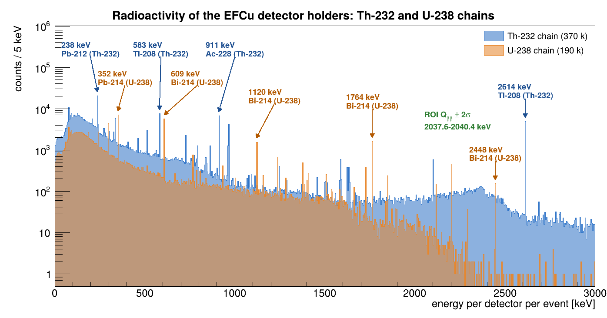
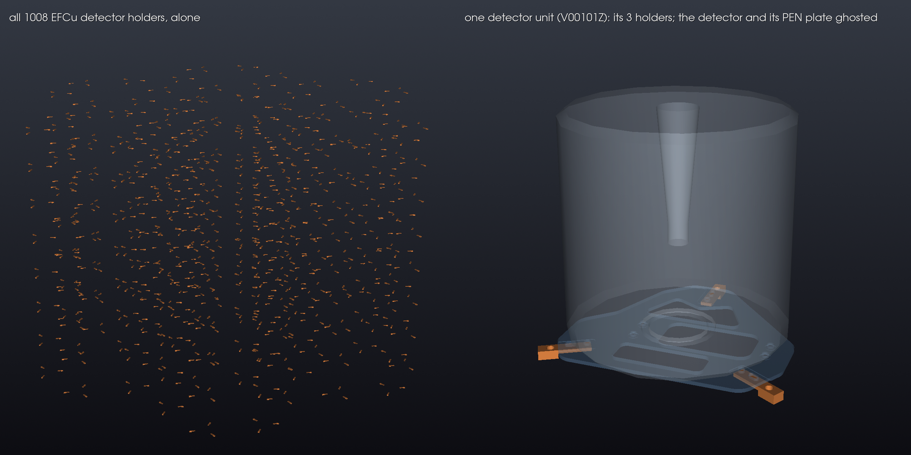
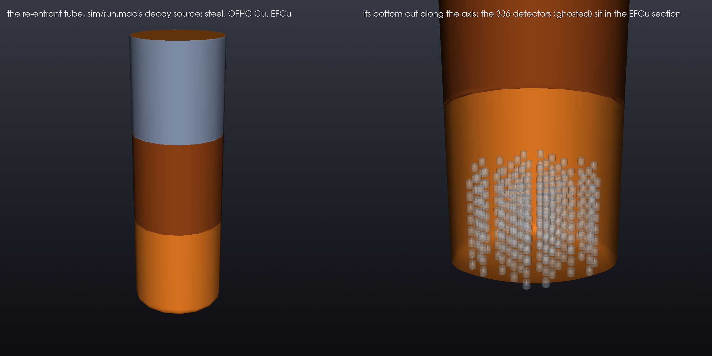
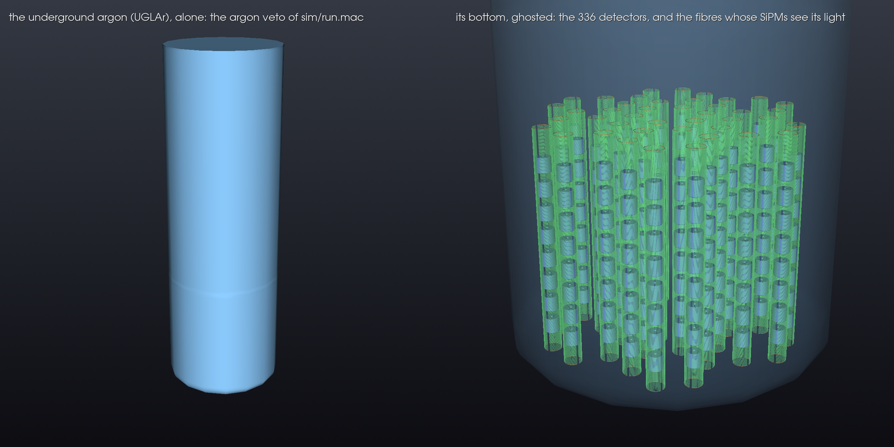
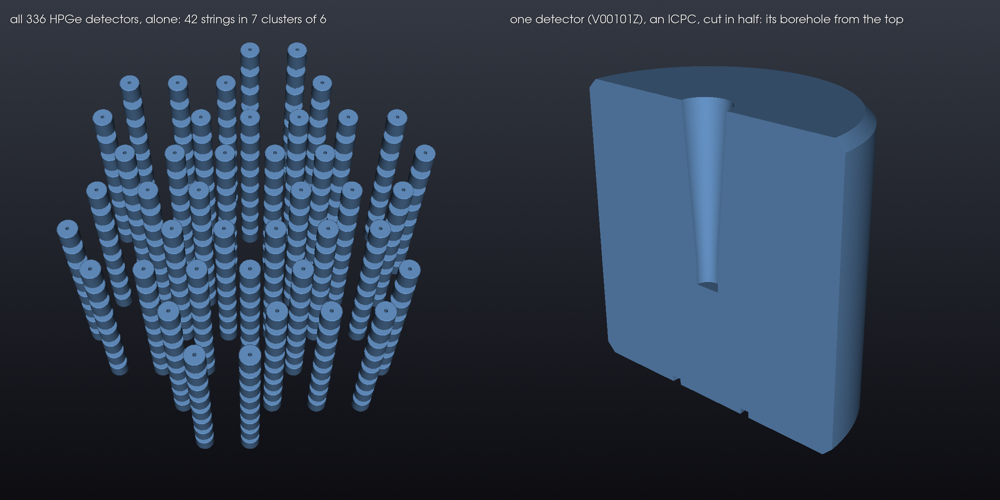
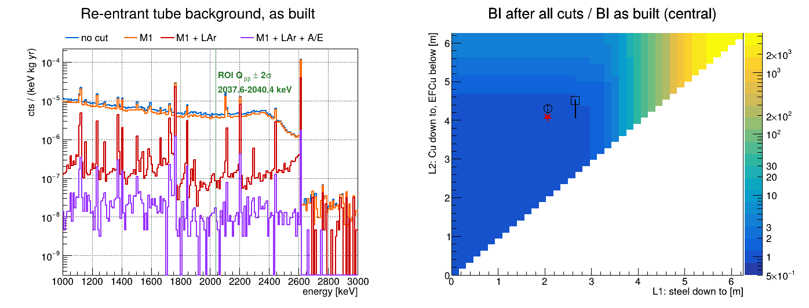

# LEGEND-1000 re-entrance tube

The re-entrance tube (RT) holds the underground argon (UGLAr) and the detector array. As built it is steel
(SS) from the top down to 2.06 m, OFHC copper (Cu) down to 4.07 m, and electroformed copper (EFCu) below,
next to the detectors. EFCu is the cleanest and the most expensive, steel the dirtiest and the cheapest.
This study asks how much of the tube can be made cheaper without its background rising.

[Proof of concept](#proof-of-concept-how-radioactive-is-efcu) · [Goal](#goal) · [Method](#method) ·
[Results](#results) · [More statistics](#more-statistics-from-nersc) · [Run](#run) · [Files](#files) ·
[Limits](#limits) · [Future work](#future-work) · [References](#references)

## Proof of concept: how radioactive is EFCu?

Before the tube: what electroformed copper's own radioactivity looks like in the detectors. The 1008 EFCu
detector holders, right under the detectors, are simulated with EFCu's Th-232 and U-238 activities. Every
line of both chains shows up, and with them the two that threaten `Qββ`: **Tl-208 at 2614 keV** and
**Bi-214 at 2448 keV**, whose gammas can leave 2039 keV in a detector. Even the cleanest copper puts them
there, which is why the tube's material mix matters. Nothing else is derived from the holders.



Blue: the Th-232 chain; orange: the U-238 chain; green: the ROI, `Qββ` ± 2σ = 2037.6-2040.4 keV (σ from the
resolution in [Inputs](#inputs)). Pb-212 238 keV is the strongest line, then Pb-214 352, Tl-208 583,
Bi-214 609, Ac-228 911 (and 969), Bi-214 1120 and 1764 keV, and the two above `Qββ`, Bi-214 2448 and
Tl-208 2614 keV. At the ROI the Th-232 chain dominates.



Left: the 1008 holders alone. Right: one detector unit, its 3 holders (copper) clamping the PEN plate
under the detector (both ghosted).

- **The holders**, found in the geometry: `hpge_string_support_weldment_copper`, which
  legend-pygeom-l1000 builds as "the copper weldment holding a detector unit to the support rods", 3 under
  each detector's PEN plate, 1008 in all, 1.92 kg (`geom/l1000-autopeel.py --holders`).
- **Simulated** (`sim/holders.mac`): a whole chain decays per event, Th-232 down to Pb-208 or U-238 down to
  Pb-206, every member once, as in secular equilibrium. 370 k Th-232 and 190 k U-238 chains, the ratio of
  EFCu's activities (0.37 : 0.19 µBq/kg), so the two spectra add as counted.
- **The spectrum** (`ana/holders.C`): the energy each detector gets per event, its steps within 10 µs summed
  (a chain's members decay minutes to years apart), all 336 detectors, 5 keV bins, log scale. Raw deposited
  energy: no dead layer, resolution or cuts.

```bash
remage -q --ignore-warnings -t 8 -w -o output/holders_th232.root -s GDML=geom/l1000.gdml -s Z=90 -s A=232 -s NEV=370000 -s SEED=21 -- sim/holders.mac
remage -q --ignore-warnings -t 8 -w -o output/holders_u238.root -s GDML=geom/l1000.gdml -s Z=92 -s A=238 -s NEV=190000 -s SEED=22 -- sim/holders.mac
~/venvs/v/bin/python geom/l1000-autopeel.py --holders output/holders_geometry.png
root -l -b -q ana/holders.C
```

Th-232: 3.5 min, 150 MB; U-238: 2.5 min, 60 MB (8 threads); the picture 1 s; the spectrum 6 s. Run on 9 Oct 2026:

```
the detector holders: hpge_string_support_weldment_copper, 1008 placements, 3 per detector (336 detectors); metal_copper, 212 mm3 each, 1.92 kg in all
close-up: V00101Z at (214, 0, 93) mm, its 3 holders 4.7 mm below the detector's base
wrote output/holders_geometry.png
output/holders_th232.root: 370000 chains, 5005703 germanium steps -> 434263 detector events
output/holders_u238.root: 190000 chains, 1960954 germanium steps -> 176339 detector events
wrote output/holders_spectrum.png
```

## Goal

1. **The tube's background index (BI) as built**, before and after the cuts.
2. **The cheapest tube as clean as the one built:** the least EFCu, then the most steel, Cu filling the
   rest, whose BI after all cuts is at most 10% above the tube's as built, at 90% confidence. The seams are
   `L1` (steel / Cu) and `L2` (Cu / EFCu), as depths from the top.

| answer | |
| --- | --- |
| BI as built | 4.71 × 10⁻⁶ cts/(keV·kg·yr) before the cuts; **1.13 ± 0.13 × 10⁻⁸ after them** (1.1-3.4 × 10⁻⁸ within the optical map's uncertainty) |
| less EFCu, shown at 90% | EFCu from 4.30 m instead of 4.07 m, 21 kg less, BI at most +6%: **669 : 692 : 154 kg = 44 : 46 : 10 % SS : Cu : EFCu** |
| less EFCu and more steel, central value only | steel to 2.66 m (0.60 m more), EFCu from 4.50 m (0.43 m less), BI +8%: **849 : 507 : 137 kg = 57 : 34 : 9 %**; not shown at 90% yet |
| as built | 669 : 672 : 175 kg = 44 : 44 : 12 % |
| what it takes to show more steel | ~3 × 10⁹ more Bi-214 and ~4 × 10⁸ more Tl-208 decays in the OFHC section (running, [More statistics](#more-statistics-from-nersc)), and the optical map for this geometry |

## Method

### The geometry

The full LEGEND-1000 geometry, `geom/l1000.gdml` (legend-pygeom-l1000 0.6.0, [geom/README.md](geom/README.md)).
The tube is 6.246 m tall and 0.999 m in radius; the 336 detectors sit 4.8-5.9 m below its top, inside the
EFCu section. Walls: EFCu 1.5 mm (2.1 mm at the OFHC seam), OFHC and steel 6 mm; the steel and OFHC are
shells on the barrel, the lid on top is EFCu. `ana/background.C` reads and checks it (`[3]`).


The tube's three sections are the decay sources (steel : OFHC : EFCu = 619.0 : 669.9 : 231.3 kg). The
underground argon around the detectors (18.82 m³, 26.16 t) is the veto, its light read by 12096 fibres and
252 SiPMs. Each detector is an ICPC, 90.0 mm tall and 88.8 mm across, its borehole 53 mm deep from the
top: 3.044 kg, 1022.8 kg in all.





### From decays to a background index

1. **Simulation** (`sim/run.mac`, remage). One nuclide decays uniformly in the tube wall: **Tl-208**
   (²³²Th chain) or **Bi-214** (²³⁸U chain), the only chain members whose gammas reach `Qββ`. It records the
   energy each decay leaves in each detector and in the UGLAr. Runs confined to one section on NERSC add
   statistics where whole-tube runs have little.
2. **Detector response** (`sim/response.py`, reboost 1.4): in the germanium the energy through the dead
   layer, the resolution and the A/E classifier; in the UGLAr the photoelectrons the SiPMs see, from the
   optical map. Every random number comes from one seeded stream per file, so a rerun gives the same result.
3. **Cuts and BI** (`ana/background.C`), in LEGEND's order: **M1** (exactly one detector above 25 keV), the
   **LAr veto** (< 4 photoelectrons), **A/E** (single-site-like, at the value that keeps 90% of the Tl-208
   double-escape peak). The BI counts MAJORANA's 360 keV window around `Qββ` [[1]](#references), per keV,
   per kg of germanium (1000 kg), per year. Each decay is weighted by the activity of the material at its
   depth (`[6]`), so one simulation serves every SS / Cu / EFCu design.

### Inputs

**Activities** (`cfg::chain` in `ana/background.C`), from Ralph's MaterialMix slides [[3]](#references),
µBq/kg. Bi-214 is 100% of the ²³⁸U chain; Tl-208 35.94% of the ²³²Th chain, the Bi-212 alpha branch
[[8]](#references) (`cfg::branch`). Chains in equilibrium. Changing them needs only `ana/background.C`.

| | ²³²Th chain | ²³⁸U chain | source quoted there |
| --- | --- | --- | --- |
| steel | 1000 | 2500 | Bernhard |
| OFHC Cu | 1.1 | 1.3 | MAJORANA assay [[4]](#references) (the CD-1 lists 83 / 1200) |
| EFCu | 0.37 | 0.19 | M. Green, CD-1 |

**Detector response**, from the LEGEND-1000 simulation production (legend1000-metadata `simprod/config`,
experiment `l1000dsg01`) [[6]](#references), applied with reboost [[7]](#references). No LEGEND-1000
detector exists yet: every detector is the dummy `V99999Z`, with the drift times of `V00000A`, which has
its geometry.

| | value | from |
| --- | --- | --- |
| dead layer | FCCD 0.7 mm, outer half fully dead, linear in between | `V99999Z`; `tier/hit` `dead_layer_fraction` 0.5 |
| resolution | FWHM = √(0.5 + 0.001·E) keV: 1.59 keV at `Qββ` | `pars/geds/eresmod` |
| A/E | A: max of one template current pulse per step, at its drift time; σ_A/E = 0.01 | `pars/geds/currmod`, `aoeresmod`; `output/dtmap_V00000A.lh5` |
| photoelectrons | LAr scintillation × the summed optical map; σ 0.3 PE, 16 ns merging, ≤ 100 PE per hit | `/all` of the optical map; `tier/opt` |
| M1, LAr veto | one detector above 25 keV; rejects ≥ 4 PE summed | `tier/evt` |
| A/E cut | classifier > −1.10, tuned to keep 90% of the Tl-208 DEP (`[5]`); the production's −1.5 keeps 91% | LEGEND's convention |

- **The A/E cut:** a gamma that scatters several times inside the crystal (multi-site) gives a broad, low
  current pulse, so its A/E is low. 0νββ, two electrons absorbed in one spot (single-site), gives A/E ≈ 1.
  The low-side cut throws away the low-A/E, multi-site events. LEGEND sets it so that 90% of the Tl-208
  double-escape peak (1592.5 keV, single-site like 0νββ) survives; `[5]` does the same on the simulated
  peak, its continuum subtracted from sidebands 5-10 keV away.
- **The optical map** (v0.4.0, M. Neuberger [[5]](#references)) has this geometry's detectors and SiPMs,
  but its tube is 68 mm narrower and it ends at z = 1.375 m. `sim/response.py` reads a step in the missing
  outer 68 mm at the map's edge, where its detection probability is flat (`pe`), and also keeps the map
  alone (`pe_map`, no light from there): the two bracket the BI.

### Judging a design

A design differs from the tube as built only in the depths whose material changes, so its BI is the
as-built's plus that change. Too few events survive all cuts far from the detectors to count the change on
them, so it is counted on the events that pass M1, 100-500 times more, times `S`, the share of them all
cuts keep, measured where the change is (`[7]`):

- near the detectors (below 4.37 m), per chain: 2.0 × 10⁻³ (Tl-208), 9.9 × 10⁻³ (Bi-214);
- higher up, both chains together: 4 of 662 = 6.0 × 10⁻³ (90% bound 1.2 × 10⁻²). Tl-208's events survive
  ~3 × more often there, partly because the optical map gives no light above z = 1.375 m.

The 90% bound on the change adds, per chain, per change (Cu or EFCu to steel, EFCu to Cu) and per region,
the Poisson limit on its M1 events (2.3 if none) × `S` × the largest weight change there. A depth range
with no event still costs its bound, so more steel can only be shown where the simulation has enough
decays. A design passes when the bound is at most 10% of the BI as built (`cfg::simTol`); the central value
is shown too.

## Results

Run on 9 Oct 2026: 776 M tube decays (Tl-208: 3 M whole tube, 30 M EFCu, 50 M steel, 50 M OFHC; Bi-214:
3 M, 30 M, 310 M, 300 M).

**The tube as built, BI in cts/(keV·kg·yr) (× the LEGEND-1000 goal of 10⁻⁵):**

| | no cut | M1 | M1 + LAr | all cuts |
| --- | --- | --- | --- | --- |
| tube | 4.71 × 10⁻⁶ (0.47) | 4.01 × 10⁻⁶ (0.40) | 1.16 ± 0.04 × 10⁻⁷ (0.012) | **1.13 ± 0.13 × 10⁻⁸ (0.0011)** |
| tube, LAr veto from the optical map alone | | | 2.85 ± 0.06 × 10⁻⁷ (0.029) | **3.36 ± 0.19 × 10⁻⁸ (0.0034)** |
| steel shell, 90% limit | | | | < 8.8 × 10⁻⁷ (Tl-208), < 1.0 × 10⁻⁶ (Bi-214) |

- **The cuts:** M1 removes 15%, the LAr veto 97% of the rest, A/E 90% of what is left. After all cuts: 107
  window events (±12%), 104 from the EFCu (83 Tl-208, 21 Bi-214), 3 from the OFHC, none from the steel.
- **The LAr veto** is the strongest and least certain cut: 30% of the argon energy lies beyond the optical
  map. Read at its edge: 1.13 × 10⁻⁸; no light from there: 3.36 × 10⁻⁸.
- **The A/E cut** (classifier > −1.10) keeps DEP 0.90, SEP 0.02, FEP 0.04, window 0.26; HADES measured
  0.90, 0.04, 0.06, 0.27 on `V00000A` [[5]](#references).

**The designs** (`[9]`; rise = BI over the tube's as built):

| EFCu from (`L2`) | EFCu | at 90%: steel to | SS : Cu : EFCu | rise ≤ | central: steel to | SS : Cu : EFCu | rise |
| --- | --- | --- | --- | --- | --- | --- | --- |
| 4.07 m, as built | 175 kg | 2.06 m | 669 : 672 : 175 kg | 0% | 2.66 m | 849 : 470 : 175 kg | 0% |
| 4.20 m | 163 kg | 2.06 m | 669 : 684 : 163 kg | 3% | 2.66 m | 849 : 482 : 163 kg | 1% |
| **4.30 m** | **154 kg** | **2.06 m** | **669 : 692 : 154 kg** | **6%** | 2.66 m | 849 : 490 : 154 kg | 3% |
| **4.50 m** | **137 kg** | fails | | | **2.66 m** | **849 : 507 : 137 kg** | **8%** |
| 4.60 m and deeper | ≤ 129 kg | fails | | | fails | | |

- **EFCu** can start 23 cm lower, at 4.30 m (154 kg, −12%), shown at 90%; on the central value at 4.50 m
  (137 kg, −22%). Below that the OFHC next to the detectors, at 3-7 × EFCu's activity, adds too much at any
  steel seam.
- **Steel** reaches 2.66 m on the central value only because no decay between 2.06 and 2.66 m put an event
  in the window, in either chain. That is the statistics' silence, not a measurement: at 90% each empty slab
  still allows +45% (Tl-208) and +53% (Bi-214), so no extra steel is shown yet. Below 2.66 m the first
  events appear, and each costs ~20% of the BI.
- **The reference itself** has the same gap: the steel as built is bounded only at +47% and +53% per chain.



Left: the tube's spectrum as built through every cut, the ROI shaded green. Right: every design's BI over
the tube's as built, on the central value (star: as built; circle: the design shown at 90%; square: the
central-value design; lines: the deepest passing steel, solid central, dashed 90%).

```
[3] the tube in geom/output/l1000.gdml: z -1259.0 .. 4987.0 mm (6.246 m), 182 points, seams EFCu | 920.0 | OFHC | 2925.0 | SS
    clean surface: on-axis points 2 (expect 2), duplicates 0, spikes 0, self-intersections 0 (expect 0)
    endcap: radius 999.0000 at z -946.6, barrel 999.0000: step +0.0000 mm
    shells against the barrel: OFHC -0.0000, SS -0.0000 mm
    wall thickness [mm]:  EFCu 1.50 (z -947)  EFCu 1.50 (z -13)  EFCu 2.10 (z 910)  OFHC 6.00 (z 1922)  SS 6.00 (z 3956)
    densities [kg/m^3], the GDML's: steel 8000, Cu 8960, EFCu 8960
    tube: PASS

[5] A/E cut tuned on the Tl208 DEP (1592.5 keV) in M1 hits: 1000 in +-2.5 keV, 1026 in the sidebands 5-10 keV off it, 487 net
    classifier > -1.10 keeps 90% of it (+- 1% statistics); the production's > -1.50 kept 91%
    kept by it, net of the continuum:  DEP 1592.5 0.90 (487 net)  SEP 2103.5 0.02 (2798 net)  FEP 2614.5 0.04 (35540 net)  window 0.26 (41447)
    measured on V00000A at HADES:       DEP 1592.5 0.90            SEP 2103.5 0.04            FEP 2614.5 0.06            window 0.27

window   : 1950-2350 keV minus 10 keV around 2039, 2103.5, 2118.5, 2204.1 keV (MAJORANA's BEW): 360 keV
cuts     : M1 (exactly one detector above 25 keV), LAr veto (the SiPMs see < 4 photoelectrons), A/E classifier > -1.10 (90% DEP, [5]). energies: the detector response
activity : chain [uBq/kg] 232Th / 238U: steel 1000 / 2500, Cu 1.1 / 1.3, EFCu 0.37 / 0.19; Tl208 is 35.94% of 232Th, Bi214 100% of 238U

=== Tl208   (output/tl208*_hit.root, 133000000 decays)
[6] decays: EFCu 23.0%, OFHC 38.5%, SS 38.5%; in the argon 0, outside the wall 0   (merged from 15 files)
    hits: 1477398, M1 1261435, + LAr 31109, + A/E 4330; in the window: 48973, 41447, 494, 86
    LAr veto keeps 1 in 41 M1 hits; read off the optical map alone, without the argon beyond its edge, 1 in 14
    section mat      V [m^3]   M [kg]     A [Bq]   MC dec.  MC per m^3  decays/yr per
    mother  EFCu     0.02583    231.4  3.077e-05  30540466  1182536983       3.18e-05
    OFHC    Cu       0.07482    670.3  2.650e-04  51199699   684348436       0.000163
    SS      steel    0.07742    619.4  2.226e-01  51259835   662063329          0.137
    sampling density mother / shells = 1.757   (1.000 would be uniform; the weights use the measured density)
[7] depth [m]          decays   hits/decay   window: M1   all cuts   kept
     0.00..0.62       22847352     0.00e+00            0          0      -
     0.62..1.25       15520648     0.00e+00            0          0      -
     1.25..1.87       15528173     0.00e+00            0          0      -
     1.87..2.50       15896354     6.29e-08            0          0      -
     2.50..3.12       16043166     3.43e-06            2          0 0.0000
     3.12..3.75       16051397     8.74e-05           41          2 0.0488
     3.75..4.37       11560446     1.74e-03          566          2 0.0035
     4.37..5.00        6949906     4.53e-02         8960         19 0.0021
     5.00..5.62        6947684     1.07e-01        20651         45 0.0022
     5.62..6.25        5654874     6.98e-02        11227         18 0.0016   <- nearest the detectors

=== Bi214   (output/bi214*_hit.root, 643000000 decays)
[6] decays: EFCu 4.7%, OFHC 46.8%, SS 48.4%; in the argon 0, outside the wall 0   (merged from 66 files)
    hits: 763353, M1 685024, + LAr 31387, + A/E 4346; in the window: 2350, 2185, 488, 21
    LAr veto keeps 1 in 22 M1 hits; read off the optical map alone, without the argon beyond its edge, 1 in 10
    section mat      V [m^3]   M [kg]     A [Bq]   MC dec.  MC per m^3  decays/yr per
    mother  EFCu     0.02583    231.4  4.397e-05  30539893  1182514796       4.54e-05
    OFHC    Cu       0.07482    670.3  8.714e-04 301199473  4025910158       9.13e-05
    SS      steel    0.07742    619.4  1.548e+00 311260634  4020189521          0.157
    sampling density mother / shells = 0.294   (1.000 would be uniform; the weights use the measured density)
[7] depth [m]          decays   hits/decay   window: M1   all cuts   kept
     0.00..0.62      101601214     0.00e+00            0          0      -
     0.62..1.25       94293263     0.00e+00            0          0      -
     1.25..1.87       94290392     0.00e+00            0          0      -
     1.87..2.50       94371586     2.12e-08            0          0      -
     2.50..3.12       94424017     3.71e-07            0          0      -
     3.12..3.75       94410451     1.40e-05            8          0 0.0000
     3.75..4.37       50064866     2.51e-04           45          0 0.0000
     4.37..5.00        6943838     2.28e-02          454          5 0.0110
     5.00..5.62        6943493     5.59e-02         1099         10 0.0091
     5.62..6.25        5656880     3.59e-02          579          6 0.0104   <- nearest the detectors

[8] background index as built [cts/(keV kg yr)], +- MC statistics; a section with no window hit gets its 90% limit, 2.30 x its heaviest decay
    chain  sect          win hits   no cut                 M1                     M1 + LAr               M1 + LAr + A/E
    Tl208  steel          0/0/0/0   < 8.76e-07 (90%)       < 8.76e-07 (90%)       < 8.76e-07 (90%)       < 8.76e-07 (90%)
           Cu        222/202/26/3   9.81e-08 +- 6.6e-09    8.96e-08 +- 6.3e-09    1.18e-08 +- 2.3e-09    1.36e-09 +- 7.9e-10
           EFCu   48751/41245/468/83   4.31e-06 +- 2.0e-08    3.64e-06 +- 1.8e-08    4.13e-08 +- 1.9e-09    7.33e-09 +- 8.0e-10
           tube                     4.40e-06 +- 2.1e-08    3.73e-06 +- 1.9e-08    5.31e-08 +- 3.0e-09    8.69e-09 +- 1.1e-09
    Bi214  steel          0/0/0/0   < 3.41e-06 (90%)       < 3.41e-06 (90%)       < 3.41e-06 (90%)       < 3.41e-06 (90%)
           Cu          40/38/12/0   1.01e-08 +- 1.6e-09    9.64e-09 +- 1.6e-09    3.04e-09 +- 8.8e-10    < 1.99e-09 (90%)
           EFCu   2310/2147/476/21   2.92e-07 +- 6.1e-09    2.71e-07 +- 5.8e-09    6.01e-08 +- 2.8e-09    2.65e-09 +- 5.8e-10
           tube                     3.02e-07 +- 6.3e-09    2.81e-07 +- 6.1e-09    6.31e-08 +- 2.9e-09    2.65e-09 +- 5.8e-10
    ALL CHAINS
      no cut           4.71e-06 +- 2.2e-08 (0.47 x goal)
      M1               4.01e-06 +- 2.0e-08 (0.4 x goal)
      M1 + LAr         1.16e-07 +- 4.2e-09 (0.012 x goal)
      M1 + LAr + A/E   1.13e-08 +- 1.3e-09 (0.0011 x goal)
    ...with the LAr veto read off the optical map alone, no light from the argon beyond its edge:
      M1 + LAr         2.85e-07 +- 5.8e-09 (0.029 x goal)
      M1 + LAr + A/E   3.36e-08 +- 1.9e-09 (0.0034 x goal)
    win hits: per cut level, as in the columns. sections with no window hit are left out of the totals

[9] designs against the tube as built, BI 1.13e-08 after all cuts: steel to L1, Cu to L2, EFCu below. a design passes when its BI
    rises by at most 10%: at 90% confidence (bound), or on the central value (central). L1 from 2.06 m down, 1 cm at a time
    the change counts M1 window hits x S, the share all cuts keep: below 4.37 m Tl208 2.01e-03 Bi214 9.85e-03; above it, both chains, 4 of 662 = 6.04e-03 (90% bound 1.21e-02)
    L2 [m]   EFCu | bound: L1 SS : Cu : EFCu                         rise | central L1 SS : Cu : EFCu                         rise
    4.07   175 kg |    2.06 m  669 : 672 : 175 kg = 44 : 44 : 12 %      +0% |    2.66 m  849 : 470 : 175 kg = 57 : 31 : 12 %      +0%   <- EFCu as built
    4.10   171 kg |    2.06 m  669 : 675 : 171 kg = 44 : 45 : 11 %      +1% |    2.66 m  849 : 473 : 171 kg = 57 : 32 : 11 %      +0%
    4.20   163 kg |    2.06 m  669 : 684 : 163 kg = 44 : 45 : 11 %      +3% |    2.66 m  849 : 482 : 163 kg = 57 : 32 : 11 %      +1%
    4.30   154 kg |    2.06 m  669 : 692 : 154 kg = 44 : 46 : 10 %      +6% |    2.66 m  849 : 490 : 154 kg = 57 : 33 : 10 %      +3%
    4.40   146 kg | -         rises too much at any L1                    |    2.66 m  849 : 499 : 146 kg = 57 : 33 : 10 %      +5%
    4.50   137 kg | -         rises too much at any L1                    |    2.66 m  849 : 507 : 137 kg = 57 : 34 :  9 %      +8%
    4.60   129 kg | -         rises too much at any L1                    | -         rises too much at any L1
    4.70   121 kg | -         rises too much at any L1                    | -         rises too much at any L1
    4.80   112 kg | -         rises too much at any L1                    | -         rises too much at any L1
    4.90   104 kg | -         rises too much at any L1                    | -         rises too much at any L1
    5.00    95 kg | -         rises too much at any L1                    | -         rises too much at any L1
    5.25    74 kg | -         rises too much at any L1                    | -         rises too much at any L1
    5.50    53 kg | -         rises too much at any L1                    | -         rises too much at any L1
    5.75    32 kg | -         rises too much at any L1                    | -         rises too much at any L1
    6.00    11 kg | -         rises too much at any L1                    | -         rises too much at any L1
    least EFCu, then most steel, at 90% confidence: L2 4.30 m, L1 2.06 m:  669 : 692 : 154 kg = 44 : 46 : 10 %
    least EFCu, then most steel, on the central value: L2 4.50 m, L1 2.66 m:  849 : 507 : 137 kg = 57 : 34 :  9 %
    as built:  669 : 672 : 175 kg = 44 : 44 : 12 %. rise: the 90% bound on dB (bound) or dB (central), over the BI as built
    a slab with no M1 window hit bounds what steel there adds (x S above 4.37 m); to bring that under 5% of the BI as built per chain:
      Tl208  steel added in the OFHC shell    51199699 decays now: bound    45%; 4.6e+08 decays would bring it to 5%
      Tl208  the steel as built, SS shell     51259835 decays now: bound    47%; 4.8e+08 decays would bring it to 5%
      Bi214  steel added in the OFHC shell   301199473 decays now: bound    53%; 3.2e+09 decays would bring it to 5%
      Bi214  the steel as built, SS shell    311260634 decays now: bound    53%; 3.3e+09 decays would bring it to 5%

wrote output/background.png and output/tube.png
```

## More statistics from NERSC

What limits the answer is the steel: the simulation has seen no window event from 2.06-2.66 m, and its bound
there is set by how many decays it has. `[9]` gives the decays each chain needs in a section for an empty
slab to bound added steel at 5% of the BI as built:

| runs | have | need | more tasks of 10⁷ decays | disk | status |
| --- | --- | --- | --- | --- | --- |
| Bi-214, OFHC section | 3.0 × 10⁸ | 3.2 × 10⁹ | 290 | ~50 GB | stage D, running (the steel added below 2.06 m) |
| Tl-208, OFHC section | 5.1 × 10⁷ | 4.6 × 10⁸ | 41 | ~7 GB | stage D, done 10 Oct |
| Bi-214, steel section | 3.1 × 10⁸ | 3.3 × 10⁹ | 299 | ~48 GB | not yet (the steel as built, the reference itself) |
| Tl-208, steel section | 5.1 × 10⁷ | 4.8 × 10⁸ | 43 | ~6 GB | not yet |

- **Cost:** ~670 tasks, each an eighth of a node for 15-30 min: ~30 node-hours of `m2676`. Disk: ~17 GB per
  10⁹ decays, mostly every decay's vertex, which the weights need. The new runs merge with the old as they are.
- **Cheaper, with a code change:** confining the decays to the OFHC shell between 2.0 and 3.5 m would cut
  the OFHC runs ~3×, but `ana/background.C` would then have to weight by the decay density per depth.
- **The optical map for this geometry** is the other half: `S` higher up rests on 4 events and on a map
  that is dark above z = 1.375 m.

## Run

**Software:** remage 1.1.0 (Geant4 11.3.2), ROOT 6.40, and Python with
`pip install reboost==1.4.0 pylegendmeta uproot vtk pyyaml` (here in `~/venvs/v`). Everything runs from the
repository root.

**Inputs, once:** the private LEGEND-1000 metadata (legend-exp/legend1000-metadata, `6cd0209`) in
`~/Documents/legend1000-metadata` (or `$LEGEND1000_METADATA`), and two maps from NERSC (the optical map,
31.4 GB, takes ~50 min):

```bash
rsync -a --partial nersc:/global/cfs/cdirs/m2676/users/neuberger/L1000_optical_muon_sims/omaps/v0.4.0/ular/merged/merged_optmap_20260225_063750.lh5 output/
rsync -a nersc:/global/cfs/cdirs/m2676/users/neuberger/L1000_optical_muon_sims/hpge_related/dtmaps/gen/V00000A.lh5 output/dtmap_V00000A.lh5
```

**The laptop runs** (`-m`: one file per run, not per thread), then the NERSC runs below, then the response of
every run and the analysis:

```bash
export G=geom/l1000.gdml
remage -q --ignore-warnings -t 8 -w -m -o output/tl208.lh5 -s GDML=$G -s Z=81 -s A=208 -s NEV=1000000 -s SEED=1 -s VOLS='reentrance_tube_.*' -- sim/run.mac
remage -q --ignore-warnings -t 8 -w -m -o output/tl208_2.lh5 -s GDML=$G -s Z=81 -s A=208 -s NEV=2000000 -s SEED=3 -s VOLS='reentrance_tube_.*' -- sim/run.mac
remage -q --ignore-warnings -t 8 -w -m -o output/bi214.lh5 -s GDML=$G -s Z=83 -s A=214 -s NEV=1000000 -s SEED=2 -s VOLS='reentrance_tube_.*' -- sim/run.mac
remage -q --ignore-warnings -t 8 -w -m -o output/bi214_2.lh5 -s GDML=$G -s Z=83 -s A=214 -s NEV=2000000 -s SEED=4 -s VOLS='reentrance_tube_.*' -- sim/run.mac
~/venvs/v/bin/python sim/response.py output/tl208*.lh5 output/bi214*.lh5
root -l -b -q ana/background.C
~/venvs/v/bin/python geom/l1000-autopeel.py --tube output/tube_geometry.png
~/venvs/v/bin/python geom/l1000-autopeel.py --uglar output/uglar_geometry.png
~/venvs/v/bin/python geom/l1000-autopeel.py --hpge output/hpge_geometry.png
```

| step | time | output |
| --- | --- | --- |
| laptop runs | 6-14 min each for 1-2 M decays (8 threads) | 47-76 MB each |
| NERSC runs | 15-60 min per task of 10⁷ decays, many side by side | 0.15-0.60 GB each |
| `sim/response.py` | ~10 min for all 81 files (7 s and 6 GB per NERSC file) | `<run>_hit.root` |
| `ana/background.C` | 50 min (29 s with the laptop runs alone) | `tube.png`, `background.png` |
| the three pictures | 1 s each | `*_geometry.png` |

- `sim/response.py` prints, per file, how much UGLAr energy lay beyond the optical map's edge (29-30% here).
- A cut, the pass line or an activity: rerun `ana/background.C` only. A response parameter or a new optical
  map: rerun `sim/response.py`, then `ana/background.C`. Never the simulation.
- More statistics: more runs, each with its own seed (one seed = the same decays). Section-confined runs
  merge with whole-tube runs, since the weights use each section's measured decay density.

**When the optical map for this geometry (0.6.0) arrives:** no new simulation is needed. It must have the
summed `/all` group and reach r = 0.9975 m; then the beyond-the-edge share should be ~0% and `pe` and
`pe_map` agree: one BI instead of a range. Refill [Results](#results) from the new printout, make
`--optmap` default to the new map, and delete the old one.

```bash
~/venvs/v/bin/python sim/response.py --optmap output/<new map>.lh5 output/tl208*.lh5 output/bi214*.lh5
root -l -b -q ana/background.C
```

### On NERSC

Perlmutter, account `m2676`, job arrays of 10⁷ decays per task, each confined to one section. `nersc` is the
`~/.ssh/config` host for perlmutter.nersc.gov; renew its 24 h key with `sshproxy -u <user>` when it asks for
a password. Setup, once, and a 3-minute test on the debug queue (its log ends with `Finished
post-processing`). `shifter --module=none` is required: NERSC's injected MPI libraries break remage's
`libcurl`.

```bash
ssh nersc 'mkdir -p $SCRATCH/LEGEND1000-Simulation/sim $SCRATCH/LEGEND1000-Simulation/geom $SCRATCH/LEGEND1000-Simulation/output'
rsync -a geom/l1000.gdml nersc:'$SCRATCH/LEGEND1000-Simulation/geom/'
rsync -a sim/run.mac nersc:'$SCRATCH/LEGEND1000-Simulation/sim/'
ssh nersc 'shifterimg pull docker:legendexp/remage:v1.1.0'
ssh nersc 'cd $SCRATCH/LEGEND1000-Simulation && sbatch --account=m2676 --qos=debug --constraint=cpu --nodes=1 --time=00:30:00 --output=output/rt_test.log --image=docker:legendexp/remage:v1.1.0 --job-name=rt_test --wrap "shifter --module=none remage -q --ignore-warnings -t 32 -w -m -s GDML=geom/l1000.gdml -s NEV=20000 -s SEED=9999 -o output/rt_test.lh5 -s Z=81 -s A=208 -s VOLS=reentrance_tube_copper -- sim/run.mac"'
```

Each array is this command, with the values of one row below:

```bash
ssh nersc 'cd $SCRATCH/LEGEND1000-Simulation && sbatch --account=m2676 --qos=shared --constraint=cpu --cpus-per-task=32 --time=<TIME> --output=output/%x_%a.log --image=docker:legendexp/remage:v1.1.0 --array=<SEEDS> --job-name=<NAME> --wrap "shifter --module=none remage -q --ignore-warnings -t 32 -w -m -s GDML=geom/l1000.gdml -s NEV=10000000 -s SEED=\$SLURM_ARRAY_TASK_ID -o output/<NUCLIDE>_\$SLURM_ARRAY_TASK_ID.lh5 -s Z=<Z> -s A=<A> -s VOLS=<VOLS> -- sim/run.mac"'
```

| stage | `<SEEDS>` | `<NAME>` | `<NUCLIDE>` `<Z>` `<A>` | `<VOLS>` | `<TIME>` | result |
| --- | --- | --- | --- | --- | --- | --- |
| A, 8 Oct 2026 | 7001-7003 / 8001-8003 | `rt_tl208_efcu` / `rt_bi214_efcu` | tl208 81 208 / bi214 83 214 | `reentrance_tube_copper` (EFCu) | 06:00:00 | the BI after all cuts from 4 window events (±50%) to 107 (±12%) |
| B, 8-9 Oct | 3001-3005 / 4001-4031 | `rt_tl208_ss` / `rt_bi214_ss` | the same | `reentrance_tube_layer_steel_316L` | 04:00:00 | 2 germanium hits in 3.6 × 10⁸ decays, none in the window |
| C, 9 Oct | 5001-5005 / 6001-6030 | `rt_tl208_cu` / `rt_bi214_cu` | the same | `reentrance_tube_layer_copper_ofhc` | 04:00:00 | OFHC measured: 3 window events, 12% of the BI |
| D, 9 Oct, running | 5006-5046 / 6031-6320 | `rt_tl208_cu2` / `rt_bi214_cu2` | the same | `reentrance_tube_layer_copper_ofhc` | 01:00:00 | the steel added below 2.06 m ([More statistics](#more-statistics-from-nersc)) |

Watch, stop, fetch, and, once every file is here (same sizes) and through `sim/response.py`, delete the work
folder so nothing is left behind:

```bash
ssh nersc 'squeue --me'
ssh nersc 'sacct -X -S today --format=JobID%18,JobName%16,State,Elapsed'
ssh nersc 'scancel -u $USER'
rsync -a --include='*_[0-9][0-9][0-9][0-9].lh5' --exclude='*' nersc:'$SCRATCH/LEGEND1000-Simulation/output/' output/
ssh nersc 'rm -r $SCRATCH/LEGEND1000-Simulation'
```

If scratch is held (jobs wait with reason `Licenses`; `ssh nersc 'scontrol show lic SCRATCH'`), cancel the
waiting tasks and run the same setup in `/global/cfs/cdirs/m2676/users/$USER/LEGEND1000-Simulation`; that
disk is shared and nearly full, so empty it as soon as the files are here. NERSC is down for maintenance
from 21 to 28 Oct 2026.

## Files

| source | |
| --- | --- |
| `sim/run.mac` | the tube simulation; `-s` aliases `GDML`, `Z` `A` (Tl-208: 81 208, Bi-214: 83 214), `NEV`, `SEED`, and `VOLS`, a regex over the source volumes: `reentrance_tube_.*` (whole tube) or one section, `reentrance_tube_copper` (EFCu), `reentrance_tube_layer_copper_ofhc`, `reentrance_tube_layer_steel_316L` |
| `sim/response.py` | the detector response; takes remage outputs, plus `--optmap`, `--dtmap`, `--metadata`, `--gdml`, `--seed` (defaults: the inputs below, seed 1) |
| `ana/background.C` | the analysis and its figures; takes the tube runs (`file=isotope`, wildcards merge files) and the GDML; the cuts, activities and pass line are in `cfg` (`m1_keV`, `lar_pe`, `depKeep`, `chain`, `simTol`) |
| `sim/holders.mac`, `ana/holders.C` | the [proof of concept](#proof-of-concept-how-radioactive-is-efcu): whole chains in the holders; their spectrum |
| `geom/l1000-autopeel.py` | the geometry viewer; `--holders`, `--tube`, `--uglar`, `--hpge <png>` draw one part alone, offscreen, and print its numbers |

| input | |
| --- | --- |
| `geom/l1000.gdml` | the geometry, legend-pygeom-l1000 0.6.0 |
| `~/Documents/legend1000-metadata` | the detectors and response parameters (`simprod/config`) |
| `output/merged_optmap_20260225_063750.lh5` | the UGLAr optical map v0.4.0; its `/all` group, every SiPM summed |
| `output/dtmap_V00000A.lh5` | the drift-time maps of `V00000A` (3500 V, ⟨100⟩ and ⟨110⟩ axes): how long each step's charge takes to reach the contact, which shapes the current pulse and so A/E |

| output (`output/`) | from | holds |
| --- | --- | --- |
| `tl208*.lh5`, `bi214*.lh5` | `sim/run.mac` | `stp/` (336 germanium tables and `liquid_argon_underground`), `vtx` (one row per decay), `tcm`, `detector_origins`. Kept: every rerun starts here |
| `<run>_hit.root` | `sim/response.py` | TTrees `geds` (`evtid`, `det`, `edep`, `energy` [keV], `aoe_class`), `lar` (`evtid`, `edep`, `pe`, `pe_map`), `vtx` (`evtid`, `xloc`, `yloc`, `zloc` [m]). Not kept: rebuilt in ~10 min |
| `tube.png`, `background.png` | `ana/background.C` | [Method](#method), [Results](#results) |
| `holders_th232.root`, `holders_u238.root` | `sim/holders.mac` | `stp/germanium`, every germanium step (`evtid`, `det_uid`, `edep_in_keV`, `time_in_ns`, ...); `stp/vtx`, one row per chain |
| `holders_spectrum.png`, `*_geometry.png` | `ana/holders.C`, `geom/l1000-autopeel.py` | the figures above |

The `ana/background.C` printout: `[3]` the tube read from the GDML, checked; `[5]` the A/E cut tuned to 90%
DEP, against HADES; `[6]` per chain, decay placement, hits through the cuts, the LAr veto, per-section mass,
activity and MC density; `[7]` per chain and depth, decays, hits per decay, window events after M1 and after
all cuts, the share kept; `[8]` the BI as built per chain, section and cut, again with the LAr veto from the
map alone; `[9]` the designs, and the decays more steel needs. git keeps only the PNGs. `sim/EdgarSim_analysis.py`
and `sim/RalphSim_materialMix.ipynb` are reference only, for Edgar's older-geometry simulation
(`output/*_EFCu_RT_nolayer_optical_map_vtx_update.parquet`).

## Limits

- Every detector is the dummy `V99999Z`; the A/E cut is one value tuned on simulation, from a single current
  template, not a pulse-shape library.
- The optical map is v0.4.0's: the outer 68 mm of this UGLAr is read at its edge, and argon above
  z = 1.375 m gives no light. The BI is a 1.1-3.4 × 10⁻⁸ range until the 0.6.0 map arrives.
- A design's change is counted on M1 events × `S`, assuming the cuts keep the same share across each
  region; higher up `S` rests on 4 events. More steel is not shown at 90% for lack of decays.
- The SiPMs are summed: the production's second veto condition (4 SiPMs with light) is not applied; no
  random coincidences.
- Reweighting changes activities, not geometry; the lid takes the top slab's material in every design.
  Bulk activities only, chains in equilibrium.

## Future work

| ‹placeholder› | adds | needs |
| --- | --- | --- |
| ‹optical map for 0.6.0› | light from the outer 68 mm and above z = 1.375 m: one BI, and `S` higher up | the collaboration's map (legend-exp/optmapper), reaching r = 1.0 m |
| ‹steel statistics› | the steel as built, and more steel, shown at 90% | the steel-section runs in [More statistics](#more-statistics-from-nersc) |
| ‹per-SiPM veto›, ‹random coincidences› | the production's second veto condition; ³⁹Ar and dark-noise light | the map's 252 channels; forced-trigger SiPM data (both in legend-simflow's `evt` tier) |
| ‹pulse-shape-library A/E›, ‹real detectors› | A/E that knows where the charge was made; each detector's own FCCD, resolution, A/E | a library per detector (legend-simflow); characterized detectors |
| ‹reach extrapolation› | an estimate where the MC has no hits | a validated model of the hit probability vs height |
| ‹margin› | a design that survives activities being off (MAJORANA's were ~5 × low [[1]](#references)) | activities varied in `cfg::chain` |
| ‹Hall C geometry› | 12-detector strings and a longer tube | `string: units: n: 12` in a legend-pygeom-l1000 config |

## References

1. C.R. Haufe et al. (MAJORANA), "Modeling Backgrounds for the MAJORANA DEMONSTRATOR", arXiv:2209.10592 (2023).
2. I.J. Arnquist et al. (MAJORANA), "Final result of the MAJORANA DEMONSTRATOR's search for neutrinoless
   double-β decay in ⁷⁶Ge", arXiv:2207.07638 (2022): the window's excluded lines.
3. R. Massarczyk, "Re-entrant tube material combination vs ROI", 23 Jun 2026, `2026-06-23-MaterialMix.pdf`
   (activities pp. 5, 15).
4. MAJORANA Collaboration, "Assay-based background projection for the MAJORANA DEMONSTRATOR using Monte
   Carlo uncertainty propagation", Phys. Rev. C 110, 055804 (2024).
5. M. Neuberger, LEGEND-1000 optical and HPGe simulation inputs, NERSC
   `/global/cfs/cdirs/m2676/users/neuberger/L1000_optical_muon_sims/`: the optical map
   (`omaps/v0.4.0/ular/merged/`, 5 mm voxels, x, y ±0.95 m, z ±1.375 m), the `V00000A` drift-time maps
   (`hpge_related/dtmaps/`) and its HADES A/E survival fractions (`hpge_related/definition/diodes/V00000A.yaml`).
6. LEGEND, legend-simflow (github.com/legend-exp/legend-simflow; `hit`, `opt`, `evt` tiers) and
   legend1000-metadata (`simprod/config`, `6cd0209`).
7. reboost 1.4.0, reboost.readthedocs.io.
8. M. J. Martin, "Nuclear Data Sheets for A = 208", Nuclear Data Sheets 108(8), 1583-1806 (2007),
   doi:10.1016/j.nds.2007.07.001: ²¹²Bi alpha branch to ²⁰⁸Tl, 35.94 ± 0.06%.
