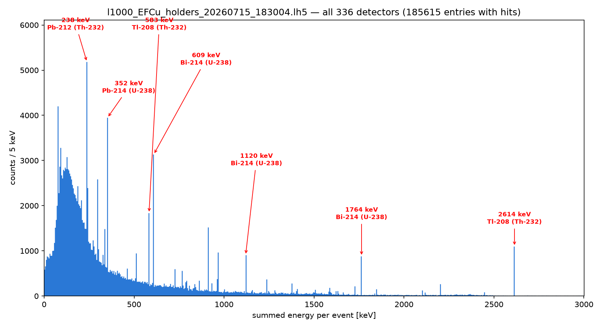

# EFCu detector holders

The background from the EFCu plates that hold each HPGe in LEGEND-1000: Th-232 and U-238 decay
uniformly through the copper and every one of the 336 detectors is read out.

| file | |
| ---- | --- |
| `run.mac` | remage: Th-232 and U-238 (50/50) at rest in every `hpge_support_copper_weldment_top_*` volume (1008), 200 000 decays |
| `spectrum.py` | sums each detector's energy per event and plots it, with the main chain lines tagged |

## Run

From this folder:

```bash
remage -t 8 -g l1000.gdml -o l1000_EFCu_holders.lh5 -- run.mac
~/venvs/v/bin/python spectrum.py l1000_EFCu_holders.lh5
```

`spectrum.py FILE [DETECTOR=all] [EMAX_KEV=3000] [BINWIDTH_KEV=5]` reads the `stp/det*` groups and writes
`<file>_<detector>_spectrum.png` next to itself. `l1000.gdml` and `l1000-dets.mac` here link to the
repository root.

## Output



One entry per detector hit in an event (185 615 from 200 000 decays), with no cuts or detector
response. Tagged: Pb-212 238 keV, Tl-208 583 and 2614 keV (Th-232); Pb-214 352 keV, Bi-214 609,
1120 and 1764 keV (U-238).

## Notes

- `nucleusLimits 1 238 1 92` lets both chains run to their stable ends. Each event holds a whole
  chain, so members that decay days apart sum in the same event.
- Counts are per simulated decay, not normalised to an activity or mass.
