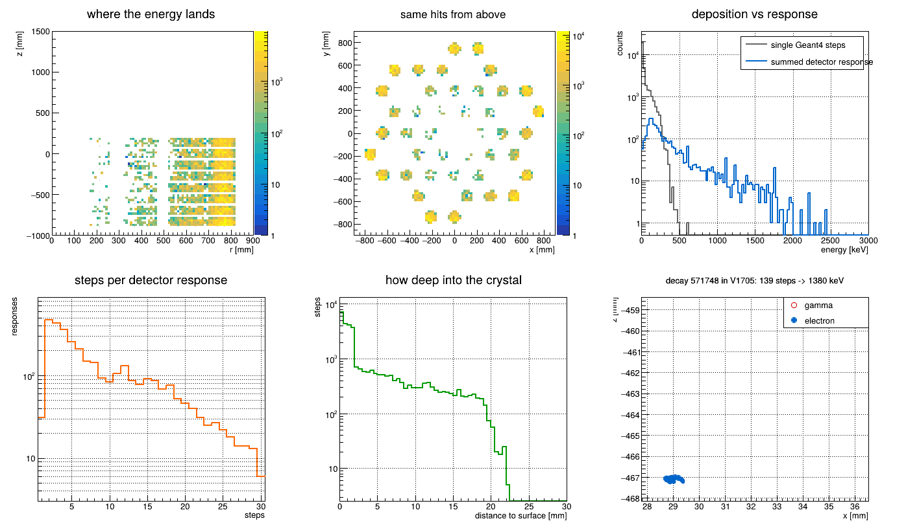
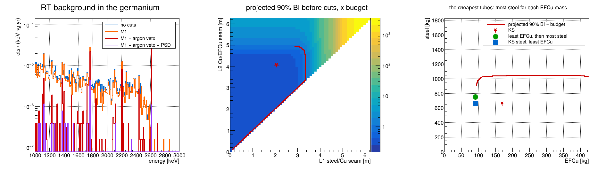
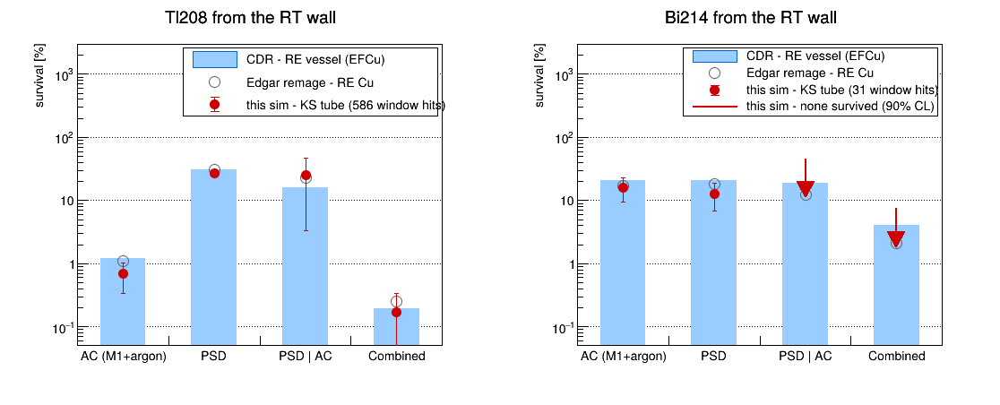
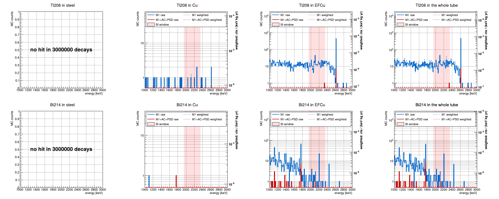
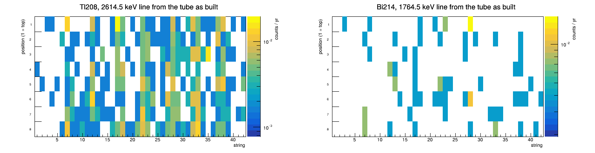

# RT backgrounds

**Goal.** The cheapest re-entrant tube (RT) whose background stays under its budget. The tube is
always three materials, stacked from the top: steel down to the seam `L1`, OFHC Cu down to the seam
`L2`, EFCu below. EFCu (underground electroformed copper) is the cleanest and by far the scarcest
and most expensive, steel the cheapest, so the search runs in this order: **the least EFCu (`L2` as
deep as possible), then the most steel (`L1` as deep as possible).** A design never drops a material.

**Target.** `1e-5 cts/(keV·kg·yr)` at `Qbb = 2039 keV`. The tube's budget, `cfg::rtBudget`, is the
whole target for now.

**Method.**

1. remage decays one chain uniformly through the tube wall (all of it, or one section to buy
   statistics where steel goes) and records every Ge and argon deposit. Chains: **Tl208** (²³²Th)
   and **Bi214** (²³⁸U); the background is their sum.
2. `response.py` turns the Ge deposits into detector responses: dead layer and A/E.
3. `background.C` applies the cuts (M1, argon veto, PSD), counts hits in MAJORANA's 360 keV
   background window [[1]](#references) and weights every decay by the activity of the material a
   design puts at its depth, so every `(L1, L2)` is arithmetic on the same run.
4. Where steel would go the MC has almost no hits: a fit of how fast a decay's chance of a Ge hit
   falls with height carries the estimate (*projected*); the MC alone is kept as the proof (*MC 90%*).

**The tube.** Depth is measured down from its top (`z = 4987 mm` in KS). The tube is 6.246 m long and
the detectors sit at depths of about 4.9-5.9 m. As built (KS): the steel shell down to 2.062 m, the
OFHC Cu shell down to 4.067 m, EFCu below, and an EFCu lid closing the top. Walls: EFCu 1.5 mm
(thickening toward the OFHC seam), OFHC and SS 6 mm.

| term        | meaning                                                                                       |
| ----------- | --------------------------------------------------------------------------------------------- |
| depth       | distance below the top of the tube, `zTop − z`                                                |
| section     | a physical volume decays are drawn in: `reentrancetube` (the EFCu mother: endcap, lower wall, lid), `ofhc_cu` and `ss_316l` (the two shells inside it) |
| slab        | the depth range a design fills with one material: steel `0-L1`, Cu `L1-L2`, EFCu `L2`-bottom |
| row         | an as-built depth range in `[10]`-`[12]`: steel, Cu, EFCu-w (the EFCu wall above the head), EFCu-h (the bottom head, below `zHead`) |
| hit         | one detector's response to one decay, above 5 keV                                             |
| M1, AC, PSD | M1: one detector fired; AC (anti-coincidence): M1 + argon veto; PSD: pulse-shape discrimination, `AoE_class > -1.80` |
| BI window   | 1950-2350 keV minus four 10 keV gaps (`Qbb` and three γ lines): 360 keV, after MAJORANA [[1]](#references) |
| BI          | background index, `cts/(keV·kg·yr)`: window counts per keV of window, per kg of Ge and year, summed over the chains |
| reach       | a decay's chance of a Ge hit against its depth; above 4.4 m a fitted exponential              |
| projected   | a design's BI from the MC below 4.4 m plus the fitted reach above it; "proj 90%" is its 90% value |
| MC 90%      | the MC alone, a slab with no window hit counted at 2.30 x its heaviest decay: the proof      |
| KS, mint    | `KSendcap_l1kGeometry.gdml`, the geometry used; `l1000.gdml`, the unmodified one              |
| CDR, Edgar  | survival references: the design report's values, and Edgar's remage chain (`survival_BI.py`)  |

**Contents.** [Results](#results) · [Pipeline](#pipeline) · [Run](#run) ·
[⓪ Geometry](#geometry) · [① Simulation](#simulation) · [② Detector response](#response) ·
[③ Background study](#background) · [Assumptions](#assumptions) · [Hall C](#hall-c) ·
[NERSC](#nersc) · [`geom/rt.h`](#rth) · [References](#references)

<a id="results"></a>

## Results

`‹…›` marks what a run fills in: a number in the text, or, in a code block, the output of the
command it names. The figures are rewritten in place by the same commands. Everything else is fixed
by the code and the GDML. Each value below names where it is read.

Run: `‹…›` decays per chain (`‹…›` files, merged), KS geometry, remage v0.26.0, `‹date›`. Masses in kg.

| design                                  | `L1` / `L2` [m]    | steel | Cu  | EFCu | proj 90%, x budget | MC 90%, x budget |
| --------------------------------------- | ------------------ | ----- | --- | ---- | ------------------ | ---------------- |
| KS as built                             | 2.062 / 4.067      | `‹…›` | `‹…›` | `‹…›` | `‹…›`            | `‹…›`            |
| KS EFCu, the most steel                 | `‹…›` / 4.067      | `‹…›` | `‹…›` | `‹…›` | `‹…›`            | `‹…›`            |
| KS steel, the least EFCu                | 2.062 / `‹…›`      | `‹…›` | `‹…›` | `‹…›` | `‹…›`            | `‹…›`            |
| **the least EFCu, then the most steel** | **`‹…›` / `‹…›`**  | `‹…›` | `‹…›` | `‹…›` | `‹…›`            | `‹…›`            |

Read from `[8]`, before cuts; the steel mass includes the lid ([Assumptions](#assumptions)).

- **EFCu:** `‹…›` kg at the optimum against `‹…›` kg as built (`[8]`).
- **Steel:** with KS's EFCu it reaches `L1 = ‹…›` m, `‹…›` kg against `‹…›` kg as built (`[8]`); no steel
  passes for `L2` beyond `‹…›` m (`[9]`).
- **Evidence:** reach lengths λ = `‹…›` mm (Tl208) and `‹…›` mm (Bi214) (`[6]`); window hits from the
  steel row: `‹…›` (`[10]`); the MC alone bounds every design with steel at `‹…›` x budget (`[8]`), and
  proving it takes `‹…›` (Tl208) and `‹…›` (Bi214) decays in the steel section (`[7]`).
- **Cuts:** M1 + argon + PSD takes the optimum's projected 90% BI to `‹…›` (`[8]`, after). Window
  survival, Tl208 Combined `‹…›`% (CDR 0.19, Edgar 0.25); Bi214 Combined `‹…›`% (CDR 4.0, Edgar 2.1) (`[10]`).
- **As built, measured:** BI `‹…›` (`‹…›` x goal) before cuts, `‹…›` after (`[11]`, ALL CHAINS); the
  bottom head gives `‹…›`% of it.
- **Purity:** EFCu alone reaches the goal at `‹…›` (wall) and `‹…›` (head) µBq/kg of Tl208, against
  the assumed `< 0.077` (`[12]`).
- **In data:** the tube puts `‹…›` counts/yr into the 2614.5 keV line and `‹…›` into the 1764.5 keV line
  of the whole array, spread `‹evenly / unevenly›` over strings and positions (`[13]`).

<a id="pipeline"></a>

## Pipeline

`geom/` the geometry, `sim/` the simulation (remage, then the detector response), `ana/` the
analysis of its output. `geom/rt.h` reads the tube from the GDML: no macro hard-codes a geometry number.

```
⓪ geometry   geom/check.mac      (does the GDML build, any overlap)
             geom/tube.C         (is the RT one clean surface)               -> tube.png
① remage     sim/run.mac + sim/source.mac  (decay a chain in the wall)       -> <run>.root
             ana/vertices.C      (did the decays fill the tube)
             ana/hits.C          (what a Ge hit is made of)                  -> <run>_hits.png
② response   sim/response.py     (dead layer + A/E)                          -> <run>_response.csv
③ study      ana/background.C    (cuts, BI, reach, designs)                  -> <Isos>_background.png
                                                                                <Isos>_survival.png
                                                                                <Isos>_spectra.png
                                                                                <Isos>_detectors.png
shared       geom/rt.h           (the tube's shape from the GDML, used by every .C)
```

`<run>` is the remage output without `.root` (`tl208`); `<Isos>` the isotopes given to
`background.C`, in order, joined by `_` (`Tl208_Bi214`). Only `output/*.png` is tracked by git.

<a id="run"></a>

## Run

From `l1000_sim/rt_sim/`: every path in the macros is relative to it, and everything writes to
`output/`. remage v0.26.0 (Geant4 11.4.2), ROOT 6.40, Python 3.14 in `~/venvs/v` (reboost 1.3.1,
uproot). In remage, `-q` prints only warnings and errors, `--ignore-warnings` keeps a warning from
failing the exit code, `-t` sets the threads, `-w` overwrites, `-s KEY=VALUE` fills a `{KEY}` alias in
the macros. `$G` is for remage; the `.C` macros find the GDML themselves (`rtResolve`).

Two runs per chain, each with its own seed: the second only adds statistics, so add more the same
way. The vertex is drawn first, so two chains on one seed would decay at the same points and their
errors would no longer be independent.

```bash
export G=../../KSendcap_l1kGeometry.gdml
remage -q --ignore-warnings -s GDML=$G -s SKIP=true -s NPOINTS=1000 -- geom/check.mac
root -l -b -q geom/tube.C
remage -q --ignore-warnings -t 8 -w -o output/tl208.root -s GDML=$G -s Z=81 -s A=208 -s NEV=1000000 -s SEED=1 -s VOLS='reentrancetube|ofhc_cu|ss_316l' -- sim/run.mac
remage -q --ignore-warnings -t 8 -w -o output/tl208_2.root -s GDML=$G -s Z=81 -s A=208 -s NEV=2000000 -s SEED=3 -s VOLS='reentrancetube|ofhc_cu|ss_316l' -- sim/run.mac
remage -q --ignore-warnings -t 8 -w -o output/bi214.root -s GDML=$G -s Z=83 -s A=214 -s NEV=1000000 -s SEED=2 -s VOLS='reentrancetube|ofhc_cu|ss_316l' -- sim/run.mac
remage -q --ignore-warnings -t 8 -w -o output/bi214_2.root -s GDML=$G -s Z=83 -s A=214 -s NEV=2000000 -s SEED=4 -s VOLS='reentrancetube|ofhc_cu|ss_316l' -- sim/run.mac
root -l -b -q 'ana/vertices.C("output/tl208.root")'
root -l -b -q 'ana/hits.C("output/tl208.root")'
root -l -b -q 'ana/hits.C("output/bi214.root")'
~/venvs/v/bin/python sim/response.py output/tl208.root
~/venvs/v/bin/python sim/response.py output/tl208_2.root
~/venvs/v/bin/python sim/response.py output/bi214.root
~/venvs/v/bin/python sim/response.py output/bi214_2.root
root -l -b -q 'ana/background.C("output/tl208*.root=Tl208,output/bi214*.root=Bi214")'
```

| command                                                  | fills                                              |
| -------------------------------------------------------- | -------------------------------------------------- |
| `geom/check.mac` with `SKIP=false` ([⓪](#geometry))      | the overlap block                                  |
| `geom/tube.C`                                            | the tube block, `tube.png`                         |
| `sim/run.mac`, four runs ([①](#simulation))              | the run table                                      |
| `ana/vertices.C`, `ana/hits.C`                           | the vertices and hits blocks, hits table and figures |
| `sim/response.py`, four files ([②](#response))           | the response block                                 |
| `ana/background.C` ([③](#background))                    | its four output blocks and figures, [Results](#results) |

<a id="geometry"></a>

## ⓪ Geometry

### `geom/check.mac` — does the GDML build, does anything overlap

Registers the Ge detectors from the GDML's own map (the KS file carries the pygeomtools map, so no
hand-written detector macro), switches the overlap check on or off, loads the GDML and initialises.
Aliases: `GDML`; `SKIP` (`true` only builds, ~6 s; `false` also scans for overlaps, ~3 min);
`NPOINTS` (points per volume for the scan: more points, finer scan).

```bash
remage --ignore-warnings -s GDML=$G -s SKIP=false -s NPOINTS=1000 -- geom/check.mac 2>&1 | grep -A1 "Overlap is detected"
```

```
‹output of the command above›
```

Known on KS: two overlaps, both the `skirt` against the `outercryostat`, a few mm; not the RT.

### `geom/tube.C` — is the tube one clean surface

`root -l -b -q geom/tube.C`, or `tube(gdml, reference, tol_mm)` with defaults `""` (the KS file),
`"l1000.gdml"` (mint) and `0.05` mm.

| section                                  | what it does                                                                  |
| ---------------------------------------- | ----------------------------------------------------------------------------- |
| `[1]` the solids that bound the wall     | the six polycones: `reentrancetube`, `undergroundlar`, `ofhc_cu_outer_bound`, `ofhc_cu_inner_bound`, `ss_316l_outer_bound`, `ss_316l_inner_bound`: points, `r` and `z` range |
| `[2]` one clean surface                  | the wall outline: on-axis points (expect 2), duplicate points, spikes (the outline folds straight back), self-intersections (expect 0) |
| `[3]` endcap flush with the barrel       | the endcap radius (the outline's maximum, at `zHead`) against the barrel radius at mid-OFHC: step within `tol_mm` |
| `[4]` barrel agrees with both shells     | the OFHC and SS outer-bound radii against the barrel, within `tol_mm`          |
| `[5]` wall thickness                     | `r(reentrancetube) − r(undergroundlar)` at seven heights                      |
| `[6]` diff against the mint geometry     | KS against `l1000.gdml`: RT bottom, top, length, endcap and barrel radius, both seams |
| `[7]` draw                               | `tube.png`                                                                    |

Verdict: `[2]` AND `[3]` AND `[4]`: `RESULT [tube]: PASS` or `FAIL`, and in batch mode the exit code.

```
‹output of: root -l -b -q geom/tube.C›
```


Three pads: the whole tube with its two seams (dotted); the endcap's bottom profile; the
endcap/barrel junction with the endcap radius (red) and barrel radius (green) and the step. KS is
solid, mint dashed grey.

Known on KS: `[3]` reports `NOT flush`, so the verdict is `FAIL` for that one reason: the endcap,
widest at `z = −607 mm` where the head meets the barrel, is 1.0 mm wider than the barrel. Against
mint, every height is shifted by +68 mm; the length is the same.

<a id="simulation"></a>

## ① Simulation

### `sim/source.mac` — the source

`/control/execute`d by `run.mac` after `/run/initialize`. Aliases: `Z`, `A`, `NEV`, `SEED`, `VOLS`.

```
1. Confine to the RT wall
   seed {SEED}
   confine uniformly by volume to the physical volumes matching the regex {VOLS}, up to 100 000 trials
     reentrancetube   the EFCu mother: endcap, lower wall AND the lid at the top
     ofhc_cu, ss_316l the two shells placed inside it
2. The decaying nucleus
   ion {Z} {A} at rest (0 eV): all the energy comes from the decay
   decay THIS nuclide only (nucleusLimits {A} {A} {Z} {Z}), not the rest of the chain
   beamOn {NEV}
```

Tl208 is `Z=81 A=208`, Bi214 `Z=83 A=214`. `VOLS='reentrancetube|ofhc_cu|ss_316l'` fills the whole
tube, the standard run. `VOLS=ss_316l` (or `ofhc_cu`, `reentrancetube`) fills one section, to add
statistics where the seams are decided; such runs merge with whole-tube ones, because the weights use
each section's measured decay density ([`[5]`](#bg5)). The wall is a thin shell, so uniform-by-volume
sampling needs ~560 tries per vertex: the default trial limit would make the sampler give up.

### `sim/run.mac` — the run

```
1. Before init
   register Ge from the GDML's own map; register undergroundlar as a scintillator (the argon veto)
   Track output scheme (the gamma catalogue); trees named by volume (V0101, not det101)
   gamma angular correlation on (a physics-list setting: before init only)
   overlap check off (geom/check.mac did it); include {GDML}; /run/initialize
2. After init
   navigator check mode off
   Track keeps gammas only (PDG 22): they are what crosses the argon
   Ge and argon deposits carry trackid and parent_trackid, so a Ge hit traces to its gamma
   Ge: zero-energy hits discarded; EdepCutLow 0 keV drops the Ge, argon and track rows of every event
       with no Ge deposit (~99%). vertices are always written, so every decay still counts
   single precision positions and energies (Ge, argon), single precision vertex positions
   execute sim/source.mac
```

`Z`/`A` pick the chain, `NEV` the decays, `SEED` the random stream, `GDML` the geometry.

| run                    | decays | wall time, `-t 8` | file    |
| ---------------------- | ------ | ----------------- | ------- |
| Tl208, `SEED=1`        | 1 M    | `‹…›`             | `‹…›`   |
| Tl208, `SEED=3` (`_2`) | 2 M    | `‹…›`             | `‹…›`   |
| Bi214, `SEED=2`        | 1 M    | `‹…›`             | `‹…›`   |
| Bi214, `SEED=4` (`_2`) | 2 M    | `‹…›`             | `‹…›`   |

Each file holds `stp/`: one tree per Ge detector (`V<string><position>`: 42 strings x 8 positions =
336, position 01 at the top), `undergroundlar`, `vtx` (every decay), `tracks`, `detector_origins`,
`processes`.

### `ana/vertices.C` — did the decays fill the tube

`root -l -b -q 'ana/vertices.C("output/tl208.root")'`, or `vertices(file, gdml = "")`; run it on each file.

| section                | what it does                                                                     |
| ---------------------- | -------------------------------------------------------------------------------- |
| `[1]` read the vertices | `stp/vtx`: count, `z` and `r` range (m → mm, the GDML's unit)                    |
| `[2]` material split   | each vertex placed by `rt.materialAt(r, z)`: EFCu / OFHC / SS / LAr / outside (exact point-in-solid, not a `z` cut: the EFCu lid sits above the SS seam) |
| `[3]` coverage along z | 16 slabs of the tube's height, a bar and a count each                            |

Verdict: nothing in argon or outside, and, for a run that has all three materials, no empty slab (a
run of one section leaves the rest empty by design): `RESULT [vertices]: PASS`.

```
‹output of: root -l -b -q 'ana/vertices.C("output/tl208.root")'›
```

A uniform fill would put 14.3% of the vertices in EFCu, its share of the wall volume; remage puts
fewer, which is why the weights use the measured density ([`[5]`](#bg5)). The fuller last slab is the lid.

### `ana/hits.C` — what a hit is (optional, for understanding)

`root -l -b -q 'ana/hits.C("output/tl208.root")'`, or `hits(file, m1_keV = 5.0)`. A pile of Geant4
steps becomes one detector response, and each response traces back to the gamma that caused it.

| section                              | what it does                                                                 |
| ------------------------------------ | ---------------------------------------------------------------------------- |
| `[1]` read every step                | every Ge step with its track ids, plus the gamma catalogue and the argon deposits (silent) |
| `[2]` collapse steps into responses  | key = (decay, detector): steps, responses, those above `m1_keV`, decays that made one |
| `[3]` which particle deposits        | steps, energy and share per particle: gamma, e-, e+, neutron, other          |
| `[4]` one response, step by step     | the response above 100 keV with the most steps, its first 12 steps and their sum |
| `[5]` trace each back to its gamma   | ten responses: Ge energy, time, the gamma that delivered most of it (an electron's parent is the gamma that freed it), argon energy of the decay |
| `[6]` draw it                        | `<run>_hits.png`                                                             |

```
‹output of: root -l -b -q 'ana/hits.C("output/tl208.root")'›
```

In `[5]` a "gamma" of ~10 keV is a Ge x-ray: the trace goes one generation up only.


Six pads: where the energy lands in `r`-`z` (the array in grey) and in `x`-`y`; single steps against
summed responses; steps per response; how deep into the crystal the steps are (distance to the
surface); the response of `[4]` drawn on its own extent (gamma open red, electron full blue, marker
area follows the energy).

|                                          | Tl208   | Bi214   |
| ---------------------------------------- | ------- | ------- |
| Geant4 steps in Ge (`[2]`)               | `‹…›`   | `‹…›`   |
| detector responses (`[2]`)               | `‹…›`   | `‹…›`   |
| responses above 5 keV (`[2]`)            | `‹…›`   | `‹…›`   |
| decays that made one (`[2]`)             | `‹…›`   | `‹…›`   |
| steps per response (`[2]`)               | `‹…›`   | `‹…›`   |
| energy deposited by electrons (`[3]`)    | `‹…›`   | `‹…›`   |
| decays with argon energy (`[5]`)         | `‹…›`   | `‹…›`   |
| mean argon energy in those (`[5]`)       | `‹…›`   | `‹…›`   |



<a id="response"></a>

## ② Detector response — `sim/response.py`

`~/venvs/v/bin/python sim/response.py output/<run>.root [seed]`: one run per file, seed 1 by default.
It is Edgar's `build_hit.yaml` "geds" group, operation for operation, using reboost's own functions;
it reads remage's ROOT output with uproot, so it runs where remage has no HDF5. Writes
`output/<run>_response.csv`: `evtid,det,energy_keV,aoe_class`, one row per detector response with
energy left after the dead layer. The same seed always gives the same CSV.

```
1. Parameters, from Edgar's reboost/config (hard-coded here)
   dead layer          FCCD 1 mm, DLF 0.5 (pars.yaml)
   pulse template      amax 797, mu 9.78, sigma 60, tail_fraction 0.4, tau 300,
                       high_tail_fraction 0 (high_tau 100) (pulse_pars.yaml)
   current smearing    MEAN_AOE 0.4, CURRENT_RESO 6
   A/E class           mu(E) = 1, sigma(E)² = a + (b/E)^c, a = 2.22383e-06, b = 24.4468, c = 2.27818
                       (aoe_class_paras.yaml)
2. Detector-independent objects, built once
   the 0° and 45° drift-time maps, the current template. the only thing read from the Edgars_sim
   mirror is the map: l1000_sim/Edgars_sim/l1000_simulations/reboost/drift_time_maps/drift_time_map.lh5,
   reference detector V00000A, used for every detector
3. Every germanium detector in the run, per detector, steps grouped per decay
   active    = piecewise_linear_activeness(dist_to_surf): 0 inside DLF x FCCD, linear up to full
               charge collection at FCCD, 1 beyond
   energy    = sum(edep x active)
   drift     = the two drift-time maps, blended by azimuth: t00 + (t45 - t00)(1 - cos 4φ)/2
   A_max     = maximum_current(active energy, drift time), Gaussian-smeared (seeded)
   AoE_class = (A_max / energy / mu(E) - 1) / sigma(E)
   write evtid, det, energy_keV, aoe_class for every response with energy > 0
```

The dead layer uses remage's distance to the nearest surface in place of the distance to the n+
contact; they differ only near the p+ contact and the passivated groove. Each detector draws its own
random stream (`seed x 1000 + index`), so their noise is independent.

```
‹output of: the four sim/response.py commands, one line each›
```

<a id="background"></a>

## ③ Background study — `ana/background.C`

```
root -l -b -q 'ana/background.C("output/tl208.root=Tl208,output/bi214.root=Bi214")'
root -l -b -q 'ana/background.C("output/tl208*.root=Tl208,output/bi214*.root=Bi214")'   # job arrays, merged per isotope
```

The arguments: `runs`, a comma-separated list of `file=isotope` (`*` and `?` allowed in the file
name; the isotope must contain `Tl` or `Bi`, and a bare file means Tl208), and optionally `gdml`. Each
file is joined with `output/<run>_response.csv` on (event, detector). Without that CSV the chain
stops at M1 + argon: the output says so and the PSD columns stay empty.

The study is the code's numbered sections. `[4]`-`[7]` print once per chain; `[8]`-`[13]` once, over
all chains; `[14]` writes the figures. The output opens with the settings it ran with:

```
geometry  : <GDML>
RT wall   : <wall volume> m^3 over <length> m
cuts      : M1 (> 5 keV) + argon veto (<= 20 keV) + PSD (AoE_class > -1.80)
window    : 1950-2350 keV minus 10 keV around 2039, 2103.5, 2118.5, 2204.1 keV (MAJORANA's BEW): 360 keV
            <chain>  detector response from response.py: active energy + PSD
```

### 1. Configuration — `cfg::`

| `cfg::`                          | value                                | role                                                      |
| -------------------------------- | ------------------------------------ | --------------------------------------------------------- |
| `winLo`, `winHi`, `winGap`, `winGapHalf`, `winWidth` | 1950, 2350 keV; gaps at 2039.0, 2103.5, 2118.5, 2204.1 keV, ±5 keV; 360 keV | the BI window, MAJORANA's [[1]](#references): `Qbb` and the Tl208 single escape peak (2103.5) and two Bi214 lines [[2]](#references) |
| `m1_keV`                         | 5 keV                                | a detector fired above this                               |
| `lar_keV`                        | 20 keV                               | the argon veto fires above this deposit (where the 4 PE cut sits) |
| `psdCut`                         | −1.80                                | `AoE_class` cut of Edgar's analysis (his `aoe_class_paras.yaml` also lists −0.83) |
| `geMass_kg`                      | 1000 kg                              | the array the BI is per kg of (336 detectors = 42 x 8; 1008 kg at the nominal 3 kg) |
| `bgGoal`, `rtBudget`             | 1e-5, 1e-5                           | the target, and the tube's share of it: a design passes when its projected 90% BI is below `rtBudget` |
| `reachEnd`                       | 4400 mm                              | from this depth down the MC is used as it is; above it the reach is fitted and extrapolated |
| `line`                           | 1764.5 (Bi214), 2614.5 keV (Tl208)   | each chain's strongest line, the tracer of `[13]`         |
| `exposureYr`                     | 10 yr                                | live time of the real-event counts in `[5]`               |
| `decaysPerSec`                   | 1600                                 | this laptop at `-t 8`: turns a decay count into hours in `[7]` |
| `targetRel`                      | 10%                                  | the relative error `[7]` sizes the run for                |
| `eLo`, `eHi`, `eBins`            | 1000-3000 keV, 200                   | the spectrum, 10 keV bins                                 |
| `NDB`, `NZ`                      | 10, 625                              | depth slabs of `[6]` (0.62 m); fine depth bins (~1 cm) of the fit and the projection |

Materials, top to bottom, and their activities:

| material | density [kg/m³] | Bi214 [µBq/kg] | Tl208 [µBq/kg] | source                               |
| -------- | --------------- | -------------- | -------------- | ------------------------------------ |
| steel    | 7900            | 2500           | 1000           | Ralph's materialMix, no uncertainty  |
| Cu       | 8960            | 1              | 1              | Ralph's materialMix, no uncertainty  |
| EFCu     | 8930            | 0.19 ± 0.10    | < 0.077        | Edgar's `survival_BI.py` radioassay  |

EFCu's Tl208 is Edgar's upper limit (Ralph had 0.37). The steel values decide how deep steel can go:
a cleaner steel moves `L1` down. Survival references, in %:

| chain | source | AC    | PSD   | PSD given AC | Combined (AC x PSD given AC) |
| ----- | ------ | ----- | ----- | ------------ | ---------------------------- |
| Bi214 | CDR    | 21.0  | 21.0  | 19.0         | 4.0                          |
| Bi214 | Edgar  | 16.94 | 18.12 | 12.27        | 2.1                          |
| Tl208 | CDR    | 1.2   | 31.0  | 16.0         | 0.19                         |
| Tl208 | Edgar  | 1.10  | 30.32 | 22.72        | 0.25                         |

### 2. One run, reduced to what a reweighting needs

```
per Ge detector, per decay: the deposits are summed
  response.py ran      the response's active energy replaces the sum; a response with no row in the CSV was all
                       dead layer and is dropped; PSD passes if AoE_class > -1.80
  it did not           the summed deposit is the energy; PSD is unknown
  above 5 keV          a hit; a decay's hits fire that many detectors
per decay
  M1                   exactly one detector fired
  argon veto           the decay's total undergroundlar deposit <= 20 keV
  depth                zTop − z of its vertex, indexed by evtid (rows are not in event order with -t 8)
  section              rt.physAt(r, z): the physical volume remage drew it from (a vertex outside the wall is
                       counted as a confinement bug)
  window hits          before cuts, and after the whole chain (M1, argon, PSD)
kept                   every decay as counts only (per section, per as-built row, per ~1 cm, per 0.62 m slab);
                       depth, section and window counts only for decays with a hit: memory follows the hits
```

### 3. Combine the runs

Files of one isotope are one run split into jobs. They are stitched, with decay slots renumbered and
detector indices remapped by name, so nothing is counted twice; `[5]` says `merged from N files`, and
files that disagree on whether `response.py` ran print a warning. A job array of any size is one run.

### 4. Cut ladder, per run — `[4]`

`hits surviving each cut: no cuts → M1 → +argon → +PSD`, in hits (detector responses above 5 keV).
`argon veto xF` is the M1 count divided by the M1 + argon count: the factor by which the veto cuts the
hits. The PSD step needs `response.py`.

<a id="bg5"></a>

### 5. Normalisation, per physical volume as built — `[5]`

```
for a simulated decay drawn in section p (mother, OFHC, SS), in a design that puts material m at its depth:
  real   = ρ_m x A_m x 1 yr           real decays per m³ of that material (ρ in kg/m³, A in Bq/kg)
  MC     = n_p / V_p                  simulated decays per m³: counted in p, V_p integrated from the GDML
  w      = real / MC / 1000 kg        real decays per kg of Ge and year that one simulated decay stands for
BI = sum of w over the window hits / 360 keV
```

`V_p` comes from integrating the GDML polycones (`rt.physVolume`): the shells are outer minus inner
bound, the mother is the wall minus both shells. remage fills the mother ~20% more sparsely than its
daughters, so the weights use the measured `n_p / V_p`, never a uniform fill, and a run of one section
(`VOLS=ss_316l`) weights correctly. The table lists the physical volumes as built, so the mother,
lid included, is EFCu:

| column       | meaning                                                             |
| ------------ | ------------------------------------------------------------------- |
| `volume`     | `mother`, `OFHC`, `SS`                                              |
| `mat`        | its as-built material                                               |
| `V`, `M`     | volume [m³] and mass [kg]                                           |
| `A`          | its activity [Bq]: `M` x the material's specific activity           |
| `N in 10 yr` | real decays in `exposureYr`                                         |
| `MC dec.`    | simulated decays drawn in it                                        |
| `MC per m^3` | `n_p / V_p`                                                         |
| `per MC dec` | real decays in 10 yr per simulated decay                            |

and the line `sampling density mother / shells` (1.000 would be a uniform fill).

### 6. Reach vs depth — `[6]`

A table of ten depth slabs of 0.62 m: `decays` simulated there, `hits` (detector responses above
5 keV), `hits/decay`, and `window` (window hits before cuts); the last row is nearest the detectors.
Below it the fit of the reach:

```
P(hit) = P0 x exp((d − 4.4 m) / λ)     for depths d above 4.4 m
  fit      44 bins of ~10 cm over 0-4.4 m; Poisson likelihood of the decays with a hit (any energy),
           expecting N_bin x P(d). λ scanned 30-1500 mm in 1 mm steps, P0 profiled for each
  90%      the largest λ within ΔlnL = 0.82 of the best: the one-sided 90% value, the farther reach
  f        window hits per decay with a hit, from every depth, assumed the same at every depth.
           f_90 is the Poisson 90% limit on the window count over the decays with a hit
  after    f x Edgar's Combined survival (his AC alone without response.py) until 10 window events
           survive the cuts, then the measured fraction
```

Below the table, two lines give `P0` and `λ` (with its 90% value), and `f` before and after cuts (with
its 90% value). The fitted `λ` should match gamma attenuation in liquid argon at a few MeV. This is the
extrapolation that stands in where the MC saw nothing.

### 7. Statistics for the seams — `[7]`

A slab of material `m` over section `p` with no window hit is only bounded, at `2.30` x one decay's
weight. That falls as 1/decays in `p`, so `[7]` turns the bound into decays:

```
bound   = 2.30 x w(m, p) / 360 keV                       the 90% bound on that slab's BI
needs   = n_p x bound / (10% x rtBudget)                 decays in p to bring it to 10% of the budget
after cuts   needs = 1 / targetRel² / (surviving window hits per decay)    i.e. 100 surviving window hits;
             the rate is measured once 10 survive, before that: before-cut window hits x Edgar's Combined survival
```

One row per section (`SS`, `OFHC`, `mother`), with `bound, needs` for steel and for Cu over it; then
`10% on the as-built BI after cuts`: the decays needed, `(h here)` at `decaysPerSec`, and the window
hits before and after cuts. A last line says above which depth no hit at all came, and what share
of the decays that is: there the fitted reach stands in.

```
‹output of [4]-[7], once per chain›
```

| decays to bound a slab at 10% of the budget (MC alone) | steel, Tl208 | steel, Bi214 | Cu, Tl208 | Cu, Bi214 |
| ------------------------------------------------------ | ------------ | ------------ | --------- | --------- |
| over the SS section                                    | `‹…›`        | `‹…›`        | `‹…›`     | `‹…›`     |
| over the OFHC section                                  | `‹…›`        | `‹…›`        | `‹…›`     | `‹…›`     |
| over the mother section                                | `‹…›`        | `‹…›`        | `‹…›`     | `‹…›`     |
| after cuts: 10% on the as-built BI                     | `‹…›`        | `‹…›`        | -         | -         |

Cu is 1000-2500 x cleaner than steel, hence the gap between the steel and Cu columns. A run of one section puts every decay there,
against the section's share of the wall volume in a whole-tube run, so it is that much cheaper for
the same section decays.

### 8. Three-material designs, summed over every run — `[8]`

A design is the two seams, measured down from the top: steel above `L1`, Cu between, EFCu below `L2`,
always all three, with at least 1 cm of Cu between the seams. As built, `L1 = 2.062 m` and
`L2 = 4.067 m` (the KS seams, read from the GDML). The search, in this order:

```
least EFCu       L2 stepped deeper in 1 cm steps while even 1 cm of steel (L1 = 1 cm) still passes;
                 the deepest such L2
then most steel  the deepest L1 (1 cm grid) that passes at that L2
also shown       KS's EFCu with the most steel; KS's steel with the least EFCu
passes           projected 90% BI before cuts <= rtBudget. cuts only lower it
```

Each design gets two numbers:

```
projected   MC part   sum over window hits at depth >= 4.4 m of w / 360 keV, w for the material the design puts there
            fit part  sum over ~1 cm bins above 4.4 m of  ρ_m A_m x 1 yr x V_bin x f x P0 exp((d − 4.4 m)/λ)
                      / (1000 kg x 360 keV): decays per year x chance of a hit x window hits per hit decay
            90%       λ → λ_90, P0 → P0(λ_90), f → f_90, plus 1.28 σ of the MC part
MC 90%      per slab: n window hits count UL(n) x the slab's mean hit weight; none count 2.30 x its heaviest
            decay. UL(n) is the Poisson 90% limit: 2.30, 3.89, 5.32, ... for n = 0, 1, 2, ...
            (n + 1.28 √n + 1 above 10). the proof, once the steel section has its decays
```

Columns: `L1`, `L2`; masses of the three slabs [kg]; `projected`; `proj 90%` and `x budget` (the same in
units of `rtBudget`); `after: 90%` (the projected 90% BI after the cuts); `MC 90% x` (the MC-only
bound in units of `rtBudget`). Masses are in kg; the steel mass includes the lid, which sits in the top
slab ([Assumptions](#assumptions)). A design that has no steel passing prints `no steel passes`.

Because the search pushes a seam until the projected 90% BI reaches the budget, the optimum has no
margin by construction. MAJORANA's assay-based model came out about five times low [[1]](#references),
so a real design should take a share of the goal as `rtBudget`, below the whole.

### 9. The trade-off — `[9]`

For each `L2`, the deepest steel/Cu seam `L1` whose projected 90% BI is under the budget (before
cuts: cuts only lower it). Rows: `L2` = 3.00 to 6.00 m in 0.25 m steps, and the three named `L2`
(marked `<- KS EFCu`, `<- least EFCu`, `<- least EFCu with KS steel`). Columns: `L2`, EFCu mass,
`steel to` (`L1`), steel and Cu mass, `proj 90%`, `x budget`, `after: 90%`, `MC 90% x`. An `L2` where
not even 1 cm of steel passes prints `no steel passes: EFCu must reach higher`. The last line gives
KS's own seams and masses.

```
‹output of [8] and [9]›
```

### 10. Survival in the background window, per chain and section — `[10]`

Counted in hits, as Edgar does, over the as-built rows (steel, Cu, EFCu-w, EFCu-h, tube):

| column          | meaning                                                              |
| --------------- | -------------------------------------------------------------------- |
| `N0`            | window hits before cuts                                              |
| `AC (M1+argon)` | the share of them that passes M1 and the argon veto                  |
| `PSD`           | the share that passes PSD alone                                      |
| `PSD given AC`  | of the hits AC kept, how many PSD keeps (printed `PSD \| AC`)        |
| `Combined`      | all three over `N0` = AC x PSD given AC                              |

Errors are binomial; `< x` is a 90% limit (2.30 over the denominator) where nothing survived; `-`
means no hits. The PSD columns need `response.py`.

### 11. Background index, per chain and section — `[11]`

```
value        BI ± sigma_act ± sigma_stat, cts/(keV kg yr), KS as built: rows steel, Cu, EFCu-w, EFCu-h
sigma_stat   sqrt(sum of w²)                MC statistics
sigma_act    BI x dA/A                      the radioassay error; in quadrature with sigma_stat it is survival_BI.py's error
no hit       never zero: < 2.30 x the section's mean decay weight, left out of the totals
             (which sum only what was measured)
act. limit   an upper-limit activity makes the BI a "<" and sigma_act print as 0 ("activity is an upper limit")
```

`win hits` reads `after/before cuts`. Each chain ends with its `tube` total; the last line, `ALL
CHAINS`, adds the chains and gives `x goal` (before and after cuts). Where `sigma_act` dominates,
more simulation cannot help: only a better activity measurement can.

### 12. Purity requirement, per chain and section — `[12]`

```
A_goal = A x goal / BI     the specific activity [µBq/kg] at which a section ALONE would give the goal
no hit                     a floor, A x goal / (2.30 x mean weight), that more decays raise; flagged
                           "assumed activity is above what this run can exclude" when the floor is below the assumed A
a budget f x goal          multiply by f
```

Columns: `assumed` (its activity, `<` for a limit), `before cuts`, `after cuts`.

```
‹output of [10], [11] and [12]›
```

### 13. Per detector, as built — `[13]`

How MAJORANA located its ²³²Th excess [[1]](#references): each detector's count rate in a chain's
strongest line, `cfg::line` ±5 keV, before cuts, as built. The rate is the sum of `w` x 1000 kg over
the hits in the line: real counts per year. Per chain it prints the line, the counts per year in the
whole array and the MC events they come from; the rate by position, top to bottom (1-8); and the
five brightest detectors with their MC events. Single detectors rest on few MC events, so their
pattern is mostly noise: the whole-array and by-position sums are the reading.

```
‹output of [13]›
```

### 14. Figures

The commands write four figures (`<Isos>` as above), each announced by a `wrote output/<Isos>_….png` line:



`<Isos>_background.png`, three pads:

- **Left:** the as-built spectrum, summed over the chains, at each cut stage, in `cts/(keV·kg·yr)`
  (10 keV bins); the PSD curve only when `response.py` ran. A bin resting on one Cu hit weighs
  several times an EFCu hit, as Cu is the dirtier.
- **Middle:** the projected 90% BI before cuts of every `(L1, L2)` (60 x 60 bins, `L1 <= L2`), in units
  of the budget; the star is KS. The red line is the edge: the deepest steel that passes for each `L2`.
- **Right:** the same edge as masses: the most steel for each EFCu mass. A tube under the line
  passes. The star is KS; the circle is the least EFCu, then the most steel; the square keeps KS's steel.



`<Isos>_survival.png`, one pad per chain: bars are the CDR (EFCu), open circles Edgar's remage; red
points this run's whole tube in the BI window, with binomial errors; a red arrow, drawn down from the
limit (capped at 100%), is a 90% limit where nothing survived.



`<Isos>_spectra.png`: a row per chain, columns steel, Cu, EFCu and the whole tube as built. Raw MC
counts (solid, left axis) beside the weighted rate (dashed, right axis, `cts/(keV·kg·yr)`), for M1
and for M1 + AC + PSD (M1 + AC without `response.py`); the BI window is shaded. Within one material
every decay weighs the same, so dashed lies on solid; in the whole tube they part, as materials
weigh differently. An empty panel says `no hit in N decays`.



`<Isos>_detectors.png`, one pad per chain: string (1-42) against position (1 = top), coloured by the
counts per year of `[13]`'s line, on a log scale.

<a id="assumptions"></a>

## Assumptions

- **Reweighting** changes a slab's activity, not the attenuation Geant4 already applied. It holds
  while the tube and the detectors stay where they are: a thicker or thinner wall, a longer tube, a
  deeper head or longer strings each need a new GDML and run.
- **Material by depth.** A design's material depends on depth alone, so the lid at the very top (EFCu
  in KS) takes the top slab's material in every design, `KS as built` included: its mass counts at
  steel's density, and its decays at steel's activity.
- **Reach.** Above 4.4 m the chance of a Ge hit is the fitted exponential, and the window fraction per
  hit decay is the same at every depth. The projection is an extrapolation; `MC 90%` is the proof.
- **Window.** The continuum is flat over the window, so counts / 360 keV is the BI at `Qbb`: 3.3 x the
  statistics of the 110 keV ROI around it.
- **Activities** are applied as the activity of the simulated nuclide: no branching fraction is
  applied (Tl208 carries ~36% of ²³²Th-chain decays). EFCu's Tl208 is an upper limit, so its BI is a `<`.
- **Cuts.** The argon veto is a deposit of at most 20 keV, not Edgar's optical-map cut:

|            | here                              | Edgar                                            |
| ---------- | --------------------------------- | ------------------------------------------------ |
| argon veto | deposit ≤ 20 keV                  | NPE ≥ 4 from the optical map                     |
| dead layer | distance to the nearest surface   | distance to the n+ contact (differ only near p+) |
| PSD        | same reboost chain                | same                                             |
| BI         | 360 keV window [[1]](#references) | ROI                                              |

<a id="hall-c"></a>

## Hall C proposal (M. Busch, 29 Sep 2026)

"String and lock updates, including a 12 detector string concept for beyond 1T deployment".

|                    | CDR-PDR design         | proposed                                     |
| ------------------ | ---------------------- | -------------------------------------------- |
| detectors / string | 8, 42 strings, 1008 kg | 12, 48 strings, 1727 kg                      |
| Ge stack           | 1.081 m                | 1.642 m: 0.28 m further up and down          |
| re-entrant tube    |                        | 0.2 m longer, added to the OFHC section      |
| bottom head        | 467 mm deep            | 575 mm                                       |
| hall               |                        | cleanroom floor, cryostat, water tank -0.2 m |

This simulation runs KS with the 8 x 42 layout. His recommendation is conditional: "IF IT WORKS
with background simulations"; his open issues include the bottom head's purity and the added
underground-argon volume.

- **Answered here:** the head's purity requirement (`[12]`), its share of the BI (`[11]`), and where
  both seams can go (`[8]`, `[9]`).
- **Needs a new GDML and run:** his geometry itself. A string reaching 0.28 m higher moves the reach
  up by about as much, so both seams move up with it: less steel, more EFCu than `[8]` says. Only a
  new run says by how much.
- **To check:** the KS head measures ~650 mm from tip to widest point (`zHead − zBottom`), matching
  neither 467 nor 575 mm: either "depth" is defined differently or KS is another profile.
- **Not this simulation:** the head's reflectivity, an optical question.

<a id="nersc"></a>

## NERSC — the statistics the seams need

`[7]`'s decays as job arrays of 10⁷ decays, 32 threads each on the `shared` QOS, most decisive first.
① runs in the same remage (the v0.26.0 container); ② and ③ run here. The task id is both seed and
file name: every file is independent, all of one isotope merge in ③ whatever section they filled, more
tasks add statistics, `scancel` drops extras.

| stage | decides                                     | `VOLS`         | Tl208 tasks      | Bi214 tasks      |
| ----- | ------------------------------------------- | -------------- | ---------------- | ---------------- |
| 1     | proof that steel can go where `[8]` puts it | `ss_316l`      | 12 (`3001-3012`) | 31 (`4001-4031`) |
| 2     | how deep steel can reach, proven            | `ofhc_cu`      | 12 (`5001-5012`) | 30 (`6001-6030`) |
| 3     | the seams after cuts, not just before       | the whole tube | 20 (`1001-1020`) | 47 (`2001-2047`) |

The task counts are `[7]`'s decays over 10⁷, from the first 3 M-decay run: resize them if your `[7]`
differs.

Here, once, from `rt_sim/`, with `<user>` and `<path>` (your NERSC login and repo path) filled in:

```bash
ssh <user>@perlmutter.nersc.gov "mkdir -p <path>/LEGEND-background-simulation/l1000_sim/rt_sim/output <path>/LEGEND-background-simulation/l1000_sim/rt_sim/sim"
rsync -av ../../KSendcap_l1kGeometry.gdml <user>@perlmutter.nersc.gov:<path>/LEGEND-background-simulation/
rsync -av sim/ <user>@perlmutter.nersc.gov:<path>/LEGEND-background-simulation/l1000_sim/rt_sim/sim/
```

On Perlmutter, from `l1000_sim/rt_sim/` (`m2676` is assumed to be the LEGEND allocation: check it):

```bash
shifterimg pull docker:legendexp/remage:v0.26.0
# stage 1, the steel section
sbatch --account=m2676 --constraint=cpu --qos=shared --time=04:00:00 --cpus-per-task=32 --output=output/%x_%a.log --image=docker:legendexp/remage:v0.26.0 --array=3001-3012 --job-name=rt_tl208_ss --wrap "shifter remage -q --ignore-warnings -t 32 -w -s GDML=../../KSendcap_l1kGeometry.gdml -s NEV=10000000 -s SEED=\$SLURM_ARRAY_TASK_ID -o output/tl208_\$SLURM_ARRAY_TASK_ID.root -s Z=81 -s A=208 -s VOLS=ss_316l -- sim/run.mac"
sbatch --account=m2676 --constraint=cpu --qos=shared --time=04:00:00 --cpus-per-task=32 --output=output/%x_%a.log --image=docker:legendexp/remage:v0.26.0 --array=4001-4031 --job-name=rt_bi214_ss --wrap "shifter remage -q --ignore-warnings -t 32 -w -s GDML=../../KSendcap_l1kGeometry.gdml -s NEV=10000000 -s SEED=\$SLURM_ARRAY_TASK_ID -o output/bi214_\$SLURM_ARRAY_TASK_ID.root -s Z=83 -s A=214 -s VOLS=ss_316l -- sim/run.mac"
# stage 2, the OFHC section
sbatch --account=m2676 --constraint=cpu --qos=shared --time=04:00:00 --cpus-per-task=32 --output=output/%x_%a.log --image=docker:legendexp/remage:v0.26.0 --array=5001-5012 --job-name=rt_tl208_cu --wrap "shifter remage -q --ignore-warnings -t 32 -w -s GDML=../../KSendcap_l1kGeometry.gdml -s NEV=10000000 -s SEED=\$SLURM_ARRAY_TASK_ID -o output/tl208_\$SLURM_ARRAY_TASK_ID.root -s Z=81 -s A=208 -s VOLS=ofhc_cu -- sim/run.mac"
sbatch --account=m2676 --constraint=cpu --qos=shared --time=04:00:00 --cpus-per-task=32 --output=output/%x_%a.log --image=docker:legendexp/remage:v0.26.0 --array=6001-6030 --job-name=rt_bi214_cu --wrap "shifter remage -q --ignore-warnings -t 32 -w -s GDML=../../KSendcap_l1kGeometry.gdml -s NEV=10000000 -s SEED=\$SLURM_ARRAY_TASK_ID -o output/bi214_\$SLURM_ARRAY_TASK_ID.root -s Z=83 -s A=214 -s VOLS=ofhc_cu -- sim/run.mac"
# stage 3, the whole tube
sbatch --account=m2676 --constraint=cpu --qos=shared --time=04:00:00 --cpus-per-task=32 --output=output/%x_%a.log --image=docker:legendexp/remage:v0.26.0 --array=1001-1020 --job-name=rt_tl208 --wrap "shifter remage -q --ignore-warnings -t 32 -w -s GDML=../../KSendcap_l1kGeometry.gdml -s NEV=10000000 -s SEED=\$SLURM_ARRAY_TASK_ID -o output/tl208_\$SLURM_ARRAY_TASK_ID.root -s Z=81 -s A=208 -s VOLS='reentrancetube|ofhc_cu|ss_316l' -- sim/run.mac"
sbatch --account=m2676 --constraint=cpu --qos=shared --time=04:00:00 --cpus-per-task=32 --output=output/%x_%a.log --image=docker:legendexp/remage:v0.26.0 --array=2001-2047 --job-name=rt_bi214 --wrap "shifter remage -q --ignore-warnings -t 32 -w -s GDML=../../KSendcap_l1kGeometry.gdml -s NEV=10000000 -s SEED=\$SLURM_ARRAY_TASK_ID -o output/bi214_\$SLURM_ARRAY_TASK_ID.root -s Z=83 -s A=214 -s VOLS='reentrancetube|ofhc_cu|ss_316l' -- sim/run.mac"
squeue --me
```

`\$SLURM_ARRAY_TASK_ID` is left for each task to fill in. A task should take about an hour (scaled
from this laptop; the first log gives the real rate); 4 h is margin. Output, mostly the vertex
table: ~0.2-0.3 GB per task, so stage 1 ~9 GB, stage 2 ~8 GB, stage 3 ~19 GB, plus one
`output/rt_*.log` each.

After each stage, here, fetch the runs and rerun ② and ③; `[7]` and `[8]` show what it settled:

```bash
rsync -av --include='*_[0-9]*.root' --exclude='*' <user>@perlmutter.nersc.gov:<path>/LEGEND-background-simulation/l1000_sim/rt_sim/output/ output/
for f in output/tl208_*.root output/bi214_*.root; do ~/venvs/v/bin/python sim/response.py "$f"; done
root -l -b -q 'ana/background.C("output/tl208*.root=Tl208,output/bi214*.root=Bi214")'
```

The wildcard expands inside the macro: each isotope's files merge into one run, events renumbered,
nothing counted twice (`[5]` says `merged from N files`). At full statistics ② and ③ take several
hours each.

<a id="rth"></a>

## `geom/rt.h`

The shared library, header-only; every `.C` includes it. Two numbered sections:

```
1. Find RT Outline
Outline                  (r, z) corners of one GDML polycone, with its bounding box
  .radiusAt(z)           outermost radius at z
  .contains(r, z)        point inside? (even-odd ray cast)
  .near(r, z, tol)       inside, or within tol of it; the point is nudged by tol in r AND z
  .deep(r, z, tol)       at least tol inside
  .areaAt(z)             cross-section area; rings handled (at the lid the argon is a ring around it)
  .volume()              stacked cross-sections
rtRead(file, solid)      one polycone out of the GDML text
2. Configure RT design
RT = rtLoad(gdml)        wall, argon, OFHC and SS shell bounds (outer, inner); zBottom, zTop;
                         seamOFHC, seamSS; zHead, the height of the tube's widest point (head meets barrel)
  .sectionAt(z)          EFCu | OFHC | SS by height alone
  .materialAt(r, z)      EFCu | OFHC | SS | LAr | outside, exact (the lid is EFCu), 1 µm slack in r and
                         z for float32 vertices (0.2 µm in z is 40 µm in r on the lid cone)
  .physAt(r, z)          physical volume the source drew from: 0 mother, 1 OFHC, 2 SS (-1: not in the wall)
  .physVolume(p)         its volume: shells = outer minus inner bound, mother = wall minus both shells
  .wallVolume(z0, z1)    wall volume between two heights (the tube's solid minus the argon in it)
rtFindFile(name)         the file in the run directory or up to 5 levels above it
rtResolve(gdml)          which GDML: the argument, then $RT_GDML, then KSendcap_l1kGeometry.gdml
rtIsGermanium(name)      is this tree a Ge detector ("V" + 4 digits)?
rtScan(tree, cols, f)    walk a tree row by row, handing the named columns to f as doubles
rtOut(name)              "output/<name>", creating output/
rtVerdict(tag, ok)       one PASS / FAIL line, and the batch exit code
```

<a id="references"></a>

## References

1. C.R. Haufe et al. (MAJORANA Collaboration), "Modeling Backgrounds for the MAJORANA DEMONSTRATOR",
   arXiv:2209.10592 [nucl-ex] (2023). Here: the background-estimation window; per-detector line rates
   as the locator of a source; and the warning that an assay-based model came out about 5 x low.
2. I.J. Arnquist et al. (MAJORANA Collaboration), "Final result of the MAJORANA DEMONSTRATOR's search
   for neutrinoless double-β decay in ⁷⁶Ge", arXiv:2207.07638 [nucl-ex] (2022), cited by [1] for the
   window. Here: the three excluded lines, 2103.5, 2118.5 and 2204.1 keV.
