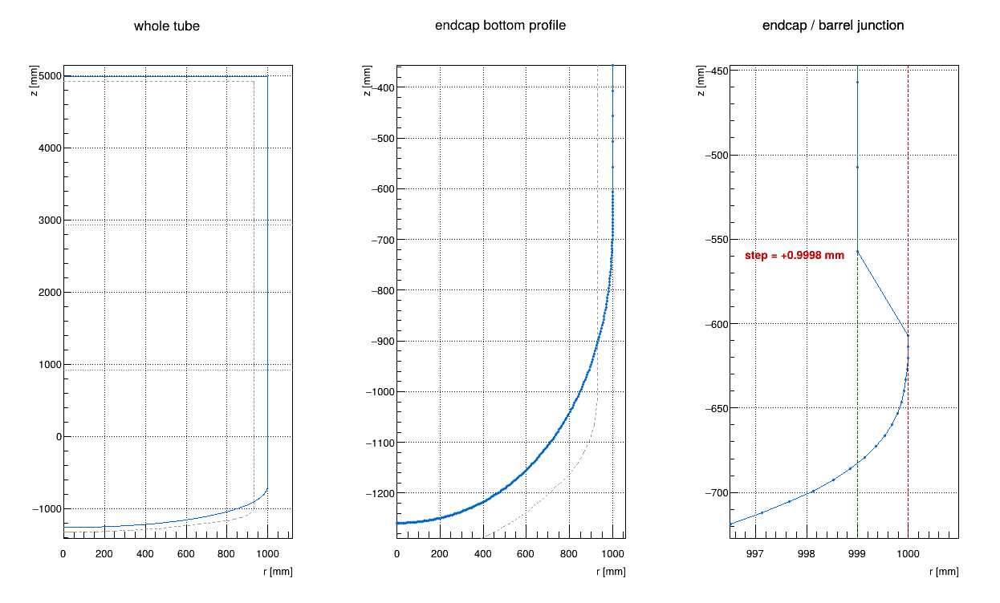
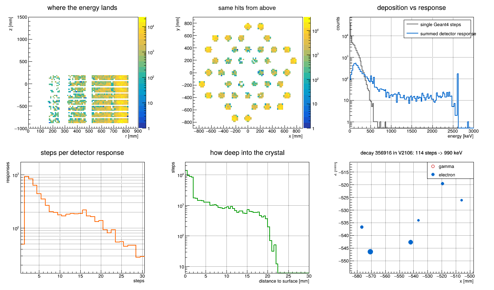
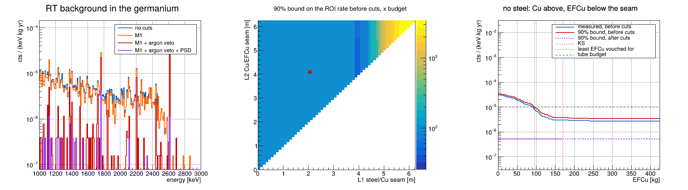
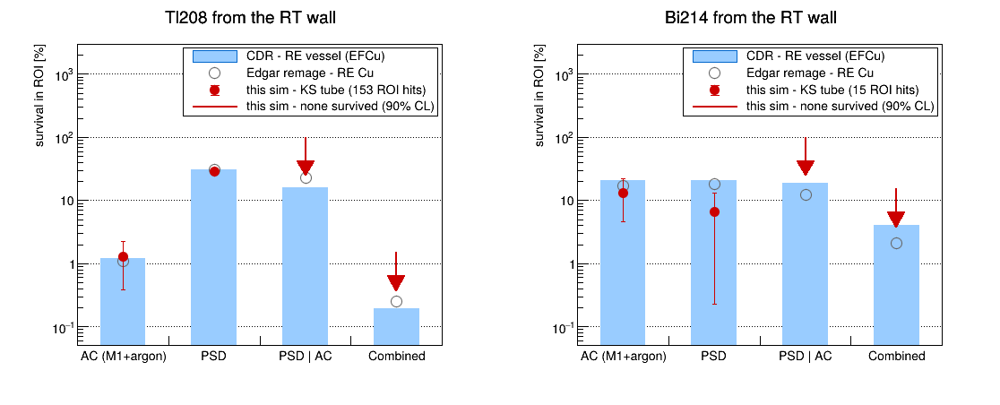
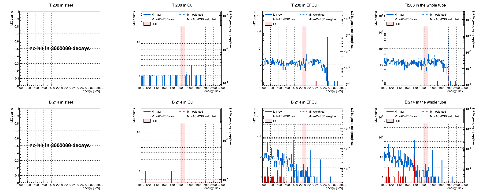

# RT backgrounds

**goal.** How little underground EFCu can the re-entrant tube (RT) use? The tube is three
materials stacked from the top: steel down to the seam `L1`, Cu down to the seam `L2`, EFCu below.
EFCu is the cleanest and the scarcest: how far down can `L2` move, and how far down can steel
reach, while the tube stays within its background budget?
**Target.** `1e-5 cts/(keV·kg·yr)` in the ROI, `2039 ± 55 keV`. The tube's budget, `cfg::rtBudget`,
is the whole goal for now.

**sim.** Simulate each decay chain uniformly through the tube wall (or one section of it, to add
statistics where they are short), then weight every decay by the material a design puts at its
depth. Every `(L1, L2)`, and any order of materials, is arithmetic on one run. Where the run saw
no hit, a design carries a 90% upper bound, never a zero. Chains: **Tl208** (Th232) and **Bi214**
(U238); the background is their sum, and each chain's runs merge into one.

**The tube.** Depth is measured down from its top (`z = 4987 mm`); it is 6.25 m long and the
detectors sit at depths 4.9-5.9 m. As built (KS): steel to 2.06 m, OFHC Cu to 4.07 m, EFCu below,
and an EFCu lid closing the top (55 kg).

| term      | meaning                                                                               |
| --------- | ------------------------------------------------------------------------------------- |
| section   | a part of the tube as built, where decays are drawn: steel shell, OFHC shell, EFCu (lower wall, head, lid) |
| slab      | a depth range a design fills with one material: steel 0-`L1`, Cu `L1`-`L2`, EFCu `L2`-bottom |
| BI        | background index, `cts/(keV·kg·yr)`, in the ROI                                        |
| 90% bound | a design's BI at 90% CL, counting what the run did not see ([Designs](#designs))       |
| M1, AC    | one detector fired; anti-coincidence = M1 + argon veto                                 |
| PSD       | pulse-shape discrimination, `AoE_class > -1.80`                                        |
| KS, mint  | `KSendcap_l1kGeometry.gdml`, the geometry used; `l1000.gdml`, the unmodified one       |
| CDR       | the design-report survival values quoted in Edgar's `survival_BI.py`                   |

**Contents.** [Results](#results-in-short) · [Pipeline](#pipeline) · [Run](#run) ·
[⓪ Geometry](#geometry) · [① Simulation](#simulation) · [② Detector response](#response) ·
[③ Background study](#background) · [Designs](#designs) · [Statistics](#statistics-for-the-seams) ·
[Hall C](#hall-c) · [NERSC](#nersc) · [`geom/rt.h`](#rth)

## Results in short

3 M decays per chain (two runs each, merged), KS geometry, remage v0.26.0, 3 Oct 2026. Every
number below comes from a table or figure further down, under the step that makes it.

|                                 | KS as built    | least EFCu that passes |
| ------------------------------- | -------------- | ---------------------- |
| seams `L1` / `L2`               | 2.06 / 4.07 m  | no steel / 4.93 m      |
| EFCu below `L2` (lid not included) | 170 kg      | 95 kg                  |
| measured BI before cuts         | 3.0e-06        | 8.2e-06                |
| 90% bound before cuts, x budget | 94 (the steel) | 0.99                   |

- **EFCu:** with Cu above and no steel, the Cu/EFCu seam can move from 4.07 m down to 4.93 m,
  95 kg of EFCu instead of 170 kg, at 90% CL before cuts. Cuts only lower the rate.
- **After cuts** no ROI hit survives anywhere, so every no-steel design, all-Cu included, is
  bounded at `0.04-0.05 x` budget: the cuts may make much of the EFCu unnecessary. Measuring
  that, not just bounding it, needs [more decays](#statistics-for-the-seams).
- **Steel is not decidable yet** where it sits. No hit came from the steel section in 3 M decays,
  and one would weigh 13 x (Tl208) to 33 x (Bi214) the goal, so every design with steel, KS
  included, is bounded at 94 x budget or more. Bounding it at 10% of the budget takes ~4e8
  (Tl208) and ~1e9 (Bi214) decays in the steel section, affordable with runs confined to it.
- **Steel cannot go deep:** reaching twice as far down (to 4.12 m), it is *measured* at `26 x` budget.
- **No hit came from above 2.5 m depth** (Tl208; 3.1 m for Bi214), 57-71% of the decays: a bound,
  not a zero, and exactly where steel sits.
- **As built, measured:** `3.0e-06` before cuts (`0.30 x` goal), a quarter of it from the bottom head.
- **Purity:** EFCu alone would reach the goal at 0.52 uBq/kg of Tl208 in the wall, 1.2 in the head.

## Pipeline

`geom/` the geometry, `sim/` the simulation (remage, then the detector response), `ana/` the
analysis of its output. `geom/rt.h` reads the tube from the GDML: no macro hard-codes a geometry number.

```
⓪ geometry   geom/check.mac      (clean GDML)
             geom/tube.C         (clean RT)                   -> tube.png
① remage     sim/run.mac + sim/source.mac  (decays)           -> <run>.root
             ana/vertices.C (decays fill) ana/hits.C (Ge hit) -> <run>_hits.png
② response   sim/response.py     (dead layer + A/E)           -> <run>_response.csv
③ cuts       ana/background.C    (cuts, BI)                   -> <Isos>_background.png
                                                                 <Isos>_survival.png
                                                                 <Isos>_spectra.png
```

## Run

From `l1000_sim/rt_sim/`; everything writes to `output/`. Two runs per chain with their own seeds,
merged by `background.C`: the second only adds statistics, so add more the same way. remage v0.26.0, ROOT 6.40, Python in
`~/venvs/v` (reboost, uproot). `$G` is for remage; the `.C` macros find the GDML themselves.

```bash
export G=../../KSendcap_l1kGeometry.gdml
remage -q --ignore-warnings -s GDML=$G -s SKIP=true -s NPOINTS=1000 -- geom/check.mac
root -l -b -q geom/tube.C
remage -q --ignore-warnings -t 8 -w -o output/tl208.root -s GDML=$G -s Z=81 -s A=208 -s NEV=1000000 -s SEED=1 -s VOLS='reentrancetube|ofhc_cu|ss_316l' -- sim/run.mac
remage -q --ignore-warnings -t 8 -w -o output/tl208_2.root -s GDML=$G -s Z=81 -s A=208 -s NEV=2000000 -s SEED=3 -s VOLS='reentrancetube|ofhc_cu|ss_316l' -- sim/run.mac
remage -q --ignore-warnings -t 8 -w -o output/bi214.root -s GDML=$G -s Z=83 -s A=214 -s NEV=1000000 -s SEED=2 -s VOLS='reentrancetube|ofhc_cu|ss_316l' -- sim/run.mac
remage -q --ignore-warnings -t 8 -w -o output/bi214_2.root -s GDML=$G -s Z=83 -s A=214 -s NEV=2000000 -s SEED=4 -s VOLS='reentrancetube|ofhc_cu|ss_316l' -- sim/run.mac
root -l -b -q 'ana/vertices.C("output/tl208.root")'
~/venvs/v/bin/python sim/response.py output/tl208.root
~/venvs/v/bin/python sim/response.py output/tl208_2.root
~/venvs/v/bin/python sim/response.py output/bi214.root
~/venvs/v/bin/python sim/response.py output/bi214_2.root
root -l -b -q 'ana/background.C("output/tl208*.root=Tl208,output/bi214*.root=Bi214")'
```

<a id="geometry"></a>

## ⓪ Geometry

### `geom/check.mac` — does the GDML build, does anything overlap

Registers the Ge detectors from the GDML's own map, loads the GDML, initialises. `SKIP=true`
(above) only builds, ~6 s. `SKIP=false` also checks overlaps at `NPOINTS` per volume, ~3 min:

```bash
remage --ignore-warnings -s GDML=$G -s SKIP=false -s NPOINTS=1000 -- geom/check.mac 2>&1 | grep -A1 "Overlap is detected"
```

```
          Overlap is detected for volume skirt:0 (G4Tubs) with outercryostat:0 (G4GenericPolycone)
          overlap at local point (2020.76,2674.4,-2679.44) by 5.04412 mm  (max of 5 cases)
--
          Overlap is detected for volume outercryostat:0 (G4GenericPolycone) with skirt:0 (G4Tubs)
          overlap at local point (-875.786,3238.58,1260.31) by 2.91165 mm  (max of 5 cases)
```

Two overlaps, both the `skirt` against the `outercryostat`, up to 5 mm. Known, and not the RT.

### `geom/tube.C` — is the tube one clean surface

`[1]` the six polycones bounding the wall, `[2]` its outline (expect 2 on-axis points, no
duplicates, spikes or self-intersections), `[3]` endcap vs barrel radius and `[4]` barrel vs the
shells, both within 0.05 mm, `[5]` wall thickness, `[6]` diff against mint, `[7]` the figure.
Verdict: `[2]` AND `[3]` AND `[4]`.

```
file : ../../KSendcap_l1kGeometry.gdml
RT   : z -1259.0 .. 4987.0 mm, 315 points, seams EFCu | 920.0 | OFHC | 2925.0 | SS

[1] solids:
      reentrancetube         n=315  r    0.0000 ..  999.9998   z  -1259.00 ..   4987.00
      undergroundlar         n=315  r    0.0000 ..  998.4983   z  -1258.99 ..   4987.00
      ofhc_cu_outer_bound    n=44   r    0.0000 ..  999.0000   z    920.00 ..   2925.00
      ofhc_cu_inner_bound    n=44   r    0.0000 ..  997.5000   z    920.00 ..   2925.00
      ss_316l_outer_bound    n=45   r    0.0000 ..  999.0000   z   2925.00 ..   4987.00
      ss_316l_inner_bound    n=45   r    0.0000 ..  993.0000   z   2925.00 ..   4987.00

[2] clean surface: on-axis points 2 (expect 2), duplicates 0, spikes 0, self-intersections 0 (expect 0)

[3] endcap flush: barrel r 999.0000 (z 1922.5), endcap r 999.9998 (z -607.1), step +0.9998 mm (tolerance 0.050)  <- NOT flush

[4] shells:
      ofhc_cu_outer_bound    rmax  999.0000 (barrel -0.0000)
      ss_316l_outer_bound    rmax  999.0000 (barrel -0.0000)

[5] wall thickness:
          z [mm]   sect      r_out       r_in   t [mm]
          -607.1   EFCu   999.9998   998.4983   1.5015
           156.4   EFCu   999.0000   997.5000   1.5000
           910.0   EFCu   999.0000   995.9580   3.0420
          1922.5   OFHC   999.0000   993.0000   6.0000
          2915.0   OFHC   999.0000   993.0000   6.0000
          3956.0     SS   999.0000   993.0000   6.0000
          4977.0     SS   999.0000   993.0000   6.0000

[6] KS vs mint ../../l1000.gdml:
                              mint          KS      delta
      RT z bottom       -1327.0000  -1259.0000   +68.0000
      RT z top           4919.0000   4987.0000   +68.0000
      RT length          6246.0000   6246.0000    +0.0000
      endcap rmax         931.0000    999.9998   +68.9998
      barrel r            931.0000    999.0000   +68.0000
      EFCu|OFHC seam      852.0000    920.0000   +68.0000
      OFHC|SS seam       2857.0000   2925.0000   +68.0000

RESULT [tube]: FAIL
```



`FAIL` for one real reason: the KS endcap is 1.0 mm wider than the barrel at `z = −607 mm`
(right panel). Walls: EFCu 1.5 mm, tapering to 6 mm around the OFHC seam; OFHC and SS 6 mm.
Against mint (dashed) everything moved +68 mm, the endcap radius +69 mm.

<a id="simulation"></a>

## ① Simulation

### `sim/source.mac` — the source

```
seed {SEED}
confine uniformly by volume to {VOLS}, a regex over:
    reentrancetube = EFCu mother: endcap, lower wall AND the lid at the top
    ofhc_cu, ss_316l = the two shells placed inside it
ion {Z} {A} at rest, decaying that nuclide only
beamOn {NEV}
```

`VOLS='reentrancetube|ofhc_cu|ss_316l'` fills the whole tube, the standard run. `VOLS=ss_316l`
(or `ofhc_cu`, `reentrancetube`) fills one section, to add statistics where the seams are
decided; such runs merge with whole-tube ones, because the weights use each section's measured
decay density. Tested: 20k decays in 48-70 s per section. The wall is thin, so remage needs
~300-1600 tries per vertex; the trial limit is 100 000.

### `sim/run.mac` — the run

```
register Ge from the GDML map, undergroundlar as a scintillator (the argon veto)
trees named by volume; gamma angular correlation on; overlap check off (geom/check.mac did it)
load {GDML}; /run/initialize
store Ge and argon deposits with track ids, single precision; drop zero-energy Ge hits
store the gamma table
drop Ge, argon and gammas of every event with no Ge deposit (~99%); vertices are always kept
execute sim/source.mac
```

`Z`/`A` pick the chain, `NEV` the decays, `SEED` the random stream. Give every run its own seed:
the vertex is drawn first, so two chains with one seed decay at the same points and their errors
are no longer independent.

| run                    | decays | wall time, `-t 8` | file   |
| ---------------------- | ------ | ----------------- | ------ |
| Tl208, `SEED=1`        | 1 M    | 622 s             | 32 MB  |
| Tl208, `SEED=3` (`_2`) | 2 M    | 1207 s            | 60 MB  |
| Bi214, `SEED=2`        | 1 M    | 541 s             | 26 MB  |
| Bi214, `SEED=4` (`_2`) | 2 M    | 1017 s            | 50 MB  |

~550 tries per vertex in all four.

Each file holds `stp/`: one tree per Ge detector (`V0101`…, 336), `undergroundlar`, `vtx` (every
decay), `tracks`, `detector_origins`, `processes`.

### `ana/vertices.C` — did the decays fill the tube

Each vertex is placed by `rt.materialAt(r, z)` (EFCu / OFHC / SS / LAr / outside), `[2]` split by
material, `[3]` counted in 16 slabs. Verdict: nothing in argon or outside, and for a whole-tube
run no empty slab. The 1 M Tl208 run below; the other three give the same 11.8 / 43.3 / 44.9% and
`PASS` (Bi214 117538 / 433063 / 449399; the 2 M runs 236110 / 866746 / 897144 and 235952 / 866629 / 897419).

```
file     : output/tl208.root
geometry : ../../KSendcap_l1kGeometry.gdml
vertices : 1000000    z -1256.5 .. 4987.0 mm    r 5.3 .. 1000.0 mm
RT extent: -1259.0 .. 4987.0 mm    seams 920.0 / 2925.0

[2] material (exact point-in-solid, not a z-cut):
      EFCu   118303 ( 11.8%)
      OFHC   432873 ( 43.3%)
      SS     448824 ( 44.9%)

[3] coverage along z:
      -1259..    -869 mm | ###                                      9514
       -869..    -478 mm | #####                                    16744
       -478..     -88 mm | #####                                    17073
        -88..     302 mm | ######                                   17104
        302..     693 mm | ######                                   17094
        693..    1083 mm | ###############                          45428
       1083..    1474 mm | #############################            84545
       1474..    1864 mm | #############################            84314
       1864..    2254 mm | #############################            84674
       2254..    2645 mm | #############################            84616
       2645..    3035 mm | #############################            85298
       3035..    3426 mm | #############################            85162
       3426..    3816 mm | #############################            84996
       3816..    4206 mm | #############################            84777
       4206..    4597 mm | #############################            84701
       4597..    4987 mm | ######################################## 113960

RESULT [vertices]: PASS
```

A truly uniform fill would give EFCu 14.3%, not 11.8%: see [Normalisation](#normalisation).
The fuller last bin is the lid; the thinner bins below 693 mm are the 1.5 mm EFCu wall.

### `ana/hits.C` — what a hit is (optional, for understanding)

Groups every Ge step by (decay, detector) into one response; `[4]` shows the response above
100 keV with the most steps, `[5]` credits each response to the gamma that delivered most of its
energy. Run: `root -l -b -q 'ana/hits.C("output/tl208.root")'`. Shown for the 1 M runs.

```
file   : output/tl208.root

[2] energy deposition  ->  detector response
      Geant4 steps in germanium               71706
      detector responses (evt x det)           6710
      responses kept                           6680   (above 5 keV)
      decays that produced one                 6128
      -> on average 10.7 steps collapse into one number per detector

[3] which particle actually deposits the energy:
      particle         steps   energy [keV]      share
      gamma             8748          578.3       0.0%
      e-               62454      3498389.7      98.5%
      e+                 421        54003.8       1.5%
      other               83            1.0       0.0%

[4] one detector response, step by step (decay 356916 in V2106):
      particle    edep [keV]       x [mm]       y [mm]       z [mm]   depth [mm]
      gamma            0.020     -570.656      166.528     -546.374       3.1721
      e-               0.111     -576.643      173.435     -536.748       0.0000
      e-               0.048     -576.643      173.436     -536.748       0.0000
      e-               0.043     -576.643      173.436     -536.748       0.0001
      e-               0.047     -576.643      173.436     -536.748       0.0001
      e-               0.520     -576.643      173.436     -536.748       0.0002
      e-               0.025     -576.643      173.436     -536.748       0.0002
      e-               0.035     -576.643      173.436     -536.748       0.0003
      e-               0.021     -576.643      173.436     -536.748       0.0004
      e-               0.114     -576.643      173.437     -536.748       0.0005
      e-               1.081     -576.643      173.437     -536.748       0.0007
      e-               0.085     -576.643      173.438     -536.747       0.0010
      ... 102 more steps
      SUM            990.228  <- what the detector reports

[5] tracing responses back to the gamma that caused them:
      decay   detector    Ge [keV]     t [ns]  gamma [keV]    LAr [keV]
      87      V2307         140.12       1.82        583.2       443.06
      405     V1703          78.56       2.59       2614.5      3119.13
      498     V3305         578.46       3.66       2614.5      2036.04
      607     V3803        1595.25       1.33       2614.5       813.76
      686     V0708         677.80       1.13       2614.5      2367.74
      693     V3307         162.10       2.85          9.8       421.08
      748     V0607         218.60       3.47       2614.5      2512.46
      1136    V2208         124.28       3.51       2614.5      2490.22
      1232    V3702         323.82       1.28       2614.5      2290.68
      1344    V1303        1886.04       1.28       2614.5      1096.62
      99% of deposits trace to a named gamma; the rest are later generations
      argon saw 1.120e+07 keV over 6038 decays, germanium 3.553e+06 keV over 6710 responses
```

In `[5]` a "gamma" of 9.8 keV is a Ge x-ray: the trace goes one generation up only.



|                                 | Tl208    | Bi214    |
| ------------------------------- | -------- | -------- |
| Geant4 steps in Ge              | 71 706   | 31 983   |
| detector responses              | 6710     | 3374     |
| responses above 5 keV           | 6680     | 3359     |
| decays that made one            | 6128     | 3152     |
| steps per response              | 10.7     | 9.5      |
| energy deposited by electrons   | 98.5%    | 99.9%    |
| decays with argon energy        | 6038     | 3069     |
| mean argon energy in those      | 1.86 MeV | 1.09 MeV |


<a id="response"></a>

## ② Detector response — `sim/response.py`

```
per Ge detector, steps grouped per decay:
  active    = piecewise_linear_activeness(dist_to_surf, FCCD 1 mm, DLF 0.5)   dead layer
  energy    = sum(edep x active)
  drift     = 0° and 45° drift-time maps, blended by azimuth
  A_max     = maximum_current(...), smeared with the current resolution (seeded)
  AoE_class = (A_max/energy / mu - 1) / sigma(energy)
write evtid, det, energy_keV, aoe_class       (responses with energy > 0 only)
```

Edgar's parameters, hard-coded in `response.py`; only the drift-time map is read from the
`Edgars_sim` mirror (reference detector `V00000A`, for every detector). A second argument changes
the seed (default 1); the same seed always gives the same CSV. Output: `output/<run>_response.csv`,
one row per response with energy left after the dead layer, ~93% of them (6269 of 6710 Tl208,
3126 of 3374 Bi214 in the 1 M runs). Without it, `background.C` uses the raw deposit and stops at
M1 + argon.

```
output/tl208.root: 336 detectors, 6269 responses, seed 1 -> output/tl208_response.csv
output/tl208_2.root: 336 detectors, 12316 responses, seed 1 -> output/tl208_2_response.csv
output/bi214.root: 336 detectors, 3126 responses, seed 1 -> output/bi214_response.csv
output/bi214_2.root: 336 detectors, 6445 responses, seed 1 -> output/bi214_2_response.csv
```

<a id="background"></a>

## ③ Background study — `ana/background.C`

```
energy   active energy from <run>_response.csv; a response with no row (all dead layer) is dropped
cuts     M1     exactly one detector above 5 keV in the decay
         argon  total undergroundlar deposit in the decay <= 20 keV   (where the 4 PE cut sits)
         PSD    AoE_class > -1.80
         ROI    |E - 2039| <= 55 keV
array    1000 kg Ge. the geometry has 336 detectors = 42 strings x 8, 1008 kg at the nominal 3 kg
input    file=isotope list, wildcards allowed; isotope Tl208 or Bi214. each file is joined with
         output/<run>_response.csv on (event, detector); files of one isotope merge into one run
memory   every decay kept as counts, per-decay data only for decays with a Ge hit:
         10^9-decay job arrays fit (1 M per chain: 0.9 GB, 10 s)

per run    [4] cut ladder   [5] normalisation per section   [6] reach vs depth   [7] statistics
all runs   [8] 7 named designs   [9] how much EFCu   [10] survival   [11] BI as built
           [12] purity   [13] figures
sections in [10]-[12]: steel | Cu | EFCu-w (the EFCu wall) | EFCu-h (the bottom head)
```

```
geometry  : ../../KSendcap_l1kGeometry.gdml
RT wall   : 0.17774 m^3 over 6.246 m
cuts      : M1 (> 5 keV) + argon veto (<= 20 keV) + PSD (AoE_class > -1.80)   ROI 2039 +/- 55 keV
            Tl208  detector response from response.py: active energy + PSD
            Bi214  detector response from response.py: active energy + PSD

=== Tl208   (output/tl208.root+output/tl208_2.root, 3000000 decays, 336 Ge tables) ===
[4] hits surviving each cut: no cuts 18432 -> M1 15712 -> +argon 347 -> +PSD 66   (argon veto x45.3)
[5] normalisation:  volume  mat      V [m^3]   M [kg]     A [Bq]  N in 10 yr   MC dec.  MC per m^3 per MC dec
                    mother  EFCu     0.02535    226.4  1.743e-05   5.501e+03    354413    13979057       0.02
                    OFHC    Cu       0.07496    671.7  6.717e-04   2.120e+05   1299619    17336890       0.16
                    SS      steel    0.07742    611.7  6.117e-01   1.930e+08   1345968    17384294     143.41
      sampling density mother / shells = 0.805   (1.000 would be uniform; weights use the measured value)
      merged from 2 files
[6] reach vs depth:  depth [m]           decays     hits    hits/decay       ROI
        0.00..0.62         494482        0      0.00e+00         0
        0.62..1.25         407210        0      0.00e+00         0
        1.25..1.87         408082        0      0.00e+00         0
        1.87..2.50         407746        0      0.00e+00         0
        2.50..3.12         406824        1      2.46e-06         0
        3.12..3.75         405283       30      7.40e-05         0
        3.75..4.37         247913      321      1.29e-03         3
        4.37..5.00          82099     3708      4.52e-02        37
        5.00..5.62          82239     8865      1.08e-01        68
        5.62..6.25          58122     5507      9.47e-02        45   <- nearest the detectors
[7] statistics: decays each section needs before a slab over it with no ROI hit is bounded at 10% of the budget
      section     decays   steel there: bound, needs  Cu there: bound, needs    
      SS         1345968   3.0e-04, 4.0e+08           3.4e-07, 4.6e+05          
      OFHC       1299619   3.0e-04, 3.9e+08           3.4e-07, 4.4e+05          
      mother      354413   3.7e-04, 1.3e+08           4.2e-07, 1.5e+05          
      10% on the as-built BI after cuts: 7.8e+08 decays (136 h here); ROI hits 153 before / 0 after cuts, rate from before cuts x Edgar's Combined 0.25%
      no hit at all came from above 2.50 m depth (57% of the decays): there the MC only gives bounds

=== Bi214   (output/bi214.root+output/bi214_2.root, 3000000 decays, 336 Ge tables) ===
[4] hits surviving each cut: no cuts 9490 -> M1 8430 -> +argon 307 -> +PSD 82   (argon veto x27.5)
[5] normalisation:  volume  mat      V [m^3]   M [kg]     A [Bq]  N in 10 yr   MC dec.  MC per m^3 per MC dec
                    mother  EFCu     0.02535    226.4  4.302e-05   1.358e+04    353490    13942652       0.04
                    OFHC    Cu       0.07496    671.7  6.717e-04   2.120e+05   1299692    17337864       0.16
                    SS      steel    0.07742    611.7  1.529e+00   4.826e+08   1346818    17395273     358.29
      sampling density mother / shells = 0.803   (1.000 would be uniform; weights use the measured value)
      merged from 2 files
[6] reach vs depth:  depth [m]           decays     hits    hits/decay       ROI
        0.00..0.62         493711        0      0.00e+00         0
        0.62..1.25         408883        0      0.00e+00         0
        1.25..1.87         407208        0      0.00e+00         0
        1.87..2.50         406285        0      0.00e+00         0
        2.50..3.12         407564        0      0.00e+00         0
        3.12..3.75         406553        5      1.23e-05         0
        3.75..4.37         247859       83      3.35e-04         0
        4.37..5.00          81882     1869      2.28e-02         5
        5.00..5.62          81865     4600      5.62e-02         8
        5.62..6.25          58190     2933      5.04e-02         2   <- nearest the detectors
[7] statistics: decays each section needs before a slab over it with no ROI hit is bounded at 10% of the budget
      section     decays   steel there: bound, needs  Cu there: bound, needs    
      SS         1346818   7.5e-04, 1.0e+09           3.4e-07, 4.6e+05          
      OFHC       1299692   7.5e-04, 9.8e+08           3.4e-07, 4.4e+05          
      mother      353490   9.3e-04, 3.3e+08           4.2e-07, 1.5e+05          
      10% on the as-built BI after cuts: 9.6e+08 decays (167 h here); ROI hits 15 before / 0 after cuts, rate from before cuts x Edgar's Combined 2.08%
      no hit at all came from above 3.12 m depth (71% of the decays): there the MC only gives bounds

[8] designs [cts/(keV kg yr)], all chains, tube budget 1e-05. 90% up = the measured rate plus what the MC did not see
      design                                        ROI hits   measured     90% up x budget    after: up x budget
      KS as built: steel / Cu / EFCu                  0/168    2.95e-06   9.38e-04       94     9.35e-04       94
      all EFCu                                        0/168    2.68e-06   2.96e-06     0.30     8.03e-08     0.01
      all Cu                                          0/168    3.08e-05   3.41e-05     3.41     4.24e-07     0.04
      all steel                                       0/168    3.08e-02   3.41e-02     3407     9.35e-04       93
      KS, steel reaching twice as far down            0/168    2.64e-04   6.98e-04       70     9.35e-04       93
      KS, no steel (Cu down to L2)                    0/168    2.95e-06   3.72e-06     0.37     5.04e-07     0.05
      SAME slabs, order reversed: EFCu / Cu / steel    0/168    3.06e-02   3.38e-02     3380     9.35e-04       94

[9] how much EFCu: Cu from the top down to the seam L2, EFCu below. judged on the 90% bound before cuts (cuts only lower it)
      L2 [m]    EFCu [m]  EFCu [kg]   measured     90% up x budget   verdict     after: up   steel to
      2.00          4.25        861   2.68e-06   3.38e-06     0.34   passes       5.04e-07     0.00 m
      2.50          3.75        694   2.68e-06   3.38e-06     0.34   passes       5.04e-07     0.00 m
      3.00          3.25        526   2.68e-06   3.38e-06     0.34   passes       5.04e-07     0.00 m
      3.50          2.75        358   2.68e-06   3.38e-06     0.34   passes       5.04e-07     0.00 m
      4.00          2.25        191   2.81e-06   3.52e-06     0.35   passes       5.04e-07     0.00 m
      4.07          2.18        170   2.95e-06   3.72e-06     0.37   passes       5.04e-07     0.00 m   <- KS
      4.50          1.75        131   3.63e-06   4.69e-06     0.47   passes       5.04e-07     0.00 m
      4.93          1.32         95   8.15e-06   9.92e-06     0.99   passes       5.04e-07     0.00 m   <- least EFCu
      5.00          1.25         89   1.03e-05   1.23e-05     1.23   fails        5.04e-07          -
      5.50          0.75         47   2.00e-05   2.28e-05     2.28   fails        5.04e-07          -
      6.00          0.25          8   2.98e-05   3.31e-05     3.31   fails        5.04e-07          -
      least EFCu this run can vouch for: seam at 4.93 m, 95 kg of EFCu (KS: 4.07 m, 170 kg)

[10] survival in the ROI, counted in hits as Edgar does [%]:
      chain  sect      N0   AC (M1+argon)    PSD              PSD | AC         Combined        
      Tl208  steel      0   -                -                -                -               
             Cu         2   < 115.0          < 115.0          -                < 115.0         
             EFCu-w   104   1.0 +- 1.0       30.8 +- 4.5      < 230.0          < 2.2           
             EFCu-h    47   2.1 +- 2.1       25.5 +- 6.4      < 230.0          < 4.9           
             tube     153   1.3 +- 0.9       28.8 +- 3.7      < 115.0          < 1.5           
      Bi214  steel      0   -                -                -                -               
             Cu         0   -                -                -                -               
             EFCu-w    13   7.7 +- 7.4       7.7 +- 7.4       < 230.0          < 17.7          
             EFCu-h     2   50.0 +- 35.4     < 115.0          < 230.0          < 115.0         
             tube      15   13.3 +- 8.8      6.7 +- 6.4       < 115.0          < 15.3          

[11] background index, KS as built [cts/(keV kg yr)] = BI +- radioassay +- MC statistics:
      chain  sect    ROI hits   before cuts                        after cuts                        
      Tl208  steel     0/0      < 3.04e-04                         < 3.04e-04                        
             Cu        0/2      2.97e-07 +-0.0e+00 +-2.1e-07       < 3.41e-07                        
             EFCu-w    0/104    <1.47e-06 +-0.0e+00 +-1.4e-07      < 3.25e-08                          activity is an upper limit
             EFCu-h    0/47     <6.63e-07 +-0.0e+00 +-9.7e-08      < 3.25e-08                          activity is an upper limit
             tube               <2.43e-06 +-0.0e+00 +-2.7e-07      no ROI hit                        
      Bi214  steel     0/0      < 7.60e-04                         < 7.60e-04                        
             Cu        0/0      < 3.41e-07                         < 3.41e-07                        
             EFCu-w    0/13     4.54e-07 +-2.4e-07 +-1.3e-07       < 8.03e-08                        
             EFCu-h    0/2      6.98e-08 +-3.7e-08 +-4.9e-08       < 8.03e-08                        
             tube               5.24e-07 +-2.4e-07 +-1.4e-07       no ROI hit                        
      ALL CHAINS                <2.95e-06 +-2.4e-07 +-3.0e-07  (<0.30 x goal) no ROI hit                        

[12] purity requirement: specific activity [uBq/kg] at which a section ALONE gives the goal:
      chain  sect     assumed   before cuts      after cuts      
      Tl208  steel       1000   > 33             > 33              assumed activity is above what this run can exclude: more decays needed
             Cu             1   34 +- 2e+01      > 29            
             EFCu-w   < 0.077   0.52 +- 0.05     > 24            
             EFCu-h   < 0.077   1.2 +- 0.2       > 24            
      Bi214  steel       2500   > 33             > 33              assumed activity is above what this run can exclude: more decays needed
             Cu             1   > 29             > 29            
             EFCu-w      0.19   4.2 +- 1         > 24            
             EFCu-h      0.19   27 +- 2e+01      > 24            
```



- **Left:** the as-built spectrum at each cut stage. The 2614 keV (Tl208) and 1764 keV (Bi214)
  lines stand out; the spikes are single hits from the Cu section, which weigh ~10 x an EFCu hit.
- **Middle:** the 90% bound for every `(L1, L2)`, in units of the budget; the star is KS. Every
  design with any steel sits at ~94 or more: the unseen steel section. From `L1` ~3.9 m the steel
  reaches the region that gave hits, and the bound climbs to the yellow corner.
- **Right:** no steel, Cu above the seam and EFCu below, against the EFCu mass. The 90% bound
  before cuts (red) crosses the budget (black) at 95 kg; KS (red dashed) uses 170 kg. After cuts
  (violet) the bound stays under the budget all the way down.



Bars: CDR, RE vessel (EFCu). Open circles: Edgar's remage, RE Cu. Red: this run; an arrow is a
90% limit where nothing survived.
Tl208, 153 ROI hits: AC keeps 2, `1.3 ± 0.9%` (CDR 1.2%, Edgar 1.1%); PSD keeps `28.8 ± 3.7%` (CDR
31%, Edgar 30%); neither AC survivor passes PSD, so Combined is `< 1.5%`. Bi214, 15 ROI hits: AC
`13 ± 9%`, PSD `7 ± 6%` (CDR 21% each, Edgar 17% and 18%): consistent, but still coarse.



Raw MC counts (solid, left axis) beside the weighted rate (dashed, right axis), for M1 and for
M1 + AC + PSD, per chain and per material as built. Within one material every decay weighs the same,
so dashed lies on solid; in the whole tube they part, because a Cu hit weighs ~10 x an EFCu hit.
The raw curve shows how many events sit under each weighted bin: in EFCu 10-20 per 10 keV bin
before cuts, a handful after. Steel: no hit in 3 M decays.

Reading the tables, beyond the [results](#results-in-short):

- **`[9]`:** from 5.00 m the seam fails (measured over the budget). `steel to` is the deepest `L1`
  that still passes: `0.00 m` everywhere, since no steel can be vouched for yet. `EFCu [kg]` is the
  wall below `L2`, without the lid.
- **`[8]`:** after cuts all-Cu is bounded at `0.04 x` budget, all-EFCu at `0.01 x`. Every design
  with steel stays at `70 x` or more: its bound is the unseen steel. Steel reaching twice as far
  down is measured at `2.6e-04`, `26 x` budget.
- **`[11]`:** the bottom head gives 47 of the 153 Tl208 ROI hits; the Cu section now gives 2.
- **`[12]`:** Tl208 0.52 ± 0.05 and 1.2 ± 0.2 uBq/kg (wall, head) against an assumed `< 0.077`;
  Cu 34 ± 20 against an assumed 1.

### Designs

A design is the two seams, measured down from the top, and the material of the three slabs.
As built: `L1 = 2.062 m`, `L2 = 4.067 m` (the KS seams, read from the GDML). `[8]` compares seven
named designs, `[9]` scans `L2` with no steel, the middle figure sweeps both seams.

A design is judged on its 90% CL upper bound, not its measured rate. Each slab adds `UL(n) x` its
mean hit weight if it has `n` ROI hits, or `2.30 x` the heaviest decay in it if it has none, so a
steel slab with no hit counts as if 2.30 of its decays had each put a hit in the ROI. Verdicts:
`passes` (bound under the budget), `unproven` (measured under, bound over: more decays decide it),
`fails` (measured over).

Reweighting changes a slab's activity, not the attenuation Geant4 already applied. It holds while
the tube and the detectors stay where they are: a thicker or thinner wall, a longer tube, a deeper
head or longer strings each need a new GDML and run. The lid sits in the top slab, so a design
gives it the top slab's material.

### Normalisation

```
for each simulated decay i, at depth d_i, drawn in section p_i (mother, OFHC, SS):
  m      = material the design puts at d_i
  real   = rho_m x A_m                        real decays per s per m^3 of that material
  MC     = n_p / V_p                          simulated decays per m^3, counted in p_i
  w_i    = real x 1 yr / MC / (1000 kg x 110 keV)     cts/(keV kg yr) for one simulated decay
BI = sum of w_i over ROI hits
```

remage fills the mother (`reentrancetube`) ~20% more sparsely than its two daughters; `[5]` prints
the ratio (0.81 Tl208, 0.80 Bi214). Assuming a uniform fill would put the BI ~17% low; counting
decays per section makes the weight right however remage samples, including runs of one section.
`V_p` comes from integrating the GDML polycones; an independent point-in-solid integration agrees
within 0.4%.

### Uncertainties and purity

```
sigma_stat   sqrt(sum of w_i^2)            MC statistics
sigma_act    BI x dA/A                     radioassay; printed separately, in quadrature they are survival_BI.py's error
no ROI hit   never zero. [11]: < 2.30 x the section's mean decay weight, left out of the totals
             (which sum only what was measured). [8]-[9]: < 2.30 x the slab's heaviest decay, added
act. limit   an upper-limit activity makes the BI a "<"; sigma_act then prints as 0
survival     binomial in ROI hits. PSD|AC = of the hits AC kept, how many PSD keeps; Combined = AC x PSD|AC
purity       A_goal = A x goal / BI: the activity at which a section alone gives the goal. with no hit
             it is a floor, A x goal / (2.30 x mean weight), raised by more decays; flagged when the
             floor is below the assumed activity. for a budget f x goal, multiply by f
```

Where sigma_act dominates, more simulation cannot help; only a better activity measurement can.

### Activities — `cfg::act`

| µBq/kg | Bi214       | Tl208   | source                              |
| ------ | ----------- | ------- | ----------------------------------- |
| steel  | 2500        | 1000    | Ralph's materialMix, no uncertainty |
| Cu     | 1           | 1       | Ralph's materialMix, no uncertainty |
| EFCu   | 0.19 ± 0.10 | < 0.077 | Edgar's `survival_BI.py` radioassay |

EFCu Tl208 is Edgar's upper limit (Ralph had 0.37). The PSD cut is Edgar's −1.80; his
`aoe_class_paras.yaml` separately lists −0.83.

### Statistics for the seams

The seams are decided where the run saw few or no hits. A slab with no ROI hit is bounded at
`2.30 x` one decay's weight, which falls as 1/decays in the section underneath; `[7]` turns that
into decays per section:

| to bound a slab at 10% of the budget | Tl208 | Bi214 |
| ------------------------------------ | ----- | ----- |
| steel over the steel section         | 4.0e8 | 1.0e9 |
| steel over the OFHC section          | 3.9e8 | 9.8e8 |
| Cu over any section                  | ~5e5  | ~5e5  |

Cu is 1000-2500 x cleaner than steel, hence the gap. Runs of one section put every decay there,
~2x cheaper than the whole tube for the same steel-section decays. After cuts no ROI hit survives
yet: a 10% after-cut BI needs 100 survivors, which `[7]` estimates at 7.8e8 (Tl208) and 9.6e8
(Bi214) whole-tube decays from the before-cut rate x Edgar's Combined survival (0.25%, 2.1%),
until 10 survive. The Bi214 number rests on 15 ROI hits (±26%).

<a id="hall-c"></a>

## Hall C proposal (M. Busch, 29 Sep 2026)

"String and lock updates, including a 12 detector string concept for beyond 1T deployment".

|                    | CDR-PDR design         | proposed                                     |
| ------------------ | ---------------------- | -------------------------------------------- |
| detectors / string | 8, 42 strings, 1008 kg | 12, 48 strings, 1727 kg                      |
| Ge stack           | 1.081 m                | 1.642 m: 0.28 m further up and down          |
| re-entrant tube    |                        | 0.2 m longer, added to the OFHC section      |
| bottom head        | 467 mm deep            | 575 mm                                       |
| hall               |                        | cleanroom floor, cryostat, water tank -0.2 m |

This simulation runs KS with the 8 x 42 layout. His recommendation is conditional: "IF IT WORKS
with background simulations"; his open issues include the bottom head's purity and the added
underground-argon volume.

- **Answered here:** the head's purity requirement (`[12]`), its share of the BI (`[11]`), how far
  the Cu/EFCu seam can move (`[9]`).
- **Needs a new GDML and run:** his geometry itself. The string reaching 0.28 m higher moves the
  region that gives hits up by about as much; the `[9]` seam (4.93 m) would rise with it, and the
  measured rate already climbs from about the KS seam. The EFCu saving shrinks; only a new run says
  by how much.
- **To check:** the KS head measures ~650 mm from tip to widest point, matching neither 467 nor
  575 mm: either "depth" is defined differently or KS is another profile.
- **Not this simulation:** the head's reflectivity, an optical question.

## Approximations vs Edgar's full chain

|            | here                            | Edgar                                            |
| ---------- | ------------------------------- | ------------------------------------------------ |
| argon veto | deposit ≤ 20 keV                | NPE ≥ 4 from the optical map                     |
| dead layer | distance to the nearest surface | distance to the n+ contact (differ only near p+) |
| PSD        | same reboost chain              | same                                             |

<a id="nersc"></a>

## NERSC — the statistics the seams need

[The table above](#statistics-for-the-seams) as job arrays of 10⁷ decays, 32 threads each on the
`shared` QOS, most decisive first. ① runs in the same remage (the v0.26.0 container); ② and ③ run
here. The task id is both seed and file name: every file is independent, all of one isotope merge
in ③ whatever section they filled, more tasks add statistics, `scancel` drops extras.

| stage | decides                               | `VOLS`         | Tl208 tasks      | Bi214 tasks       |
| ----- | ------------------------------------- | -------------- | ---------------- | ----------------- |
| 1     | whether any steel is allowed          | `ss_316l`      | 40 (`3001-3040`) | 100 (`4001-4100`) |
| 2     | how deep steel can reach              | `ofhc_cu`      | 39 (`5001-5039`) | 98 (`6001-6098`)  |
| 3     | the seams after cuts, not just before | the whole tube | 93 (`1001-1093`) | 240 (`2001-2240`) |

Here, once, from `rt_sim/`, with `<user>` and `<path>` (your NERSC login and repo path) filled in:

```bash
ssh <user>@perlmutter.nersc.gov "mkdir -p <path>/LEGEND-background-simulation/l1000_sim/rt_sim/output <path>/LEGEND-background-simulation/l1000_sim/rt_sim/sim"
rsync -av ../../KSendcap_l1kGeometry.gdml <user>@perlmutter.nersc.gov:<path>/LEGEND-background-simulation/
rsync -av sim/ <user>@perlmutter.nersc.gov:<path>/LEGEND-background-simulation/l1000_sim/rt_sim/sim/
```

On Perlmutter, from `l1000_sim/rt_sim/` (`m2676` is assumed to be the LEGEND allocation: check it):

```bash
shifterimg pull docker:legendexp/remage:v0.26.0
# stage 1, the steel section
sbatch --account=m2676 --constraint=cpu --qos=shared --time=04:00:00 --cpus-per-task=32 --output=output/%x_%a.log --image=docker:legendexp/remage:v0.26.0 --array=3001-3040 --job-name=rt_tl208_ss --wrap "shifter remage -q --ignore-warnings -t 32 -w -s GDML=../../KSendcap_l1kGeometry.gdml -s NEV=10000000 -s SEED=\$SLURM_ARRAY_TASK_ID -o output/tl208_\$SLURM_ARRAY_TASK_ID.root -s Z=81 -s A=208 -s VOLS=ss_316l -- sim/run.mac"
sbatch --account=m2676 --constraint=cpu --qos=shared --time=04:00:00 --cpus-per-task=32 --output=output/%x_%a.log --image=docker:legendexp/remage:v0.26.0 --array=4001-4100 --job-name=rt_bi214_ss --wrap "shifter remage -q --ignore-warnings -t 32 -w -s GDML=../../KSendcap_l1kGeometry.gdml -s NEV=10000000 -s SEED=\$SLURM_ARRAY_TASK_ID -o output/bi214_\$SLURM_ARRAY_TASK_ID.root -s Z=83 -s A=214 -s VOLS=ss_316l -- sim/run.mac"
# stage 2, the OFHC section
sbatch --account=m2676 --constraint=cpu --qos=shared --time=04:00:00 --cpus-per-task=32 --output=output/%x_%a.log --image=docker:legendexp/remage:v0.26.0 --array=5001-5039 --job-name=rt_tl208_cu --wrap "shifter remage -q --ignore-warnings -t 32 -w -s GDML=../../KSendcap_l1kGeometry.gdml -s NEV=10000000 -s SEED=\$SLURM_ARRAY_TASK_ID -o output/tl208_\$SLURM_ARRAY_TASK_ID.root -s Z=81 -s A=208 -s VOLS=ofhc_cu -- sim/run.mac"
sbatch --account=m2676 --constraint=cpu --qos=shared --time=04:00:00 --cpus-per-task=32 --output=output/%x_%a.log --image=docker:legendexp/remage:v0.26.0 --array=6001-6098 --job-name=rt_bi214_cu --wrap "shifter remage -q --ignore-warnings -t 32 -w -s GDML=../../KSendcap_l1kGeometry.gdml -s NEV=10000000 -s SEED=\$SLURM_ARRAY_TASK_ID -o output/bi214_\$SLURM_ARRAY_TASK_ID.root -s Z=83 -s A=214 -s VOLS=ofhc_cu -- sim/run.mac"
# stage 3, the whole tube
sbatch --account=m2676 --constraint=cpu --qos=shared --time=04:00:00 --cpus-per-task=32 --output=output/%x_%a.log --image=docker:legendexp/remage:v0.26.0 --array=1001-1093 --job-name=rt_tl208 --wrap "shifter remage -q --ignore-warnings -t 32 -w -s GDML=../../KSendcap_l1kGeometry.gdml -s NEV=10000000 -s SEED=\$SLURM_ARRAY_TASK_ID -o output/tl208_\$SLURM_ARRAY_TASK_ID.root -s Z=81 -s A=208 -s VOLS='reentrancetube|ofhc_cu|ss_316l' -- sim/run.mac"
sbatch --account=m2676 --constraint=cpu --qos=shared --time=04:00:00 --cpus-per-task=32 --output=output/%x_%a.log --image=docker:legendexp/remage:v0.26.0 --array=2001-2240 --job-name=rt_bi214 --wrap "shifter remage -q --ignore-warnings -t 32 -w -s GDML=../../KSendcap_l1kGeometry.gdml -s NEV=10000000 -s SEED=\$SLURM_ARRAY_TASK_ID -o output/bi214_\$SLURM_ARRAY_TASK_ID.root -s Z=83 -s A=214 -s VOLS='reentrancetube|ofhc_cu|ss_316l' -- sim/run.mac"
squeue --me
```

`\$SLURM_ARRAY_TASK_ID` is left for each task to fill in. A task should take about an hour (scaled
from this laptop; the first log gives the real rate); 4 h is margin. Output, mostly the vertex
table: ~200 MB per single-section task, ~320 MB (Tl208) or ~260 MB (Bi214) per whole-tube task;
stage 1 ~28 GB, stage 2 ~27 GB, stage 3 ~90 GB, plus one `output/rt_*.log` each.

After each stage, here, fetch the runs and rerun ② and ③; `[9]` and `[7]` show what it settled:

```bash
rsync -av --include='*_[0-9]*.root' --exclude='*' <user>@perlmutter.nersc.gov:<path>/LEGEND-background-simulation/l1000_sim/rt_sim/output/ output/
for f in output/tl208_*.root output/bi214_*.root; do ~/venvs/v/bin/python sim/response.py "$f"; done
root -l -b -q 'ana/background.C("output/tl208_*.root=Tl208,output/bi214_*.root=Bi214")'
```

The wildcard expands inside the macro: each isotope's files merge into one run, events renumbered,
nothing counted twice (`[5]` says `merged from N files`). At full statistics ② and ③ take several
hours each, scaled from the 1 M runs.

<a id="rth"></a>

## `geom/rt.h`

```
Outline                  (r, z) corners of one GDML polycone
  .radiusAt(z)           outermost radius at z
  .contains(r, z)        point inside?  (even-odd ray cast)
  .near / .deep(r, z, tol)  within tol of it / at least tol inside, tested in r AND z
  .areaAt(z)             cross-section area; rings handled (the argon at the lid)
  .volume()              stacked cross-sections
rtRead(file, solid)      one polycone out of the GDML text
RT = rtLoad(gdml)        wall, argon, OFHC and SS shell bounds, zBottom/zTop, seamOFHC/seamSS, zHead
  .sectionAt(z)          EFCu | OFHC | SS by height alone
  .materialAt(r, z)      EFCu | OFHC | SS | LAr | outside, exact (the lid is EFCu), 1 µm slack
                         in r and z for float32 vertices (0.2 µm in z is 40 µm in r on the lid cone)
  .physAt(r, z)          physical volume the source drew from: 0 mother, 1 OFHC, 2 SS
  .physVolume(p)         its volume
  .wallVolume(z0, z1)    wall volume between two heights
rtResolve(gdml)          which GDML: argument -> $RT_GDML -> KSendcap_l1kGeometry.gdml, each looked for
                         in the run directory and up to 5 levels above it
rtIsGermanium(name)      is this tree a Ge detector ("V" + 4 digits)?
rtScan(tree, cols, f)    walk a tree row by row, handing the named columns to f
rtOut(name)              "output/<name>", creating output/
rtVerdict(tag, ok)       PASS / FAIL line and batch exit code
```
